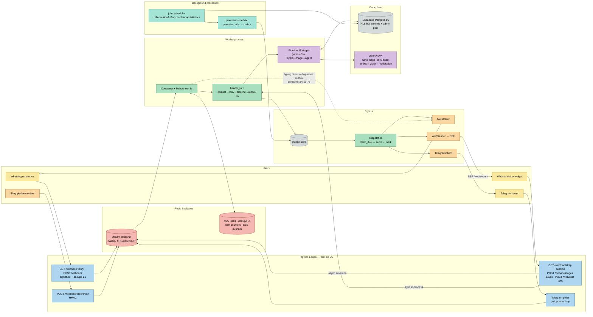
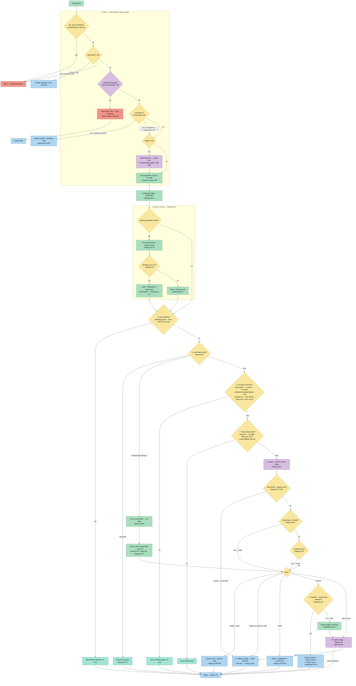
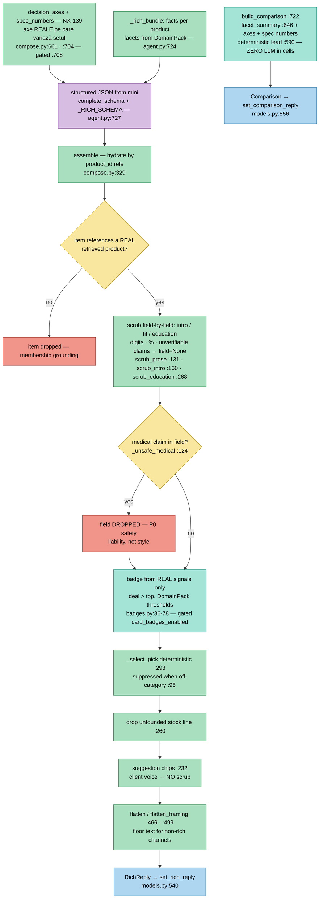
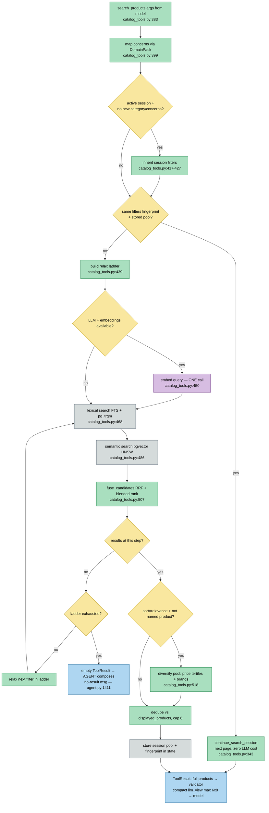
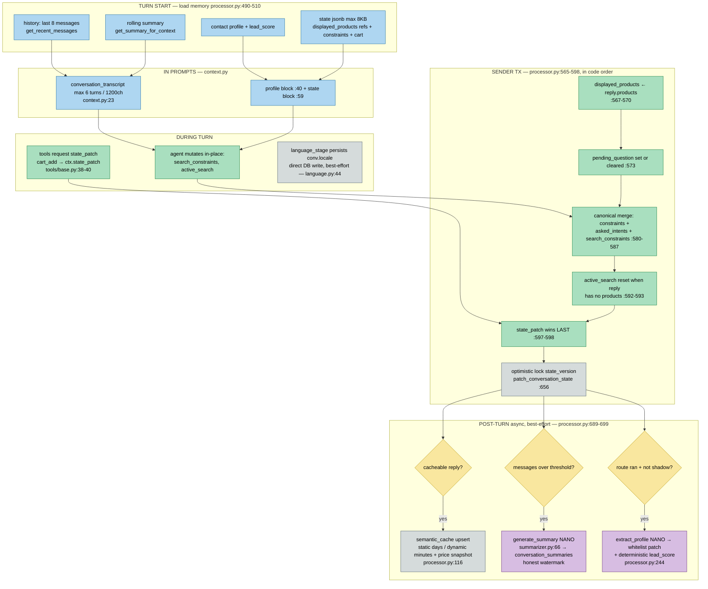
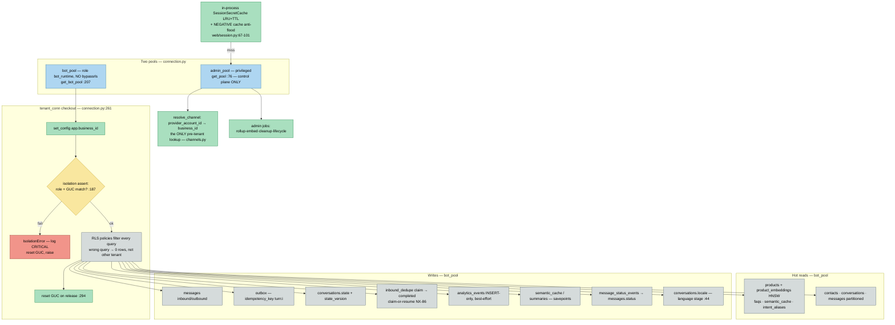
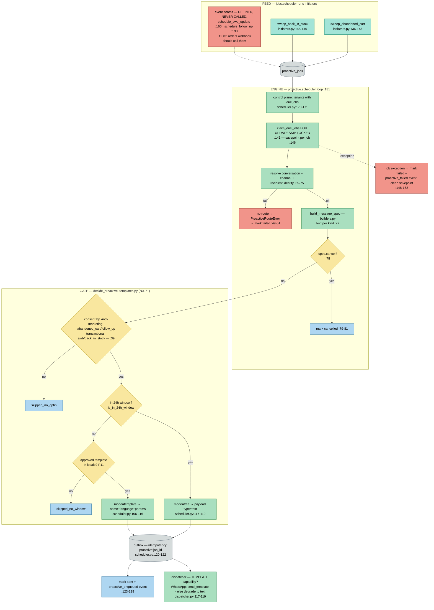

# Nativx Assistant — Workflow Architecture (n8n-style)

> Generat prin reverse-engineering pe codul real (branch `feat/NX-139-decision-axes`, 2026-07-02).
> Schelet verificat contra `arch_explorer/` (AST-derivat: 719 noduri / 555 muchii) și a codului sursă.
> **Regulă de evidență:** fiecare muchie corespunde unui call/import real, citat `file:line`.
> **Verificat prin trace invers de execuție** (2026-07-02): fiecare entry point simulat până la
> terminare, 17 nepotriviri corectate (v. Diagram 4a/4b split).
> **Runda 2 — audit adversarial** (2026-07-02): sweep pe fișierele necitite la prima trecere →
> +Diagram 4c (compunerea rich / grounding) și Diagram 10 (proactiv), +18 noduri/muchii
> (rute de margine, price-check cache, typing-bypass, operator webhook, media download,
> XADD trim). Cod mort și seams neapelate marcate în audit. Simplificări asumate, notate:
> Vision fail-soft păstrează caption-ul (`gates.py:397-434`), debounce coalescing N→1
> (`debounce.py:76-79`), `_persist_events`/`_record_turn_cost` între pipeline și reply
> (`processor.py:529-532`), kill-switch `DB_ISOLATION_ASSERT=off` (`connection.py:181-184`).
> Diagramele se randează în VS Code (extensia Mermaid Chart) sau pe GitHub.

**Procese** ([docker-compose.yml:31-98](../docker-compose.yml)):

| Serviciu            | Comandă                                   | Rol                                                           |
| ------------------- | ------------------------------------------ | ------------------------------------------------------------- |
| `webhook`         | `uvicorn src.webhook.app:app`            | Ingress HTTP (Meta + orders + /web/*)                         |
| `worker`          | `python -m src.worker.consumer`          | Consumer Redis Streams → pipeline                            |
| `dispatcher`      | `python -m src.worker.dispatcher`        | outbox → canale (singurul punct de trimitere)                |
| `scheduler`       | `python -m src.jobs.scheduler`           | Joburi mentenanță (rollup/embed/lifecycle/cleanup)          |
| `proactive`       | `python -m src.proactive.scheduler`      | proactive_jobs → outbox                                      |
| `telegram-poller` | `python -m src.channels.telegram.poller` | Long polling Telegram (canal TEST)                            |
| `redis`           | —                                         | Streams · locks · dedupe L1 · cost counters · SSE pub/sub |

DB = Supabase Postgres 16 (extern), RLS pe rol `bot_runtime`.

---

## Diagram 1 — Overall Architecture

**Metadata (noduri cheie):**

| Nod                  | Fișier                                | Funcție               | Responsabilitate                                                            |
| -------------------- | -------------------------------------- | ---------------------- | --------------------------------------------------------------------------- |
| POST /webhook        | `src/webhook/app.py:81`              | `receive_webhook()`  | Verifică semnătura Meta, dedupe L1, XADD, ACK 200 <50ms                   |
| POST /webhook/orders | `src/webhook/app.py:127`             | `receive_order()`    | HMAC pe corp brut → envelope`kind=order` pe stream                       |
| POST /web/chat       | `src/web/app.py:190`                 | `web_chat()`         | Pipeline in-process, răspuns în același HTTP request                     |
| POST /web/messages   | `src/web/app.py:157`                 | `web_message()`      | Envelope neutru pe stream; reply prin SSE                                   |
| Telegram poller      | `src/channels/telegram/poller.py:70` | `poll_once()`        | getUpdates → envelope neutru pe stream                                     |
| Stream inbound       | `src/redis_bus.py:66`                | `enqueue_inbound()`  | XADD cu maxlen ~100k                                                        |
| Consumer             | `src/worker/consumer.py:275`         | `run_consumer()`     | XREADGROUP + debounce + reaper PEL                                          |
| handle_turn          | `src/worker/processor.py:418`        | `handle_turn()`      | Miezul turului: dedupe L2 → context → pipeline → outbox TX               |
| Pipeline             | `src/worker/runner.py:47`            | `run_pipeline()`     | Stagii în ordine fixă, early-exit pe reply/halt, măsoară                |
| Dispatcher           | `src/worker/dispatcher.py:245`       | `run_dispatcher()`   | Singurul punct de trimitere: outbox → ChannelSender                        |
| MetaClient           | `src/meta_client.py:28`              | `MetaClient`         | WhatsApp Cloud API send (text/template/typing)                              |
| TelegramClient       | `src/channels/telegram/client.py:62` | `TelegramClient`     | Bot API send + edit carusel                                                 |
| WebSender            | `src/channels/web/sender.py:34`      | `WebSender`          | Publish SSE pe`web:out:{visitor}` + backlog replay                        |
| Proactive            | `src/proactive/scheduler.py:181`     | `run_scheduler()`    | Joburi scadente → poartă consent/24h → outbox                            |
| Jobs scheduler       | `src/jobs/scheduler.py:36`           | `Job` loop           | rollup_usage · embed_products · lifecycle · cleanup_dedupe · initiators |
| GET /webhook         | `src/webhook/app.py:62`              | `verify_webhook()`   | Handshake verificare Meta (token → challenge / 403)                        |
| GET /web/bootstrap   | `src/web/app.py:136`                 | `web_bootstrap()`    | Emite sesiunea vizitatorului (HMAC) + verificare Origin server-side         |
| Rich compose         | `src/worker/compose.py:329`          | `assemble()`         | Lanțul de grounding al căii bogate — v. Diagram 4c                       |
| Proactive gate       | `src/proactive/templates.py:39`      | `decide_proactive()` | Consent per kind + fereastra 24h + template aprobat — v. Diagram 10        |

---

## Diagram 2 — Application Startup

Evidență: poarta de boot pe migrări `src/worker/consumer.py:315-321`; assert rol `bot_runtime` `src/db/connection.py:96-107`; pool eager („parolă greșită crapă la boot, nu la primul mesaj") `src/worker/consumer.py:322`.
**Shutdown** (audit adversarial): worker `finally: close_media + close_redis + close_pool` (`consumer.py:331-334`); dispatcher idem (`dispatcher.py:286-289`). Singletoni lazy la runtime (nu la boot): `get_llm`, `get_media_registry` (`channels/media.py:34-43`), `SessionSecretCache` (`web/session.py:98-101`).

---

## Diagram 3 — User Message Workflow (async: WhatsApp / Telegram / web-SSE)

```mermaid
flowchart TD
  classDef edge fill:#aed6f1,stroke:#2874a6,color:#000
  classDef dec fill:#f9e79f,stroke:#b7950b,color:#000
  classDef step fill:#a9dfbf,stroke:#1e8449,color:#000
  classDef queue fill:#f5b7b1,stroke:#922b21,color:#000
  classDef db fill:#d5dbdb,stroke:#566573,color:#000
  classDef err fill:#f1948a,stroke:#922b21,color:#000

  MSG["Inbound message"]:::edge
  CAP{"body over cap?<br/>enforce_body_cap app.py:99-101"}:::dec
  R413["413 payload too large"]:::err
  SIG{"signature valid?<br/>webhook/app.py:103"}:::dec
  JSONV{"valid JSON?<br/>app.py:106-109"}:::dec
  R400["400 bad request"]:::err
  R403["403 forbidden"]:::err
  DED1{"message seen before? dedupe L1 Redis<br/>MESSAGES only — statuses skip :112-118<br/>redis_bus.py:53"}:::dec
  SKIP1["skip — Meta retry"]:::step
  XADD["XADD stream inbound<br/>maxlen ~100k trim — oldest LOST under backlog<br/>redis_bus.py:68-73"]:::queue
  RDOWN{"Redis down?"}:::dec
  R503["503 → Meta retries"]:::err
  ACK200["ACK 200 under 50ms"]:::step

  XREAD["consumer XREADGROUP<br/>consumer.py:198"]:::step
  KIND{"event kind?<br/>consumer.py:219"}:::dec
  TYPING["typing indicator fire-and-forget<br/>consumer.py:222"]:::step
  DEB["Debouncer 3s coalesce<br/>debounce.py:57"]:::step
  ORDERK["process_order — attribution<br/>webhook/orders.py:64"]:::step
  RESOLVE["resolve_channel → business_id<br/>admin_conn, consumer.py:123"]:::db
  STATUSK["record_status_event<br/>delivered/read/failed"]:::db
  LOCK{"conv lock acquired?<br/>consumer.py:159"}:::dec
  REQUEUE["requeue + backoff, capped<br/>consumer.py:90"]:::queue
  DROPQ["over requeue cap → event DROPPED<br/>log only — consumer.py:95-96"]:::err
  LOADB["load_business + DomainPack attach<br/>consumer.py:173 · businesses.py:60"]:::db
  CBK{"callback?"}:::dec
  CAROUSEL["handle_callback — carousel nav<br/>callback.py:36"]:::step

  HT["handle_turn processor.py:418"]:::step
  DED2{"claim_inbound dedupe L2 DB?<br/>processor.py:456"}:::dec
  SKIP2["deduped — return"]:::step
  CTX["contact + conversation + insert inbound msg<br/>+ history max 8 + state + summary"]:::db
  SEEDC["seed_daily_cost lazy reseed from usage_daily<br/>processor.py:523-524"]:::step
  GUARD{"cost guard over budget?<br/>processor.py:525"}:::dec
  NOLLM["llm=None — degraded pipeline"]:::err
  PIPE["run_pipeline — see Diagram 4"]:::step
  REPLY{"reply produced?"}:::dec
  HALT["intentional silence / no-reply logged<br/>processor.py:534-545"]:::step
  DISC["ensure_disclaimer processor.py:551"]:::step
  SPLIT{"text over limit + not rich?"}:::dec
  FRAG["split into max 2 fragments"]:::step
  TX["TX: outbound messages + outbox rows<br/>+ state patch + mark_inbound_completed<br/>processor.py:565-667"]:::db
  POST["post-turn async: cache writeback<br/>+ summarizer + profile extract<br/>processor.py:689-699"]:::step

  DISP["dispatcher claim_due FOR UPDATE SKIP LOCKED"]:::step
  RENDER{"choose_render by capabilities<br/>dispatcher.py:101"}:::dec
  SEND["send via ChannelSender<br/>rich/carousel/cards/template/text"]:::edge
  SENT["mark_sent + link provider_msg_id TX<br/>dispatcher.py:215"]:::db
  FAIL["mark_failed → backoff → dead<br/>dispatcher.py:211"]:::err
  RP["render_path event if requested ≠ delivered<br/>dispatcher.py:69-98"]:::step

  MSG --> CAP
  CAP -- yes --> R413
  CAP -- no --> SIG
  SIG -- no --> R403
  SIG -- yes --> JSONV
  JSONV -- no --> R400
  JSONV -- yes --> DED1
  DED1 -- yes --> SKIP1
  DED1 -- no --> XADD --> RDOWN
  RDOWN -- yes --> R503
  RDOWN -- no --> ACK200
  XADD -.-> XREAD --> KIND
  KIND -- message --> TYPING --> DEB
  KIND -- order --> ORDERK
  KIND -- "status/callback" --> RESOLVE
  DEB -- "flush after 3s idle" --> RESOLVE
  RESOLVE --> STATUSK
  RESOLVE --> LOCK
  LOCK -- busy --> REQUEUE
  REQUEUE -- "cap exceeded" --> DROPQ
  LOCK -- ok --> LOADB --> CBK
  CBK -- yes --> CAROUSEL
  CBK -- no --> HT --> DED2
  DED2 -- "already done" --> SKIP2
  DED2 -- claimed --> CTX --> SEEDC --> GUARD
  GUARD -- yes --> NOLLM --> PIPE
  GUARD -- no --> PIPE
  PIPE --> REPLY
  REPLY -- no --> HALT
  REPLY -- yes --> DISC --> SPLIT
  SPLIT -- yes --> FRAG --> TX
  SPLIT -- no --> TX
  TX --> POST
  TX -.-> DISP --> RENDER --> SEND
  SEND -- ok --> SENT --> RP
  SEND -- error --> FAIL
```

Calea **sincronă** `/web/chat` diferă doar la capete: sesiune HMAC + rate-limit fail-closed + gard de buget (`src/web/app.py:197-240`) → `handle_turn(deliver=False)` — fără outbox, răspunsul HTTP e transportul (`src/web/app.py:241-252`, `src/worker/processor.py:560,613-621`).

---

## Diagram 4a — Pipeline Routing Workflow (stagiile 1-9 + fallback)

Ordinea stagiilor: `DEFAULT_STAGES`, `src/worker/runner.py:207-219`. Internele stagiului Agent → Diagram 4b.
*(Corectat după trace-ul invers: alias route-hit continuă spre agent, clarify are escaladare pe attempts, greeting rulează și după resume, handoff are ramura web→SALES, rate-limit are tăcere pe burst.)*

---

## Diagram 4b — Agent Stage Internals (agent.py:957)

Intențiile deterministe PRE-loop scurtcircuitează bucla LLM (cost zero); compunerea POST-loop e cod determinist peste `ctx.retrieval` — modelul nu are ultimul cuvânt pe cifre/linkuri.

```mermaid
flowchart TD
  classDef dec fill:#f9e79f,stroke:#b7950b,color:#000
  classDef llm fill:#d7bde2,stroke:#6c3483,color:#000
  classDef free fill:#a3e4d7,stroke:#148f77,color:#000
  classDef out fill:#aed6f1,stroke:#2874a6,color:#000
  classDef step fill:#a9dfbf,stroke:#1e8449,color:#000

  IN2["route = sales / order"]:::step

  subgraph PRE["PRE-loop deterministic intents — no LLM"]
    LNK{"link request on displayed?<br/>:984"}:::dec
    SLNK["serve product_url from state<br/>+ Offer — :894"]:::free
    CMPI{"compare on displayed set?<br/>:1001"}:::dec
    HCMP{"2+ valid products fetched?<br/>:933"}:::dec
    CTAB["deterministic comparison table"]:::free
    SM{"show-more on active session?<br/>:1019"}:::dec
  end

  MERGEC["merge_constraints stack — sales only<br/>:1098-1112"]:::step
  PAGE2["continue_search_session :1135"]:::free
  PGOK{"page has products?"}:::dec
  NOMORE["no-more message :1139"]:::out

  subgraph LOOPG["LLM tool loop"]
    PROMPT["build_agent_system from DB<br/>prompt_builder.py:279"]:::step
    LOOP["run_tool_loop max 3 steps<br/>llm.py:227"]:::llm
    EXEC["execute → run_tool + bookkeeping :1041-1086<br/>10 tools: search·details·compare·cart·checkout<br/>reorder·back_in_stock·faq·check_order·request_human"]:::step
  end

  subgraph POST["POST-loop deterministic composition"]
    LOGIN{"check_order hit login wall?<br/>:1155"}:::dec
    LWALL["login-required msg"]:::out
    CKF{"purchase intent + cart lines,<br/>no link yet? :1174"}:::dec
    CKEXEC["code calls checkout_link itself<br/>:1195"]:::step
    XS{"cart_add ok + no link? :1204"}:::dec
    XSELL["cross-sell complementary cards<br/>:1213-1236"]:::out
    ATQ{"superlative on displayed set?<br/>:1246"}:::dec
    HYD1["rehydrate displayed set :1255"]:::step
    CHP{"cheaper intent? :1265"}:::dec
    CHS["search_cheaper_than :1276"]:::step
    CH0{"anything cheaper?"}:::dec
    CHMSG["already-cheapest msg :1283"]:::out
    RHD{"no products + displayed +<br/>text ungrounded? :1291"}:::dec
    HYD2["get_products_by_ids :1300"]:::step
    CMPD{"model called compare_products?<br/>:1314"}:::dec
    CTAB2["deterministic table :1315-1324"]:::out
  end

  subgraph FIN["Finalize + validator"]
    PRD{"products retrieved?"}:::dec
    RICHC["_finalize_rich structured JSON :1330<br/>+ decision axes NX-139 input :704-720<br/>grounding chain → Diagram 4c"]:::llm
    ROK{"rich has items?"}:::dec
    RICHOUT["rich reply: cards + chips<br/>+ checkout Offer :1340-1348"]:::out
    VALID{"_valid: prices / links / bare numbers /<br/>claims / medical — agent.py:472"}:::dec
    RETRY["1 retry, allowed prices only :587"]:::llm
    V2{"valid now?"}:::dec
    DETR["deterministic reply :523"]:::free
    PROSE["prose reply + cards :1379"]:::out
    ORD{"order route?"}:::dec
    GRND["_finalize_grounded on order views<br/>:1389"]:::llm
    TXTOK{"text valid without products?<br/>:1398"}:::dec
    NORES["safe no-result / login msg<br/>:1405 · :1406-1411"]:::out
  end

  IN2 --> LNK
  LNK -- yes --> SLNK
  LNK -- no --> CMPI
  CMPI -- yes --> HCMP
  HCMP -- yes --> CTAB
  HCMP -- "no → fall through :1009" --> MERGEC
  CMPI -- no --> MERGEC
  MERGEC --> SM
  SM -- yes --> PAGE2 --> PGOK
  PGOK -- no --> NOMORE
  PGOK -- "yes, skip loop" --> LOGIN
  SM -- no --> PROMPT --> LOOP <--> EXEC
  LOOP --> LOGIN
  LOGIN -- yes --> LWALL
  LOGIN -- no --> CKF
  CKF -- yes --> CKEXEC --> XS
  CKF -- no --> XS
  XS -- yes --> XSELL
  XSELL -- "no complement / rich fail → continue :1238" --> ATQ
  XS -- no --> ATQ
  ATQ -- yes --> HYD1 --> CMPD
  ATQ -- no --> CHP
  CHP -- yes --> CHS --> CH0
  CH0 -- no --> CHMSG
  CH0 -- yes --> CMPD
  CHP -- no --> RHD
  RHD -- yes --> HYD2 --> CMPD
  RHD -- no --> CMPD
  CMPD -- yes --> CTAB2
  CMPD -- no --> PRD
  PRD -- "yes + sales" --> RICHC --> ROK
  ROK -- yes --> RICHOUT
  ROK -- "no → prose downgrade :1350" --> VALID
  PRD -- "yes + order" --> VALID
  VALID -- ok --> PROSE
  VALID -- invalid --> RETRY --> V2
  V2 -- yes --> PROSE
  V2 -- no --> DETR
  PRD -- "no, but final text" --> ORD
  ORD -- yes --> GRND
  ORD -- no --> TXTOK
  TXTOK -- yes --> PROSE
  TXTOK -- no --> NORES
  PRD -- "no, no text" --> NORES
```

Memoria (istoric/profil/state/rezumat) intră în prompturi prin `conversation_transcript` + `context_blocks` (`src/worker/context.py:23`; folosite la `triage.py:223-226` și `agent.py:1088-1091`). System-promptul agentului e GENERAT din DB (`src/agent/prompt_builder.py:279`, principiul 9).

---

## Diagram 4c — Rich Composition & Grounding (compose.py — adăugată la auditul adversarial)

Echivalentul validatorului pentru calea BOGATĂ: modelul emite DOAR cuvinte + referințe `product_id`; codul hidratează faptele. Garanția anti-halucinație a căii care servește majoritatea recomandărilor.

Cine o folosește: `_finalize_rich` (agent.py:688-731, recomandare + cross-sell) și randorul web (`flatten_framing` la `channels/web/render.py:150`). Comparația (CMPB) e apelată din ambele căi de compare (agent.py:933, :1315).

---

## Diagram 5 — Product Search Workflow

Degradare: `embed` picat → `query_vec=None` → lexical-only (`catalog_tools.py:447-454`); semantic picat în tur → rămâne lexical (`catalog_tools.py:501-502`).

---

## Diagram 6 — Conversation Memory Workflow

---

## Diagram 7 — Database Workflow

Tranzacția Sender (mesaje + outbox + state + dedupe-complete, atomic): `src/worker/processor.py:565-667`. Scrierile best-effort rulează în savepoint propriu (`processor.py:159-161, 218, 278`).

---

## Diagram 8 — External Services Workflow

> %% UNVERIFIED: repo-ul frontend al widget-ului („Sales MVP Frontend") e extern acestui codebase;
> contractul JSON e documentat în `docs/FRONTEND-CONTRACT-IZI.md`, dar implementarea FE nu poate fi
> verificată de aici.

---

## Diagram 9 — Error Handling Workflow

```mermaid
flowchart TD
  classDef err fill:#f1948a,stroke:#922b21,color:#000
  classDef dec fill:#f9e79f,stroke:#b7950b,color:#000
  classDef ok fill:#a9dfbf,stroke:#1e8449,color:#000
  classDef deg fill:#fad7a0,stroke:#af601a,color:#000

  subgraph LLMErr["LLM failures"]
    L1["API error / 429"]:::err
    L2{"bounded retry ok?<br/>llm.py:45"}:::dec
    L3["triage fail → route None<br/>triage.py:247-251"]:::deg
    L4["agent loop fail → return<br/>agent.py:1148"]:::deg
    L5["fallback_stage: clarify question<br/>NEVER silence — runner.py:169"]:::ok
  end

  subgraph ValErr["Validator failures — agent.py:560"]
    V1{"reply valid? prices/links/claims"}:::dec
    V2["1 retry with allowed prices :587"]:::deg
    V3{"valid now?"}:::dec
    V4["deterministic reply from DB products :595"]:::ok
  end

  subgraph CostErr["Cost guard — processor.py:308"]
    C1{"daily cap business/contact hit?"}:::dec
    C2["llm=None: gates + cache still work<br/>LLM stages skip"]:::deg
  end

  subgraph InfraErr["Infra failures"]
    I1["Redis down at webhook → 503, Meta retries<br/>webhook/app.py:119"]:::err
    I2["cache/FAQ error → miss, turn continues<br/>cache.py:146"]:::deg
    I3["analytics fail → log only<br/>processor.py:112"]:::deg
    I4["conv lock busy → requeue capped<br/>consumer.py:90"]:::deg
    I5["consumer crash mid-turn → un-ACKed<br/>reaper XAUTOCLAIM re-claims :234"]:::ok
    I6["processing exception → ACK + log<br/>consumer.py:228 — WARNING: turn LOST"]:::err
    I7["requeue cap exceeded → event DROPPED<br/>consumer.py:95-96 — WARNING: turn LOST"]:::err
    I8["inbound stream maxlen ~100k trim →<br/>oldest LOST under backlog — redis_bus.py:68-73"]:::err
  end

  subgraph BgErr["Background process failures"]
    B1["proactive job crash → mark failed<br/>+ event, clean savepoint<br/>proactive/scheduler.py:148-162"]:::deg
    B2["maintenance job crash → log + skip,<br/>retry next interval — jobs/scheduler.py:101-108"]:::deg
    B3["poller getUpdates fail → log +<br/>sleep 3s + retry — poller.py:113-115"]:::deg
  end

  subgraph SendErr["Delivery failures — dispatcher"]
    S1{"send failed?"}:::dec
    S2["mark_failed → backoff retry :211"]:::deg
    S3{"attempts exhausted?"}:::dec
    S4["status dead — visible, not silent"]:::err
    S5["dispatcher dead between claim/mark →<br/>visibility timeout, row redeemed"]:::ok
  end

  subgraph Human["Human handoff"]
    H1["risk pattern / route handoff"]:::dec
    H2["request_human: set handoff_until + notify<br/>gates.py:473"]:::ok
    H3["next turns: gates → intentional silence"]:::deg
  end

  L1 --> L2
  L2 -- no --> L3 --> L5
  L2 -- no --> L4 --> L5
  V1 -- invalid --> V2 --> V3
  V3 -- no --> V4
  C1 -- yes --> C2
  S1 -- yes --> S2 --> S3
  S3 -- yes --> S4
  H1 --> H2 --> H3
```

---

## Diagram 10 — Proactive Lifecycle (adăugată la auditul adversarial)

Cele mai reglementate decizii din sistem (consent + fereastra 24h Meta) — 100% cod determinist, zero LLM (`templates.py`).

---

# Audit arhitectural (evidence-based)

## Discrepanțe documentație ↔ implementare (implementarea câștigă)

1. **CLAUDE.md e în urmă:** secțiunea „Structura proiectului" spune `stages/ … TODO: gates, free_layers; echo=fallback` — dar `gates.py`, `greeting.py`, `alias.py`, `cache.py`, `faq.py`, `clarify.py`, `handoff.py`, `language.py` există și sunt LIVE în `src/worker/runner.py:207-219`.
2. **Docstring stale în runner:** `src/worker/runner.py:8-10` descrie „un singur stagiu real (`echo_stage`)" — `echo_stage` nu există în `DEFAULT_STAGES`; pipeline-ul are 11 stagii.
3. **„Validatorul (stagiul 8)" din CLAUDE.md nu e stagiu separat:** e implementat ca funcții interne ale stagiului Agent (`src/worker/stages/agent.py:472-502`, `560-595`) — comportamentul e cel documentat, structura diferă.
4. **arch_explorer e ușor stale pe branch-ul curent:** raportează `agent_stage` la linia 858 și `triage_stage` la 179; în cod sunt la `agent.py:957` și `triage.py:212`. Necesită re-rulare `arch_explorer/analyze.py`.
5. **`webhook/status.py` NU există** — CLAUDE.md îl listează ca LIVE; statusurile sunt parsate în `webhook/meta.py:104` (`parse_statuses`) și scrise de worker (`consumer.py:137-146`).
6. **STT/Whisper NU e implementat** — CLAUDE.md promite „vocale → STT (Whisper)"; `audio` e doar un tip de media parsat cu caption drept body (`webhook/meta.py:27,36-39`), ne-rutat spre vreo transcriere (gates rutează DOAR `image`, `gates.py:482`).
7. **Tool-ul `delivery_eta` NU există** — CLAUDE.md îl listează; registry-ul real are 10 tool-uri (grep `@register` în `src/tools/`), fără `delivery_eta`.

## Puncte forte

- **Pipeline liniar cu un singur owner per câmp** — runner generic; observabilitatea (latency + tokens per stagiu + buget per tur) e în runner, nu în stagii (`src/worker/runner.py:47-105`).
- **Un singur punct de ieșire, tranzacțional** — reply + outbox + state + dedupe-complete într-o singură TX (`src/worker/processor.py:565-667`); dispatcher cu visibility-timeout self-healing (`src/worker/dispatcher.py:8-13`).
- **Validatorul e apărarea load-bearing anti-halucinație și anti-prompt-injection** — orice preț/link/produs trebuie să existe în `ctx.retrieval` (`src/worker/stages/agent.py:486-489`); degradarea finală e un reply determinist din DB (`agent.py:523`).
- **Izolare multi-tenant în straturi** — rol LOGIN fără bypassrls + GUC per checkout + assert de izolare la fiecare checkout (`src/db/connection.py:187-204, 274-287`); boot-gate pe migrări (`src/worker/consumer.py:315-321`).
- **Fiabilitate pe coadă** — dedupe 2 straturi (Redis + DB claim-or-resume), ACK-after-flush (`src/worker/debounce.py:11-15`), reaper XAUTOCLAIM (`src/worker/consumer.py:234-272`).
- **Cost governance pe 3 niveluri** — business/zi, contact/zi, vizitator web, reseed din `usage_daily`, enforcement post-increment fără TOCTOU (`src/worker/processor.py:308-379`).

## Puncte slabe / riscuri

1. **⚠ Cel mai serios: excepție de procesare = tur pierdut tăcut.** La orice excepție în `process_event`, consumer-ul face ACK și doar loghează (`src/worker/consumer.py:228-230`; la fel reaper-ul `:267-269`). Meta a primit deja 200 → nu re-trimite. Clientul nu primește NIMIC — încălcare a principiului 6 exact pe calea de eroare pe care principiul o vizează. **A doua cale de pierdere (găsită la trace-ul invers):** lock ocupat persistent → după `conv_lock_max_requeues` evenimentul e DROPAT cu un simplu log (`consumer.py:95-96`). → **NX-140**
2. **`agent.py` e un god-module** — 1200+ linii; `agent_stage` (`:957+`) amestecă 3 intenții deterministe, bucla LLM, login-wall, checkout-fallback, cross-sell; validatorul + 3 căi de finalize în același fișier.
3. **Cuplaj maxim în processor** — `handle_turn` are fan-out 45 (cel mai mare din sistem, `arch_explorer/GRAPH_REPORT.md`) și ~300 linii: orchestrare + politică de state-merge + sender + post-tur.
4. **Ciclu de import gestionat manual** — stagiile importă `PipelineDeps` din runner sub `TYPE_CHECKING` (`src/worker/stages/gates.py:37-38`); runner-ul importă stagiile la sfârșitul fișierului (`src/worker/runner.py:189-199`).
5. **Conexiune DB ținută pe durata apelurilor LLM** — pipeline-ul rulează pe `conn` din `bot_pool` (max_size=10, `src/db/connection.py:224-229`) în timp ce agentul face 1-4 apeluri LLM (`src/worker/processor.py:528`); la fel `/web/chat` (`src/web/app.py:223-243`). Plafon ~10 tururi concurente/proces; pooler Supabase capat la ~15 sesiuni. **Bottleneck-ul #1 de scalare.** → **NX-141**
6. **Dispatcher secvențial + poll de 2s** — rând cu rând, tenant cu tenant (`src/worker/dispatcher.py:233-241`), sleep 2s la idle (`:245-251`). Un tenant lent întârzie toți ceilalți; +0-2s latență pe calea async.
7. **Fallback-ul final e doar în română** — `src/worker/runner.py:173-176`, deși pipeline-ul e RO/HU/EN și triage are `_CLARIFY_FALLBACK` per-locale (`src/worker/stages/triage.py:313`). Încalcă P11.
8. **SSL fără verificare pe orice win32** — `src/db/connection.py:56-73` dezactivează verificarea certificatului condiționat de platformă, nu de env. Prod e Linux → risc latent.
9. **Cuplaj src→scripts la runtime** — `src/worker/consumer.py:315` importă `scripts.migrate`; a produs deja incidentul Dockerfile (imagine fără `scripts/` → crash-loop, PR #132).
10. **Duplicare mică de asamblare context** — `history_block`/`context_block` construite identic în triage (`triage.py:223-226`) și agent (`agent.py:1088-1091`).

**Circular dependencies:** doar ciclul runner↔stages gestionat prin late-import (pct. 4). **Dead code (corectat la auditul adversarial):** `estimate_turn_cost` (`src/worker/limits.py:186`) — definit, referit doar într-un comentariu (`processor.py:355`), înlocuit de costul real NX-125 → de șters. **Unreachable seams (intenționate, TODO):** `schedule_awb_update` (`initiators.py:160-187`) și `schedule_follow_up` (`initiators.py:190`) — definite, niciun apelant; webhook-ul de comenzi ar trebui să le cheme la expediere.

---

# Refactoring — plan cu evidență

| #  | Problemă                                                                      | Evidență                                  | Soluție                                                                                      | Impact                                                                                  | Card             |
| -- | ------------------------------------------------------------------------------ | ------------------------------------------- | --------------------------------------------------------------------------------------------- | --------------------------------------------------------------------------------------- | ---------------- |
| R1 | Excepție de procesare → ACK + drop, client fără răspuns                   | `consumer.py:228-230`                     | Re-queue cu contor; la epuizare → fallback reply în outbox + event`turn_failed`, apoi ACK | Erorile tranzitorii se auto-vindecă; cele permanente produc mesaj + semnal, nu tăcere | **NX-140** |
| R2 | Validatorul (apărarea critică) trăiește ca funcții private în god-module | `agent.py:472-502, 560-688`               | Mutare pură în`src/worker/validator.py`                                                   | Testare izolată; auditabilitate de securitate pe un fișier                            | —               |
| R3 | Intențiile deterministe împletite în`agent_stage`                         | `agent.py:984-1027, 1174-1216`            | `stages/intents.py` cu registru `[(predicate, handler)]` înaintea buclei LLM             | Intent nou = fișier nou + intrare în registru                                         | —               |
| R4 | Ciclu import runner↔stages prin late-import                                   | `runner.py:189-199`, `gates.py:37-38`   | `PipelineDeps` în `src/worker/deps.py`                                                   | Graf de importuri aciclic real                                                          | —               |
| R5 | Conexiune DB ținută prin apelurile LLM → plafon ~10 tururi concurente       | `processor.py:528`, `connection.py:227` | Fazează handle_turn: load → release conn → LLM fără conn → TX pe conn proaspăt         | Concurența limitată de LLM, nu de pool                                                | **NX-141** |
| R6 | Dispatcher serial + poll 2s                                                    | `dispatcher.py:233-251`                   | gather bounded per tenant; tenanti în paralel; idle 0.5s                                     | Latență de livrare constantă sub load mixt                                           | —               |
| R7 | fallback_stage RO-only (încalcă P11)                                         | `runner.py:173-176`                       | Dict per-locale ro/hu/en pe`ctx.language`                                                   | Paritate multilingvă pe toate ieșirile                                                | —               |
| R8 | Docstring-uri/documentație stale                                              | `runner.py:8-10`, CLAUDE.md „Structura"  | Update + re-rulare`arch_explorer/analyze.py`                                                | Previne decizii greșite pe documentație veche                                         | —               |

**Concluzie:** sistemul e neobișnuit de disciplinat — principiile din CLAUDE.md chiar sunt implementate (pipeline liniar, single-exit, validator structural, RLS în straturi), iar mecanismele de fiabilitate sunt de calitate de producție. Cele două datorii reale: **concentrarea** (agent.py + processor.py acumulează tot ce e nou — R2/R3/R4 le dezamorsează ieftin) și **gaura ACK-on-error** (R1, singura încălcare structurală a propriilor principii). R5 e singurul subiect veritabil de scalare.
