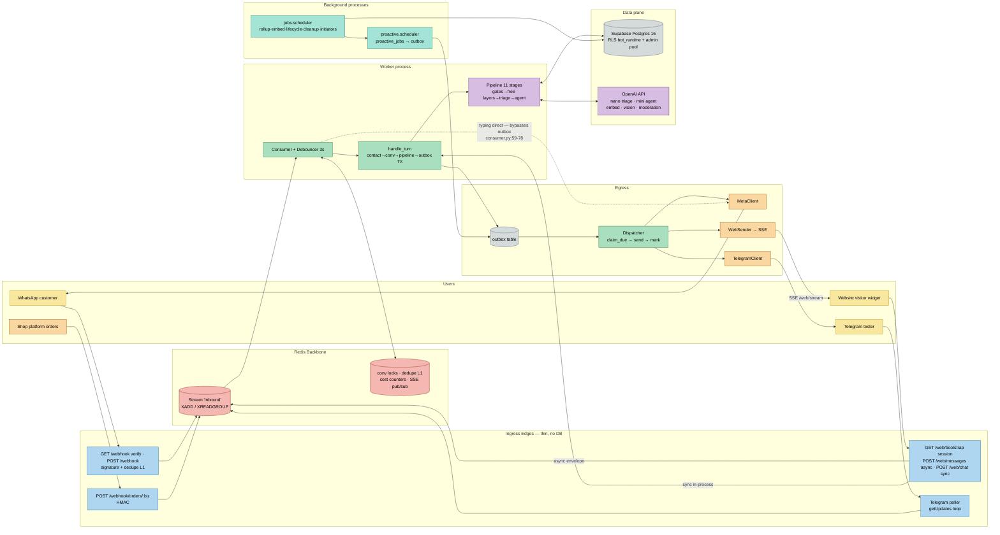
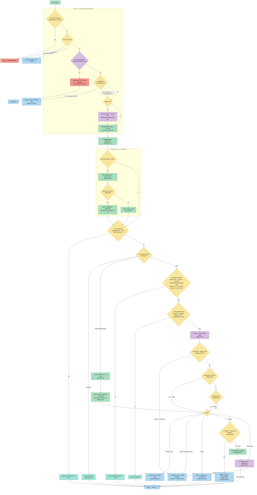
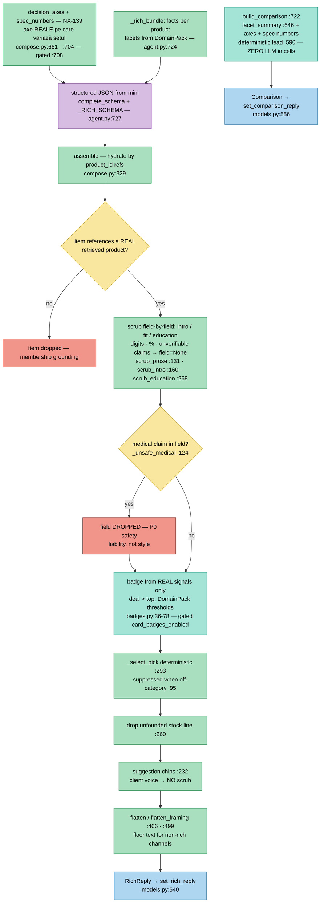
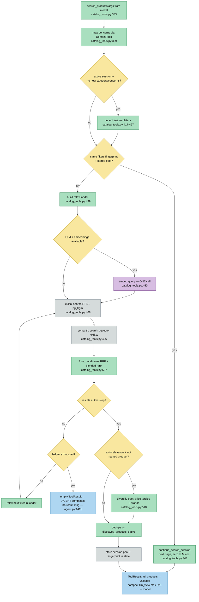
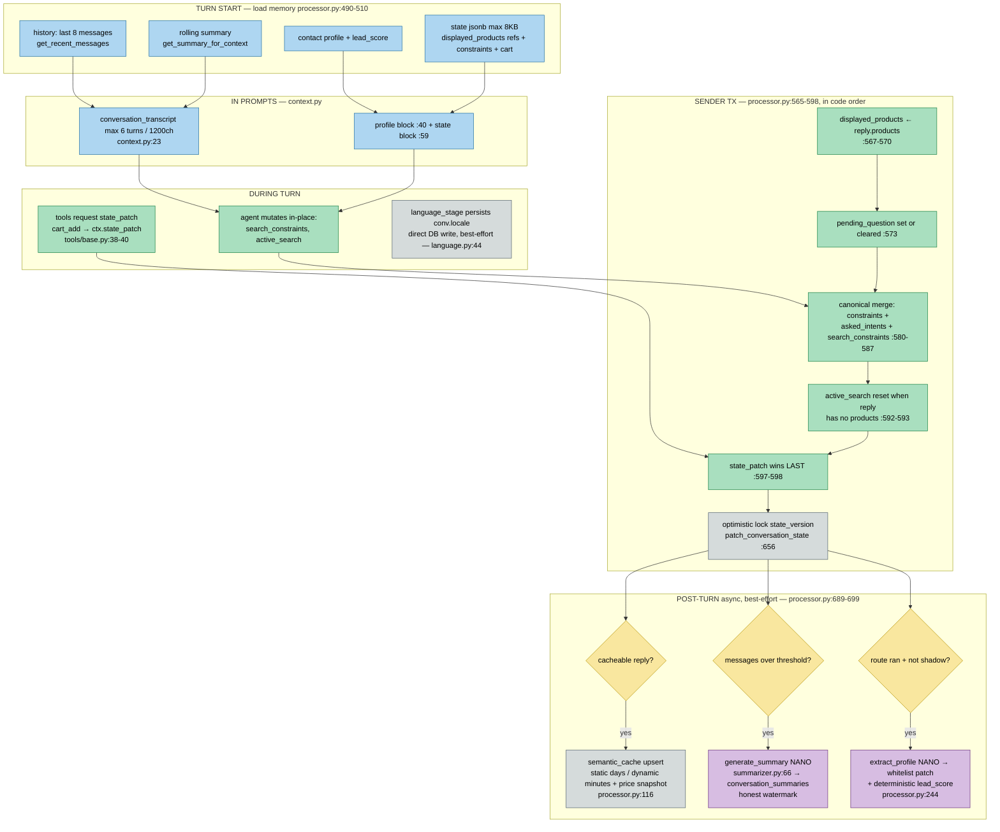
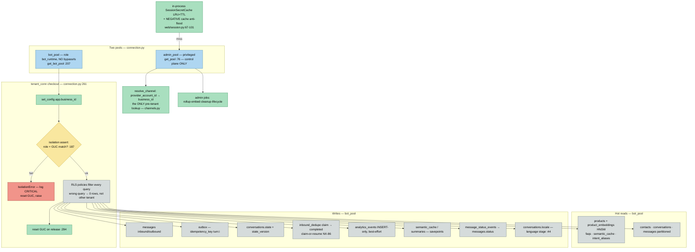
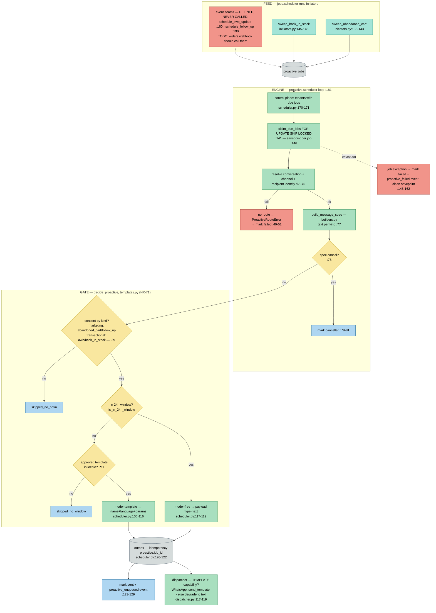

# Nativx Assistant — Workflow Architecture (n8n-style)

> **Revizia auditată: `6bbeb6f` (2026-08-10).** Când citești asta pe alt commit, prima
> întrebare e cât de departe ai ajuns de aici: `git log --oneline 6bbeb6f..HEAD`.
>
> **Regulă de evidență:** fiecare muchie corespunde unui call/import real, citat `file:line`.
> Scheletul e verificat contra `arch_explorer/` (AST-derivat, regenerabil determinist:
> `python arch_explorer/analyze.py --repo . --root src` → **182 fișiere / 1272 noduri /
> 941 muchii**, plus `verify.py` care re-derivă graful printr-o metodă DIFERITĂ, regex vs AST,
> și cade dacă cele două nu sunt de acord).
>
> **Poartă anti-putrezire (CI):** `python scripts/verify_architecture_doc.py` compară blocurile
> ```` ```claim:...` ```` de la finalul documentului cu codul. Divergență → CI roșu. Ce garantează:
> LISTELE (stagii în ordine, tool-uri, procese, rute, flag-uri, migrări). Ce **nu** garantează:
> săgețile dintre ele. O diagramă poate avea toate stagiile corecte și o muchie greșită.
>
> Diagramele se randează în VS Code (extensia Mermaid Chart) sau pe GitHub.

<details>
<summary>Istoricul verificărilor (2026-07-02 → 2026-08-10)</summary>

- **2026-07-02, redactare inițială** (branch `feat/NX-139-decision-axes`, AST: 719 noduri /
  555 muchii). Verificat prin trace invers de execuție: fiecare entry point simulat până la
  terminare, 17 nepotriviri corectate (v. split-ul Diagram 4a/4b).
- **2026-07-02, runda 2 — audit adversarial**: sweep pe fișierele necitite la prima trecere →
  +Diagram 4c (compunerea rich / grounding) și Diagram 10 (proactiv), +18 noduri/muchii
  (rute de margine, price-check cache, typing-bypass, operator webhook, media download, XADD trim).
- **2026-08-10, resincronizare**. Documentul rămăsese în urmă cu ~6 săptămâni. Măsurat, nu
  presupus: din 229 de citări `file:line`, **201 încă aterizau în interval**; cele 27 în afară
  erau concentrate în exact două fișiere — `src/worker/stages/agent.py` (1411 → 423 linii) și
  `src/worker/processor.py`. Cauza: modularizarea agentului (NX-142/143/144) a spart monolitul
  în 19 module `src/agent/*`, deci **Diagram 4b a fost rescrisă din temelii**. Adăugate
  subsistemele apărute după 2026-07-02, absente complet: `src/safety/`, `src/knowledge/`,
  `src/commerce/`, `answer_plan`, `match_gate`, `query_spec`/`query_rewrite`,
  `search_documents`, rollup-ul de cerere. Restructurat pe niveluri + lentile.

</details>

---

## Cum se citește documentul

Un singur desen „cu tot proiectul" nu există aici, deliberat: sistemul are axe **ortogonale**
pe care un flowchart nu le poate purta simultan. În loc de asta, patru **niveluri** de zoom și
șase **lentile** peste același schelet.

**Regula de includere** (de ce un pas apare pe diagramă și altul nu): un pas primește nod dacă
face cel puțin unul dintre — *poate ieși devreme*, *cheamă un LLM*, *atinge DB/Redis/serviciu
extern*, *e stins/aprins de un flag*, *poate eșua într-un fel care schimbă răspunsul trimis*.
Restul e detaliu de implementare și stă în cod.

| Nivel | Întrebarea la care răspunde | Unde |
| --- | --- | --- |
| **1 · Context** | Cine vorbește cu sistemul și de ce servicii externe depinde | Diagram 1 |
| **2 · Procese** | Ce rulează, în ce container, și cine cu cine vorbește | Diagram 2 + tabelul de mai jos |
| **3 · Pipeline** | Cele 11 stagii, în ordine, cu toate ieșirile devreme | Diagram 4a |
| **4 · Un tur** | „Intră un mesaj — ce se întâmplă, pas cu pas" | Diagram 3 (+4b pentru interiorul agentului) |

**Lentilele** (aceleași stagii, întrebări diferite): Cost · Date · Eșec · Flag-uri · Izolare ·
Siguranță → secțiunea [Lentile](#lentile).

---

**Procese** ([docker-compose.yml:31-98](../docker-compose.yml)):

| Serviciu            | Comandă                                   | Rol                                                           |
| ------------------- | ------------------------------------------ | ------------------------------------------------------------- |
| `webhook`         | `uvicorn src.webhook.app:app`            | Ingress HTTP (Meta + orders + /web/*)                         |
| `worker`          | `python -m src.worker.consumer`          | Consumer Redis Streams → pipeline                            |
| `dispatcher`      | `python -m src.worker.dispatcher`        | outbox → canale (singurul punct de trimitere)                |
| `scheduler`       | `python -m src.jobs.scheduler`           | Joburi mentenanță (rollup/embed/lifecycle/cleanup)          |
| `proactive`       | `python -m src.proactive.scheduler`      | proactive_jobs → outbox                                      |
| `telegram-poller` | `python -m src.channels.telegram.poller` | Long polling Telegram (canal TEST)                            |
| `redis`           | —                                         | Streams · locks · dedupe L1 · cost counters · SSE pub/sub |

DB = Supabase Postgres 16 (extern), RLS pe rol `bot_runtime`.

---

## Diagram 1 — Overall Architecture



**Metadata (noduri cheie):**

| Nod                  | Fișier                                | Funcție               | Responsabilitate                                                            |
| -------------------- | -------------------------------------- | ---------------------- | --------------------------------------------------------------------------- |
| POST /webhook        | `src/webhook/app.py:81`              | `receive_webhook()`  | Verifică semnătura Meta, dedupe L1, XADD, ACK 200 <50ms                   |
| POST /webhook/orders | `src/webhook/app.py:127`             | `receive_order()`    | HMAC pe corp brut → envelope`kind=order` pe stream                       |
| POST /web/chat       | `src/web/app.py:190`                 | `web_chat()`         | Pipeline in-process, răspuns în același HTTP request                     |
| POST /web/messages   | `src/web/app.py:157`                 | `web_message()`      | Envelope neutru pe stream; reply prin SSE                                   |
| Telegram poller      | `src/channels/telegram/poller.py:70` | `poll_once()`        | getUpdates → envelope neutru pe stream                                     |
| Stream inbound       | `src/redis_bus.py:66`                | `enqueue_inbound()`  | XADD cu maxlen ~100k                                                        |
| Consumer             | `src/worker/consumer.py:275`         | `run_consumer()`     | XREADGROUP + debounce + reaper PEL                                          |
| handle_turn          | `src/worker/processor.py:418`        | `handle_turn()`      | Miezul turului: dedupe L2 → context → pipeline → outbox TX               |
| Pipeline             | `src/worker/runner.py:47`            | `run_pipeline()`     | Stagii în ordine fixă, early-exit pe reply/halt, măsoară                |
| Dispatcher           | `src/worker/dispatcher.py:245`       | `run_dispatcher()`   | Singurul punct de trimitere: outbox → ChannelSender                        |
| MetaClient           | `src/meta_client.py:28`              | `MetaClient`         | WhatsApp Cloud API send (text/template/typing)                              |
| TelegramClient       | `src/channels/telegram/client.py:62` | `TelegramClient`     | Bot API send + edit carusel                                                 |
| WebSender            | `src/channels/web/sender.py:34`      | `WebSender`          | Publish SSE pe`web:out:{visitor}` + backlog replay                        |
| Proactive            | `src/proactive/scheduler.py:181`     | `run_scheduler()`    | Joburi scadente → poartă consent/24h → outbox                            |
| Jobs scheduler       | `src/jobs/scheduler.py:36`           | `Job` loop           | rollup_usage · embed_products · lifecycle · cleanup_dedupe · initiators |
| GET /webhook         | `src/webhook/app.py:62`              | `verify_webhook()`   | Handshake verificare Meta (token → challenge / 403)                        |
| GET /web/bootstrap   | `src/web/app.py:136`                 | `web_bootstrap()`    | Emite sesiunea vizitatorului (HMAC) + verificare Origin server-side         |
| Rich compose         | `src/worker/compose.py:329`          | `assemble()`         | Lanțul de grounding al căii bogate — v. Diagram 4c                       |
| Proactive gate       | `src/proactive/templates.py:39`      | `decide_proactive()` | Consent per kind + fereastra 24h + template aprobat — v. Diagram 10        |

---

## Diagram 2 — Application Startup


Evidență: poarta de boot pe migrări `src/worker/consumer.py:315-321`; assert rol `bot_runtime` `src/db/connection.py:96-107`; pool eager („parolă greșită crapă la boot, nu la primul mesaj") `src/worker/consumer.py:322`.
**Shutdown** (audit adversarial): worker `finally: close_media + close_redis + close_pool` (`consumer.py:331-334`); dispatcher idem (`dispatcher.py:286-289`). Singletoni lazy la runtime (nu la boot): `get_llm`, `get_media_registry` (`channels/media.py:34-43`), `SessionSecretCache` (`web/session.py:98-101`).

---

## Diagram 3 — User Message Workflow (async: WhatsApp / Telegram / web-SSE)

```mermaid
flowchart TD
  classDef edge fill:#aed6f1,stroke:#2874a6,color:#000
  classDef dec fill:#f9e79f,stroke:#b7950b,color:#000
  classDef step fill:#a9dfbf,stroke:#1e8449,color:#000
  classDef queue fill:#f5b7b1,stroke:#922b21,color:#000
  classDef db fill:#d5dbdb,stroke:#566573,color:#000
  classDef err fill:#f1948a,stroke:#922b21,color:#000

  MSG["Inbound message"]:::edge
  CAP{"body over cap?<br/>enforce_body_cap app.py:99-101"}:::dec
  R413["413 payload too large"]:::err
  SIG{"signature valid?<br/>webhook/app.py:103"}:::dec
  JSONV{"valid JSON?<br/>app.py:106-109"}:::dec
  R400["400 bad request"]:::err
  R403["403 forbidden"]:::err
  DED1{"message seen before? dedupe L1 Redis<br/>MESSAGES only — statuses skip :112-118<br/>redis_bus.py:53"}:::dec
  SKIP1["skip — Meta retry"]:::step
  XADD["XADD stream inbound<br/>maxlen ~100k trim — oldest LOST under backlog<br/>redis_bus.py:68-73"]:::queue
  RDOWN{"Redis down?"}:::dec
  R503["503 → Meta retries"]:::err
  ACK200["ACK 200 under 50ms"]:::step

  XREAD["consumer XREADGROUP<br/>consumer.py:198"]:::step
  KIND{"event kind?<br/>consumer.py:219"}:::dec
  TYPING["typing indicator fire-and-forget<br/>consumer.py:222"]:::step
  DEB["Debouncer 3s coalesce<br/>debounce.py:57"]:::step
  ORDERK["process_order — attribution<br/>webhook/orders.py:64"]:::step
  RESOLVE["resolve_channel → business_id<br/>admin_conn, consumer.py:123"]:::db
  STATUSK["record_status_event<br/>delivered/read/failed"]:::db
  LOCK{"conv lock acquired?<br/>consumer.py:159"}:::dec
  REQUEUE["requeue + backoff, capped<br/>consumer.py:90"]:::queue
  DROPQ["over requeue cap → event DROPPED<br/>log only — consumer.py:95-96"]:::err
  LOADB["load_business + DomainPack attach<br/>consumer.py:173 · businesses.py:60"]:::db
  CBK{"callback?"}:::dec
  CAROUSEL["handle_callback — carousel nav<br/>callback.py:36"]:::step

  HT["handle_turn processor.py:418"]:::step
  DED2{"claim_inbound dedupe L2 DB?<br/>processor.py:456"}:::dec
  SKIP2["deduped — return"]:::step
  CTX["contact + conversation + insert inbound msg<br/>+ history max 8 + state + summary"]:::db
  SEEDC["seed_daily_cost lazy reseed from usage_daily<br/>processor.py:523-524"]:::step
  GUARD{"cost guard over budget?<br/>processor.py:525"}:::dec
  NOLLM["llm=None — degraded pipeline"]:::err
  PIPE["run_pipeline — see Diagram 4"]:::step
  REPLY{"reply produced?"}:::dec
  HALT["intentional silence / no-reply logged<br/>processor.py:534-545"]:::step
  DISC["ensure_disclaimer processor.py:551"]:::step
  SPLIT{"text over limit + not rich?"}:::dec
  FRAG["split into max 2 fragments"]:::step
  TX["TX: outbound messages + outbox rows<br/>+ state patch + mark_inbound_completed<br/>processor.py:565-667"]:::db
  POST["post-turn async: cache writeback<br/>+ summarizer + profile extract<br/>processor.py:689-699"]:::step

  DISP["dispatcher claim_due FOR UPDATE SKIP LOCKED"]:::step
  RENDER{"choose_render by capabilities<br/>dispatcher.py:101"}:::dec
  SEND["send via ChannelSender<br/>rich/carousel/cards/template/text"]:::edge
  SENT["mark_sent + link provider_msg_id TX<br/>dispatcher.py:215"]:::db
  FAIL["mark_failed → backoff → dead<br/>dispatcher.py:211"]:::err
  RP["render_path event if requested ≠ delivered<br/>dispatcher.py:69-98"]:::step

  MSG --> CAP
  CAP -- yes --> R413
  CAP -- no --> SIG
  SIG -- no --> R403
  SIG -- yes --> JSONV
  JSONV -- no --> R400
  JSONV -- yes --> DED1
  DED1 -- yes --> SKIP1
  DED1 -- no --> XADD --> RDOWN
  RDOWN -- yes --> R503
  RDOWN -- no --> ACK200
  XADD -.-> XREAD --> KIND
  KIND -- message --> TYPING --> DEB
  KIND -- order --> ORDERK
  KIND -- "status/callback" --> RESOLVE
  DEB -- "flush after 3s idle" --> RESOLVE
  RESOLVE --> STATUSK
  RESOLVE --> LOCK
  LOCK -- busy --> REQUEUE
  REQUEUE -- "cap exceeded" --> DROPQ
  LOCK -- ok --> LOADB --> CBK
  CBK -- yes --> CAROUSEL
  CBK -- no --> HT --> DED2
  DED2 -- "already done" --> SKIP2
  DED2 -- claimed --> CTX --> SEEDC --> GUARD
  GUARD -- yes --> NOLLM --> PIPE
  GUARD -- no --> PIPE
  PIPE --> REPLY
  REPLY -- no --> HALT
  REPLY -- yes --> DISC --> SPLIT
  SPLIT -- yes --> FRAG --> TX
  SPLIT -- no --> TX
  TX --> POST
  TX -.-> DISP --> RENDER --> SEND
  SEND -- ok --> SENT --> RP
  SEND -- error --> FAIL
```



Calea **sincronă** `/web/chat` diferă doar la capete: sesiune HMAC + rate-limit fail-closed + gard de buget (`src/web/app.py:197-240`) → `handle_turn(deliver=False)` — fără outbox, răspunsul HTTP e transportul (`src/web/app.py:241-252`, `src/worker/processor.py:560,613-621`).

---

## Diagram 4a — Pipeline Routing Workflow (cele 11 stagii)

Ordinea stagiilor: `DEFAULT_STAGES`, `src/worker/runner.py:207-219`. Internele stagiului Agent → Diagram 4b.
*(Corectat după trace-ul invers: alias route-hit continuă spre agent, clarify are escaladare pe attempts, greeting rulează și după resume, handoff are ramura web→SALES, rate-limit are tăcere pe burst.)*



---

## Diagram 4b — Agent Stage Internals (fazele A–F după modularizare)

Monolitul `agent.py` (1411 linii) a fost spart în 19 module `src/agent/*` (NX-142/143/144).
`agent_stage` ([src/worker/stages/agent.py:267](../src/worker/stages/agent.py)) a rămas **doar
regia**: A→B→C→D → `build_plan` → `render`.

| Fază | Unde trăiește | Ce decide |
| --- | --- | --- |
| **A · Regie + siguranță** | `stages/agent.py:267` · `_persist_safety_context:217` | Porți de intrare (fără LLM / rută ≠ sales,order / mesaj gol → no-op). Persistă contextul de siguranță ÎNAINTE de orice cale care servește produse |
| **B · Intenții pre-loop** | `deterministic.py:469` (`try_pre_intents`) | Link / comparație / detaliu / recenzii pe setul deja afișat → răspuns determinist, **$0 inferență** |
| **C · Compunerea promptului** | `prompt_builder` · `merge_constraints:126` · `context.py` | System GENERAT din DB (P9); stiva de constrângeri multi-tur; hint-uri per-tur (filtre, cumpărare, lead score) |
| **D · Bucla de tool-uri** | `llm.py:227` (`run_tool_loop`) · `tool_executor.py` (`ToolRun`) | Modelul alege tool-urile (max 3/tur, cap dur). `show_more` ocolește complet bucla → paginare deterministă |
| **E · Planner** | `planner.py:162` (`build_plan`) | Shaping determinist post-loop → `ResponsePlan`. Patru căi aduc produse din DB **în afara** `ToolRun` — fiecare cu gate de siguranță propriu |
| **F · Render** | `finalize.py:325` (`render`) | Comparație → rich → proză → order → no-result. Validator + retry + fallback determinist |

**Invariantul central:** modelul nu are ultimul cuvânt pe cifre și linkuri. Fazele E și F sunt cod
determinist peste `ctx.retrieval`; validatorul respinge orice preț/link/număr care nu e în retrieval.

```mermaid
flowchart TD
  classDef dec fill:#f9e79f,stroke:#b7950b,color:#000
  classDef llm fill:#d7bde2,stroke:#6c3483,color:#000
  classDef free fill:#a3e4d7,stroke:#148f77,color:#000
  classDef out fill:#aed6f1,stroke:#2874a6,color:#000
  classDef step fill:#a9dfbf,stroke:#1e8449,color:#000
  classDef safe fill:#f5b7b1,stroke:#922b21,color:#000

  IN2["route = sales / order<br/>agent.py:267"]:::step

  subgraph A["A · Regie + siguranță — agent.py:267-295"]
    GRD0{"llm None? rută ≠ sales/order?<br/>mesaj gol? :270-277"}:::dec
    NOOP["no-op → fallback_stage"]:::step
    SAFEP["_persist_safety_context :217<br/>SafetyPolicy.for_turn · policy.py:85"]:::safe
    PRUNE["_prune_displayed :235 — hidratează din catalog<br/>+ taie contraindicatele din state"]:::safe
  end

  subgraph B["B · Intenții deterministe pre-loop — deterministic.py:469"]
    PRE{"link / compare / detaliu / recenzie<br/>pe setul afișat?"}:::dec
    PREOUT["răspuns determinist — $0 inferență"]:::free
  end

  subgraph C["C · Prompt — prompt_builder · agent.py:299-350"]
    MERGEC["merge_constraints :126 — stivă multi-tur<br/>rafinarea NU pierde constrângerile"]:::step
    HINTS["hint-uri per-tur: filtre · purchase_intent<br/>· lead_score · context · istoric (max 8)"]:::step
    SYS["build_agent_system — GENERAT din DB (P9)"]:::step
  end

  subgraph D["D · Buclă tool-uri — llm.py:227"]
    SM{"show_more?<br/>deterministic.py:541"}:::dec
    PAGE["continue_search_session — paginare<br/>deterministă, fără LLM"]:::free
    PGOK{"pool epuizat?"}:::dec
    NOMORE["mesaj determinist, cacheable=False"]:::out
    LOOP["run_tool_loop — max 3 tool calls"]:::llm
    EXEC["ToolRun.execute — acumulează<br/>produse / linkuri / sume"]:::step
  end

  subgraph E["E · Planner — planner.py:162"]
    LOGIN{"check_order pe web anonim?<br/>run.order_gated_login :187"}:::dec
    LWALL["mesaj login determinist → handled"]:::out
    CKF{"purchase_intent fără checkout_url?<br/>:206-214"}:::dec
    CKEXEC["codul creează linkul<br/>prin ACELAȘI execute :227"]:::step
    XS{"cart_add fără link?<br/>:236-242"}:::dec
    XSELL["cross-sell complementare<br/>+ policy.gate :251"]:::safe
    ATQ{"superlativ pe setul afișat?<br/>_ATTR_QUERY_RE :282-288"}:::dec
    HYD1["rehidratează setul afișat<br/>+ policy.gate :294"]:::safe
    CHP{"„ceva mai ieftin"?<br/>:304-311"}:::dec
    CHS["search_cheaper_than<br/>+ policy.gate :317"]:::safe
    CH0{"găsit ceva mai ieftin?"}:::dec
    UNMET["unmet_query reason=price_gap :331<br/>= gol de catalog, marcat LA SURSĂ"]:::step
    CHMSG["„deja cel mai ieftin" + chips → handled"]:::out
    RHD{"zero produse + set afișat?<br/>plasa R3 :352-359"}:::dec
    HYD2["rehidratează din state + policy.gate :363"]:::safe
    FINALG["policy.gate purpose=retrieval_final :372<br/>ULTIMUL punct înainte de validator/carduri"]:::safe
    RETR["ctx.retrieval = RetrievalResult :373"]:::step
    MGS["match_gate_shadow :374 — OFF by default"]:::step
  end

  subgraph F["F · Render — finalize.py:325"]
    APLAN{"answer_plan_enabled?<br/>agent.py:396 — OFF by default"}:::dec
    AGUARD["enforce_answer_plan<br/>answer_plan_guard.py:20"]:::llm
    CMPD{"compared?"}:::dec
    CTAB["tabel comparativ determinist<br/>ZERO proză LLM în celule"]:::free
    PRD{"produse?"}:::dec
    RICHC["_finalize_rich :266 — apel structurat"]:::llm
    ROK{"rich cu items?"}:::dec
    RICHOUT["set_rich_reply + checkout offer<br/>+ agent_recommended"]:::out
    DOWN["rich_downgraded :396 — motiv emis"]:::step
    VALID{"validate_prose :195<br/>preț · link · număr bar · claim · stoc · safety"}:::dec
    RETRY["1 retry cu feedback"]:::llm
    V2{"valid acum?"}:::dec
    DETR["formulare deterministă fără cifre"]:::free
    PROSE["proză + carduri"]:::out
    ORD{"rută order?"}:::dec
    GRND["_finalize_grounded :149 pe order views"]:::llm
    TXTOK{"text valid fără produse?"}:::dec
    NORES["no-result sigur, cacheable=False<br/>+ chips de continuare :211"]:::out
  end

  IN2 --> GRD0
  GRD0 -- da --> NOOP
  GRD0 -- nu --> SAFEP --> PRUNE --> PRE
  PRE -- da --> PREOUT
  PRE -- nu --> MERGEC --> HINTS --> SYS --> SM
  SM -- da --> PAGE --> PGOK
  PGOK -- da --> NOMORE
  PGOK -- nu --> LOGIN
  SM -- nu --> LOOP <--> EXEC
  LOOP --> LOGIN
  LOGIN -- da --> LWALL
  LOGIN -- nu --> CKF
  CKF -- da --> CKEXEC --> XS
  CKF -- nu --> XS
  XS -- da --> XSELL
  XSELL -- "fără complement / rich eșuat → continuă" --> ATQ
  XS -- nu --> ATQ
  ATQ -- da --> HYD1 --> FINALG
  ATQ -- nu --> CHP
  CHP -- da --> CHS --> CH0
  CH0 -- nu --> UNMET --> CHMSG
  CH0 -- da --> FINALG
  CHP -- nu --> RHD
  RHD -- da --> HYD2 --> FINALG
  RHD -- nu --> FINALG
  FINALG --> RETR --> MGS --> APLAN
  APLAN -- da --> AGUARD
  APLAN -- nu --> CMPD
  CMPD -- da --> CTAB
  CMPD -- nu --> PRD
  PRD -- "da + sales" --> RICHC --> ROK
  ROK -- da --> RICHOUT
  ROK -- nu --> DOWN --> VALID
  PRD -- "da + order" --> VALID
  VALID -- ok --> PROSE
  VALID -- invalid --> RETRY --> V2
  V2 -- da --> PROSE
  V2 -- nu --> DETR
  PRD -- "nu, dar există text" --> ORD
  ORD -- da --> GRND
  ORD -- nu --> TXTOK
  TXTOK -- da --> PROSE
  TXTOK -- nu --> NORES
  PRD -- "nu, fără text" --> NORES
```

**Cele patru căi care ocolesc `ToolRun`** (cross-sell, superlativ, „mai ieftin", rehidratare) aduc
produse direct din DB. Fiecare are `policy.gate` propriu, iar `retrieval_final`
([planner.py:372](../src/agent/planner.py)) e plasa de siguranță: idempotent pe un set deja filtrat,
dar prinde orice cale VIITOARE care uită gate-ul. Fără el, un `cart_add` perfect sigur putea trage
un complement contraindicat.

**`unmet_query` cu `reason="price_gap"`** ([planner.py:331](../src/agent/planner.py)) e marcat exact
unde se știe că turul a fost o intenție de preț. Din rollup n-ai cum să distingi post-hoc „n-am găsit
nimic" de „n-am găsit nimic mai ieftin" — de aceea faptul se scrie la sursă, nu se inferă.

Memoria (istoric / profil / state / rezumat) intră în prompturi prin `conversation_transcript` +
`context_blocks` ([src/worker/context.py:23](../src/worker/context.py)). System-promptul agentului e
GENERAT din DB ([src/agent/prompt_builder.py](../src/agent/prompt_builder.py), principiul 9).

---

## Diagram 4c — Rich Composition & Grounding (compose.py — adăugată la auditul adversarial)

Echivalentul validatorului pentru calea BOGATĂ: modelul emite DOAR cuvinte + referințe `product_id`; codul hidratează faptele. Garanția anti-halucinație a căii care servește majoritatea recomandărilor.



Cine o folosește: `_finalize_rich` (agent.py:688-731, recomandare + cross-sell) și randorul web (`flatten_framing` la `channels/web/render.py:150`). Comparația (CMPB) e apelată din ambele căi de compare (agent.py:933, :1315).

---

## Diagram 5 — Product Search Workflow



Degradare: `embed` picat → `query_vec=None` → lexical-only (`catalog_tools.py:447-454`); semantic picat în tur → rămâne lexical (`catalog_tools.py:501-502`).

---

## Diagram 6 — Conversation Memory Workflow



---

## Diagram 7 — Database Workflow



Tranzacția Sender (mesaje + outbox + state + dedupe-complete, atomic): `src/worker/processor.py:565-667`. Scrierile best-effort rulează în savepoint propriu (`processor.py:159-161, 218, 278`).

---

## Diagram 8 — External Services Workflow


> %% UNVERIFIED: repo-ul frontend al widget-ului („Sales MVP Frontend") e extern acestui codebase;
> contractul JSON e documentat în `docs/FRONTEND-CONTRACT-IZI.md`, dar implementarea FE nu poate fi
> verificată de aici.

---

## Diagram 9 — Error Handling Workflow

```mermaid
flowchart TD
  classDef err fill:#f1948a,stroke:#922b21,color:#000
  classDef dec fill:#f9e79f,stroke:#b7950b,color:#000
  classDef ok fill:#a9dfbf,stroke:#1e8449,color:#000
  classDef deg fill:#fad7a0,stroke:#af601a,color:#000

  subgraph LLMErr["LLM failures"]
    L1["API error / 429"]:::err
    L2{"bounded retry ok?<br/>llm.py:45"}:::dec
    L3["triage fail → route None<br/>triage.py:247-251"]:::deg
    L4["agent loop fail → return<br/>agent.py:1148"]:::deg
    L5["fallback_stage: clarify question<br/>NEVER silence — runner.py:169"]:::ok
  end

  subgraph ValErr["Validator failures — agent.py:560"]
    V1{"reply valid? prices/links/claims"}:::dec
    V2["1 retry with allowed prices :587"]:::deg
    V3{"valid now?"}:::dec
    V4["deterministic reply from DB products :595"]:::ok
  end

  subgraph CostErr["Cost guard — processor.py:308"]
    C1{"daily cap business/contact hit?"}:::dec
    C2["llm=None: gates + cache still work<br/>LLM stages skip"]:::deg
  end

  subgraph InfraErr["Infra failures"]
    I1["Redis down at webhook → 503, Meta retries<br/>webhook/app.py:119"]:::err
    I2["cache/FAQ error → miss, turn continues<br/>cache.py:146"]:::deg
    I3["analytics fail → log only<br/>processor.py:112"]:::deg
    I4["conv lock busy → requeue capped<br/>consumer.py:90"]:::deg
    I5["consumer crash mid-turn → un-ACKed<br/>reaper XAUTOCLAIM re-claims :234"]:::ok
    I6["processing exception → ACK + log<br/>consumer.py:228 — WARNING: turn LOST"]:::err
    I7["requeue cap exceeded → event DROPPED<br/>consumer.py:95-96 — WARNING: turn LOST"]:::err
    I8["inbound stream maxlen ~100k trim →<br/>oldest LOST under backlog — redis_bus.py:68-73"]:::err
  end

  subgraph BgErr["Background process failures"]
    B1["proactive job crash → mark failed<br/>+ event, clean savepoint<br/>proactive/scheduler.py:148-162"]:::deg
    B2["maintenance job crash → log + skip,<br/>retry next interval — jobs/scheduler.py:101-108"]:::deg
    B3["poller getUpdates fail → log +<br/>sleep 3s + retry — poller.py:113-115"]:::deg
  end

  subgraph SendErr["Delivery failures — dispatcher"]
    S1{"send failed?"}:::dec
    S2["mark_failed → backoff retry :211"]:::deg
    S3{"attempts exhausted?"}:::dec
    S4["status dead — visible, not silent"]:::err
    S5["dispatcher dead between claim/mark →<br/>visibility timeout, row redeemed"]:::ok
  end

  subgraph Human["Human handoff"]
    H1["risk pattern / route handoff"]:::dec
    H2["request_human: set handoff_until + notify<br/>gates.py:473"]:::ok
    H3["next turns: gates → intentional silence"]:::deg
  end

  L1 --> L2
  L2 -- no --> L3 --> L5
  L2 -- no --> L4 --> L5
  V1 -- invalid --> V2 --> V3
  V3 -- no --> V4
  C1 -- yes --> C2
  S1 -- yes --> S2 --> S3
  S3 -- yes --> S4
  H1 --> H2 --> H3
```



---

## Diagram 10 — Proactive Lifecycle (adăugată la auditul adversarial)

Cele mai reglementate decizii din sistem (consent + fereastra 24h Meta) — 100% cod determinist, zero LLM (`templates.py`).



---

# Audit arhitectural (evidence-based)

## Discrepanțe documentație ↔ implementare (implementarea câștigă)

1. **CLAUDE.md e în urmă:** secțiunea „Structura proiectului" spune `stages/ … TODO: gates, free_layers; echo=fallback` — dar `gates.py`, `greeting.py`, `alias.py`, `cache.py`, `faq.py`, `clarify.py`, `handoff.py`, `language.py` există și sunt LIVE în `src/worker/runner.py:207-219`.
2. **Docstring stale în runner:** `src/worker/runner.py:8-10` descrie „un singur stagiu real (`echo_stage`)" — `echo_stage` nu există în `DEFAULT_STAGES`; pipeline-ul are 11 stagii.
3. **„Validatorul (stagiul 8)" din CLAUDE.md nu e stagiu separat:** e implementat ca funcții interne ale stagiului Agent (`src/worker/stages/agent.py:472-502`, `560-595`) — comportamentul e cel documentat, structura diferă.
4. **arch_explorer e ușor stale pe branch-ul curent:** raportează `agent_stage` la linia 858 și `triage_stage` la 179; în cod sunt la `agent.py:957` și `triage.py:212`. Necesită re-rulare `arch_explorer/analyze.py`.
5. **`webhook/status.py` NU există** — CLAUDE.md îl listează ca LIVE; statusurile sunt parsate în `webhook/meta.py:104` (`parse_statuses`) și scrise de worker (`consumer.py:137-146`).
6. **STT/Whisper NU e implementat** — CLAUDE.md promite „vocale → STT (Whisper)"; `audio` e doar un tip de media parsat cu caption drept body (`webhook/meta.py:27,36-39`), ne-rutat spre vreo transcriere (gates rutează DOAR `image`, `gates.py:482`).
7. **Tool-ul `delivery_eta` NU există** — CLAUDE.md îl listează; registry-ul real are 10 tool-uri (grep `@register` în `src/tools/`), fără `delivery_eta`.

## Puncte forte

- **Pipeline liniar cu un singur owner per câmp** — runner generic; observabilitatea (latency + tokens per stagiu + buget per tur) e în runner, nu în stagii (`src/worker/runner.py:47-105`).
- **Un singur punct de ieșire, tranzacțional** — reply + outbox + state + dedupe-complete într-o singură TX (`src/worker/processor.py:565-667`); dispatcher cu visibility-timeout self-healing (`src/worker/dispatcher.py:8-13`).
- **Validatorul e apărarea load-bearing anti-halucinație și anti-prompt-injection** — orice preț/link/produs trebuie să existe în `ctx.retrieval` (`src/worker/stages/agent.py:486-489`); degradarea finală e un reply determinist din DB (`agent.py:523`).
- **Izolare multi-tenant în straturi** — rol LOGIN fără bypassrls + GUC per checkout + assert de izolare la fiecare checkout (`src/db/connection.py:187-204, 274-287`); boot-gate pe migrări (`src/worker/consumer.py:315-321`).
- **Fiabilitate pe coadă** — dedupe 2 straturi (Redis + DB claim-or-resume), ACK-after-flush (`src/worker/debounce.py:11-15`), reaper XAUTOCLAIM (`src/worker/consumer.py:234-272`).
- **Cost governance pe 3 niveluri** — business/zi, contact/zi, vizitator web, reseed din `usage_daily`, enforcement post-increment fără TOCTOU (`src/worker/processor.py:308-379`).

## Puncte slabe / riscuri

1. **⚠ Cel mai serios: excepție de procesare = tur pierdut tăcut.** La orice excepție în `process_event`, consumer-ul face ACK și doar loghează (`src/worker/consumer.py:228-230`; la fel reaper-ul `:267-269`). Meta a primit deja 200 → nu re-trimite. Clientul nu primește NIMIC — încălcare a principiului 6 exact pe calea de eroare pe care principiul o vizează. **A doua cale de pierdere (găsită la trace-ul invers):** lock ocupat persistent → după `conv_lock_max_requeues` evenimentul e DROPAT cu un simplu log (`consumer.py:95-96`). → **NX-140**
2. **`agent.py` e un god-module** — 1200+ linii; `agent_stage` (`:957+`) amestecă 3 intenții deterministe, bucla LLM, login-wall, checkout-fallback, cross-sell; validatorul + 3 căi de finalize în același fișier.
3. **Cuplaj maxim în processor** — `handle_turn` are fan-out 45 (cel mai mare din sistem, `arch_explorer/GRAPH_REPORT.md`) și ~300 linii: orchestrare + politică de state-merge + sender + post-tur.
4. **Ciclu de import gestionat manual** — stagiile importă `PipelineDeps` din runner sub `TYPE_CHECKING` (`src/worker/stages/gates.py:37-38`); runner-ul importă stagiile la sfârșitul fișierului (`src/worker/runner.py:189-199`).
5. **Conexiune DB ținută pe durata apelurilor LLM** — pipeline-ul rulează pe `conn` din `bot_pool` (max_size=10, `src/db/connection.py:224-229`) în timp ce agentul face 1-4 apeluri LLM (`src/worker/processor.py:528`); la fel `/web/chat` (`src/web/app.py:223-243`). Plafon ~10 tururi concurente/proces; pooler Supabase capat la ~15 sesiuni. **Bottleneck-ul #1 de scalare.** → **NX-141**
6. **Dispatcher secvențial + poll de 2s** — rând cu rând, tenant cu tenant (`src/worker/dispatcher.py:233-241`), sleep 2s la idle (`:245-251`). Un tenant lent întârzie toți ceilalți; +0-2s latență pe calea async.
7. **Fallback-ul final e doar în română** — `src/worker/runner.py:173-176`, deși pipeline-ul e RO/HU/EN și triage are `_CLARIFY_FALLBACK` per-locale (`src/worker/stages/triage.py:313`). Încalcă P11.
8. **SSL fără verificare pe orice win32** — `src/db/connection.py:56-73` dezactivează verificarea certificatului condiționat de platformă, nu de env. Prod e Linux → risc latent.
9. **Cuplaj src→scripts la runtime** — `src/worker/consumer.py:315` importă `scripts.migrate`; a produs deja incidentul Dockerfile (imagine fără `scripts/` → crash-loop, PR #132).
10. **Duplicare mică de asamblare context** — `history_block`/`context_block` construite identic în triage (`triage.py:223-226`) și agent (`agent.py:1088-1091`).

**Circular dependencies:** doar ciclul runner↔stages gestionat prin late-import (pct. 4). **Dead code (corectat la auditul adversarial):** `estimate_turn_cost` (`src/worker/limits.py:186`) — definit, referit doar într-un comentariu (`processor.py:355`), înlocuit de costul real NX-125 → de șters. **Unreachable seams (intenționate, TODO):** `schedule_awb_update` (`initiators.py:160-187`) și `schedule_follow_up` (`initiators.py:190`) — definite, niciun apelant; webhook-ul de comenzi ar trebui să le cheme la expediere.

---

---

# Lentile

Aceleași 11 stagii, șase întrebări diferite. O lentilă nu adaugă noduri — recolorează scheletul
din Diagram 4a. Deciziile arhitecturale se iau pe lentile, nu pe topologie.

## Lentila 1 · COST — unde se duc banii pe tur

Zece puncte în care sistemul cheamă un model. Restul e cod determinist.

| Punct | Model | Când | Evitabil prin |
| --- | --- | --- | --- |
| Moderation | `omni-moderation-latest` | Gates, fiecare mesaj text | `moderation_enabled` |
| Vision | `gpt-5.4-mini` | Gates, doar imagini | `vision_enabled` |
| Embedding query | `text-embedding-3-small` | Cache + FAQ lookup | — (ieftin, e chiar mecanismul de economie) |
| Triaj | `gpt-5.4-nano` | Orice mesaj care trece de straturile gratuite | alias / cache / FAQ hit |
| Triaj compune „simple" | `gpt-5.4-nano` | Rută `simple` | — |
| Buclă tool-uri | `gpt-5.4-mini` | Rute `sales` / `order` | intenții pre-loop · `show_more` |
| Compunere rich | `gpt-5.4-mini` | Recomandare cu produse | — |
| Finalizare proză (+1 retry) | `gpt-5.4-mini` | Când rich eșuează sau ruta e order | — |
| Extractor profil | `gpt-5.4-nano` | Post-tur, async | `profile_extraction_enabled` |
| Summarizer | `gpt-5.4-mini` | Conversații > 20 mesaje | `summary_enabled` |

**Căile cu cost zero de inferență** (ținta: 40-60% din trafic): alias exact · cache semantic ·
FAQ · salut determinist · intenții pre-loop (link/compare/detaliu/recenzie) · paginare
`show_more` · tabel comparativ · căutarea „mai ieftin" · toate mesajele de fallback.

**Plafoane impuse în cod**, nu în prompturi: max 3 tool calls/tur · istoric max 8 mesaje ·
state ≤ 8KB (CHECK în DB ca plasă) · max 6 produse × 8 câmpuri în tool results · cost guard
zilnic per business (`cost_guard_enabled`, contor Redis; sursa de facturare rămâne `usage_daily`).
Prefixul de system e byte-identic între tururi → prompt caching (75-90% discount) — orice hint
per-tur se pune în USER, nu în prefix.

## Lentila 2 · DATE — un singur proprietar per câmp

Principiul 3 din CLAUDE.md e verificabil: fiecare câmp din `TurnContext` are exact un stagiu
care îl scrie. Când două vor să scrie același câmp, arhitectura e greșită.

| Câmp | Proprietar unic | Notă |
| --- | --- | --- |
| `language` | `language_stage` | Cheie în TOATE lookup-urile (faqs / semantic_cache / wa_templates) |
| `route` | `triage_stage` | Excepții documentate: `alias_stage` setează ruta fără reply; `handoff_stage` o rescrie în SALES pe canale fără operator; `clarify_resume` o restaurează |
| `retrieval` | `planner.build_plan` | Singurul scriitor — de aceea gate-ul de siguranță final stă tot acolo |
| `reply` | orice stagiu (early exit) | Un singur punct de IEȘIRE (Sender), dar multe puncte de decizie |
| `halt` | `gates_stage` | Tăcere INTENȚIONATĂ, fără reply — distinctă de „n-am produs nimic" |
| `from_cache` | `cache_stage` | — |
| `state.safety` | `agent_stage` (faza A) | Persistat de processor din `state_patch` |
| `state.search_constraints` | `agent_stage` (faza C) | Stiva multi-tur |

**State = ref-uri, nu obiecte** (P8): `displayed_products` ține `{product_id, name, price}`.
De aceea toate cele patru căi din faza E **rehidratează din catalog** înainte să judece —
un ref nu-și trădează retinalul în nume.

## Lentila 3 · EȘEC — unde poate ieși tăcere

Principiul 6 („niciodată tăcere") are un lanț de degradare explicit. Fiecare treaptă e cod, nu
speranță.

```
rich eșuat ──→ rich_downgraded ──→ proză
proză invalidă ──→ 1 retry cu feedback ──→ formulare deterministă fără cifre
buclă LLM eșuată ──→ no-op ──→ fallback_stage (întrebare de clarificare)
fără cheie LLM / cost guard depășit ──→ llm=None ──→ pipeline degradat, tot cu reply
tool eșuat ──→ commerce_note ──→ chips-urile nu promit acțiunea refuzată
zero rezultate ──→ mesaj sigur, cacheable=False ──→ chips de continuare
```

**Cele două locuri unde tăcerea e corectă**, ambele intenționate: `halt` din Gates (om a preluat
conversația / burst de rate-limit) și dedupe (retry Meta pe un mesaj deja procesat).

**Cache poisoning** e clasa de bug care revine: orice reply de tip „n-am găsit" trebuie
`cacheable=False`. Altfel un `hit_count` care crește servește „n-am găsit" la orice query similar,
sărind agentul. S-a întâmplat live pe demo.

## Lentila 4 · FLAG-URI — ce rulează de fapt

**86 de flag-uri bool** în `Settings`; **71 ON**, **15 OFF** by default. Lista exactă e în blocul
`claim:flags` — CI-ul cade dacă divergeaza. Ce contează arhitectural:

**Stratul shadow** — rulează în paralel cu producția, observă, nu atinge `reply`:
`query_spec_shadow_enabled` · `match_gate_shadow_enabled` · `search_shadow_enabled`.
Toate OFF. Asta e o dimensiune întreagă a sistemului pe care nicio diagramă de dinainte n-o arăta:
măsurăm calitatea căutării fără să riscăm răspunsul.

**Construit dar neactivat**: `answer_plan_enabled` (+ `_critic`, `_max_quality`) ·
`injection_screen_enabled` · `web_identity_enabled` · `ai_disclaimer_enabled` ·
`faq_locale_fallback_enabled` · `replay_store_prompt_enabled` · `validator_stock_claims_enabled`.

**Atenție la citire**: `web_enabled` e OFF în default-urile din cod și ON în `.env.prod`.
Un flag OFF în `config.py` nu înseamnă OFF în producție — înseamnă „decizia se ia în env".

## Lentila 5 · IZOLARE — unde se poate scurge un tenant

Izolarea primară e `WHERE business_id = $1` în cod. RLS e plasa, nu mecanismul.

| Cale | Rol DB | Ce poate atinge |
| --- | --- | --- |
| `tenant_conn` (pipeline, joburi per-tenant) | `bot_runtime`, FĂRĂ `bypassrls` | Doar rândurile tenantului (`app.business_id` setat per checkout) |
| `admin_conn` (control plane) | privilegiat | **Excepție unică documentată**: `resolve_channel` (canal → business, rulează ÎNAINTE ca tenantul să fie cunoscut) + mentenanță non-PII |

**Orice alt query pe `admin_conn` e un bug de izolare.** CI-ul are un test dedicat
(`scripts/check_no_raw_conn.py` + jobul „Izolare concurentă NX-53").

**PII trăiește într-un singur loc**: `channel_identities` (telefon E.164 / id canal + hash).
Nici în `orders`, nici în loguri (redaction în logger), nici în `analytics_events` — de aceea
whitelist-ul de argumente pentru evenimentul `tool_call` exclude deliberat `search_products.query`
(ar putea ecoua fraza userului) și întoarce `{}` pentru tool-urile cu argumente PII.

## Lentila 6 · SIGURANȚĂ — gate-uri P0

Două familii, ambele cu kill-switch, ambele verificate prin mutație (o protecție inertă e teatru
de siguranță).

**Contraindicații** (`src/safety/policy.py`): `SafetyPolicy.for_turn` o dată per tur, aplicat în
**cinci** puncte — `cross_sell`, `attr_query`, `cheaper`, `rehydrate`, `retrieval_final` — plus
`state_prune` pe `displayed_products`. Contextul declarat (ex. sarcină) se **persistă** în
`state.safety`, pentru că istoricul e plafonat la 8 mesaje: fără persistare, o declarație de la
turul 9 dispărea și produsul contraindicat reintra.

**Claim-uri medicale** (`validator._safety_ok`, `safety_medical_guardrail_enabled`): niciun claim
terapeutic („tratează", „sigur în sarcină", „fără alergeni", „recomandat de medic"). Pe proză:
invalid → retry → fallback. Pe calea bogată: scrub → DROP. Răspundere juridică, nu preferință de ton.

---

# Contract verificat

Blocurile de mai jos sunt comparate cu codul de `scripts/verify_architecture_doc.py`, rulat în CI.
Nu le edita de mână: `python scripts/verify_architecture_doc.py --emit-claims` le regenerează.

Ce se verifică: **listele**. Ce nu: **săgețile**. O diagramă poate avea toate stagiile corecte și
o muchie greșită între ele — pentru muchii rămân `arch_explorer/verify.py` și cititorul.

```claim:stages
gates_stage
language_stage
clarify_resume_stage
greeting_stage
alias_stage
cache_stage
faq_stage
triage_stage
handoff_stage
agent_stage
fallback_stage
```

```claim:tools
cart_add
check_order
checkout_link
compare_products
faq_lookup
get_product_details
reorder
request_human
search_products
subscribe_back_in_stock
```

```claim:processes
dispatcher
proactive
redis
scheduler
telegram-poller
webhook
worker
```

```claim:routes
GET /bootstrap
GET /r/{business_id}/{ref_code}
GET /stream
GET /webhook
POST /chat
POST /messages
POST /webhook
POST /webhook/orders/{business_id}
```

```claim:flags
admission_enabled = true
ai_disclaimer_enabled = false
alias_enabled = true
answer_plan_critic_enabled = false
answer_plan_enabled = false
answer_plan_max_quality = false
attr_query_enabled = true
cache_enabled = true
card_badges_enabled = true
catalog_projection_v2_enabled = true
catalog_reason_codes_enabled = true
cheaper_intent_enabled = true
cheapest_alternatives_enabled = true
checkout_intent_fallback_enabled = true
closure_chips_enabled = true
compare_coherence_guard_enabled = true
compare_intent_enabled = true
comparison_facets_enabled = true
content_status_filter_enabled = true
conv_lock_enabled = true
conversation_facts_enabled = true
cost_guard_enabled = true
cross_sell_enabled = true
decision_axes_enabled = true
demand_rollup_enabled = true
detail_intent_enabled = true
domain_pack_enabled = true
embed_job_enabled = true
facet_search_enabled = true
faq_enabled = true
faq_locale_fallback_enabled = false
faq_policy_gate_on_faq_kind = true
faq_rerank_enabled = true
injection_screen_enabled = false
input_pii_mask_enabled = true
lead_score_hint_enabled = true
lifecycle_job_enabled = true
link_intent_enabled = true
llm_sampling_enabled = true
match_gate_shadow_enabled = false
memory_canonicalize_enabled = true
memory_open_capture_enabled = true
memory_safe_injection_enabled = true
memory_v2_enabled = true
moderation_enabled = true
no_result_alternatives_enabled = true
partition_job_enabled = true
pool_metrics_enabled = true
proactive_enabled = true
proactive_initiators_enabled = true
profile_extraction_enabled = true
query_spec_shadow_enabled = false
rate_limit_enabled = true
relations_first_enabled = true
replay_store_prompt_enabled = false
response_style_enabled = true
response_telemetry_enabled = true
review_intent_enabled = true
rich_facets_enabled = true
rich_pick_deterministic_enabled = true
rich_pick_relevance_gate_enabled = true
rich_pick_web_enabled = false
rich_review_anchor_enabled = false
safety_contraindications_enabled = true
safety_medical_guardrail_enabled = true
search_blended_rank_enabled = true
search_category_hard_enabled = true
search_category_tree_enabled = true
search_diversify_enabled = true
search_offcategory_guard_enabled = true
search_sessions_enabled = true
search_shadow_enabled = false
search_sort_mode_enabled = true
short_ack_guard_enabled = true
spec_digits_grounded_enabled = true
summary_enabled = true
triage_factual_guard_enabled = true
turn_budget_alerts_enabled = true
typing_enabled = true
validator_bare_numbers_enabled = true
validator_claims_enabled = true
validator_stock_claims_enabled = false
vision_enabled = true
web_enabled = false
web_identity_enabled = false
welcome_enabled = true
```

```claim:migrations
003_bot_runtime_role.sql
004_inbound_dedupe.sql
005_bot_runtime_login.sql
006_semantic_cache_v2.sql
007_semantic_cache_invalidation.sql
008_order_items_insert.sql
009_gdpr_svc_role.sql
010_conversations_one_open.sql
011_bot_runtime_read_aliases_faqs.sql
012_inbound_dedupe_completion.sql
013_usage_cached_tokens.sql
014_schema_migrations.sql
015_fts_index.sql
016_analytics_turn_trace.sql
017_faqs_embedding_model.sql
018_orders_external_customer_ref.sql
019_proactive_job_dedupe.sql
020_messages_latency_seconds.sql
021_outbox_priority_dispatcher.sql
022_analytics_turn_id_index.sql
023_conversation_facts.sql
024_conversation_facts_memory_v2.sql
025_usage_split_attribution.sql
026_variant_gtin_net_content.sql
027_product_relations.sql
028_product_content_status.sql
029_product_embeddings_versioned.sql
032_commerce_and_content.sql
033_ro_unaccent_search.sql
034_semantic_cache_prompt_version.sql
035_evidence_and_derived_signals.sql
036_search_documents_shadow.sql
037_partition_maintenance.sql
038_demand_daily.sql
039_public_read_categories.sql
```


---

# Refactoring — plan cu evidență

> **Stare la resincronizarea din 2026-08-10.** Tabelul de mai jos e din 2026-07-02; citările lui
> către `agent.py:472-1216` trimit la un fișier care între timp a fost spart în 19 module.
> Verificat pe cod, nu presupus:
>
> - **R2 REZOLVAT** — validatorul trăiește în [`src/agent/validator.py`](../src/agent/validator.py).
> - **R3 REZOLVAT** — intențiile deterministe în [`src/agent/deterministic.py`](../src/agent/deterministic.py) (pre-loop) și `planner.py` (post-loop).
> - **R4 DESCHIS** — `src/worker/deps.py` nu există; ciclul runner↔stages e tot pe late-import.
> - **R7 DESCHIS** — `fallback_stage` are și azi textul RO hardcodat (încalcă P11).
> - R1/R5/R6/R8 — neverificate la această trecere; tratează-le ca necunoscute, nu ca deschise.


| #  | Problemă                                                                      | Evidență                                  | Soluție                                                                                      | Impact                                                                                  | Card             |
| -- | ------------------------------------------------------------------------------ | ------------------------------------------- | --------------------------------------------------------------------------------------------- | --------------------------------------------------------------------------------------- | ---------------- |
| R1 | Excepție de procesare → ACK + drop, client fără răspuns                   | `consumer.py:228-230`                     | Re-queue cu contor; la epuizare → fallback reply în outbox + event`turn_failed`, apoi ACK | Erorile tranzitorii se auto-vindecă; cele permanente produc mesaj + semnal, nu tăcere | **NX-140** |
| R2 | Validatorul (apărarea critică) trăiește ca funcții private în god-module | `agent.py:472-502, 560-688`               | Mutare pură în`src/worker/validator.py`                                                   | Testare izolată; auditabilitate de securitate pe un fișier                            | —               |
| R3 | Intențiile deterministe împletite în`agent_stage`                         | `agent.py:984-1027, 1174-1216`            | `stages/intents.py` cu registru `[(predicate, handler)]` înaintea buclei LLM             | Intent nou = fișier nou + intrare în registru                                         | —               |
| R4 | Ciclu import runner↔stages prin late-import                                   | `runner.py:189-199`, `gates.py:37-38`   | `PipelineDeps` în `src/worker/deps.py`                                                   | Graf de importuri aciclic real                                                          | —               |
| R5 | Conexiune DB ținută prin apelurile LLM → plafon ~10 tururi concurente       | `processor.py:528`, `connection.py:227` | Fazează handle_turn: load → release conn → LLM fără conn → TX pe conn proaspăt         | Concurența limitată de LLM, nu de pool                                                | **NX-141** |
| R6 | Dispatcher serial + poll 2s                                                    | `dispatcher.py:233-251`                   | gather bounded per tenant; tenanti în paralel; idle 0.5s                                     | Latență de livrare constantă sub load mixt                                           | —               |
| R7 | fallback_stage RO-only (încalcă P11)                                         | `runner.py:173-176`                       | Dict per-locale ro/hu/en pe`ctx.language`                                                   | Paritate multilingvă pe toate ieșirile                                                | —               |
| R8 | Docstring-uri/documentație stale                                              | `runner.py:8-10`, CLAUDE.md „Structura"  | Update + re-rulare`arch_explorer/analyze.py`                                                | Previne decizii greșite pe documentație veche                                         | —               |

**Concluzie:** sistemul e neobișnuit de disciplinat — principiile din CLAUDE.md chiar sunt implementate (pipeline liniar, single-exit, validator structural, RLS în straturi), iar mecanismele de fiabilitate sunt de calitate de producție. Cele două datorii reale: **concentrarea** (agent.py + processor.py acumulează tot ce e nou — R2/R3/R4 le dezamorsează ieftin) și **gaura ACK-on-error** (R1, singura încălcare structurală a propriilor principii). R5 e singurul subiect veritabil de scalare.
