# Nativx Assistant — Workflow Architecture (n8n-style)

> **Revizia auditată: `6bbeb6f` (2026-08-10).** Când citești asta pe alt commit, prima
> întrebare e cât de departe ai ajuns de aici: `git log --oneline 6bbeb6f..HEAD`.
>
> **Regulă de evidență:** fiecare muchie corespunde unui call/import real, citat `file:line`.
> Scheletul e verificat contra `arch_explorer/` (AST-derivat, regenerabil determinist:
> `python arch_explorer/analyze.py --repo . --root src` → **182 fișiere / 1272 noduri /
> 941 muchii**, plus `verify.py` care re-derivă graful printr-o metodă DIFERITĂ, regex vs AST,
> și cade dacă cele două nu sunt de acord).
>
> **Poartă anti-putrezire (CI):** `python scripts/verify_architecture_doc.py` compară blocurile
> ```` ```claim:...` ```` de la finalul documentului cu codul. Divergență → CI roșu. Ce garantează:
> LISTELE (stagii în ordine, tool-uri, procese, rute, flag-uri, migrări). Ce **nu** garantează:
> săgețile dintre ele. O diagramă poate avea toate stagiile corecte și o muchie greșită.
>
> Diagramele se randează în VS Code (extensia Mermaid Chart) sau pe GitHub.
>
> **Ce descrie documentul (NX-250, 2026-08-18): calea v1, singura care rulează.** Tot ce e Stage 1
> (NX-232→249: ledger, executor v2, context ID-only, acțiuni opace, coș canonic, creier unic,
> projector, deadline, observabilitate, controller de release) e **dormant prin flag ȘI absent din
> artefactul deployat** — măsurat, nu presupus: producția întoarce 404 pe `/health/*` (montat
> NEcondiționat) și pe `POST /web/v2/turns`, în timp ce `POST /web/chat` răspunde 422 ca local.
> Cutoverul **nu a avut loc**, deci nu există diagramă „as-built v2" de scris. Auditul complet,
> dispozițiile celor 9 drifturi istorice și verdictul `BLOCKED`:
> [`docs/architecture/04-EVIDENCE.md`](architecture/04-EVIDENCE.md).

<details>
<summary>Istoricul verificărilor (2026-07-02 → 2026-08-10)</summary>

- **2026-07-02, redactare inițială** (branch `feat/NX-139-decision-axes`, AST: 719 noduri /
  555 muchii). Verificat prin trace invers de execuție: fiecare entry point simulat până la
  terminare, 17 nepotriviri corectate (v. split-ul Diagram 4a/4b).
- **2026-07-02, runda 2 — audit adversarial**: sweep pe fișierele necitite la prima trecere →
  +Diagram 4c (compunerea rich / grounding) și Diagram 10 (proactiv), +18 noduri/muchii
  (rute de margine, price-check cache, typing-bypass, operator webhook, media download, XADD trim).
- **2026-08-10, resincronizare**. Documentul rămăsese în urmă cu ~6 săptămâni. Măsurat, nu
  presupus: din 229 de citări `file:line`, **201 încă aterizau în interval**; cele 27 în afară
  erau concentrate în exact două fișiere — `src/worker/stages/agent.py` (1411 → 423 linii) și
  `src/worker/processor.py`. Cauza: modularizarea agentului (NX-142/143/144) a spart monolitul
  în 19 module `src/agent/*`, deci **Diagram 4b a fost rescrisă din temelii**. Adăugate
  subsistemele apărute după 2026-07-02, absente complet: `src/safety/`, `src/knowledge/`,
  `src/commerce/`, `answer_plan`, `match_gate`, `query_spec`/`query_rewrite`,
  `search_documents`, rollup-ul de cerere. Restructurat pe niveluri + lentile.

</details>

---

## Cum se citește documentul

Un singur desen „cu tot proiectul" nu există aici, deliberat: sistemul are axe **ortogonale**
pe care un flowchart nu le poate purta simultan. În loc de asta, patru **niveluri** de zoom și
șase **lentile** peste același schelet.

**Regula etichetelor** (2026-08-10): prima linie a unui chenar spune CE se întâmplă, pe
românește, fără jargon; citarea `(fișier:linie)` din paranteză e dovada, nu mesajul.
Diagramele 1/2/7/8/9/10 rămân în limbaj de componente — publicul lor e operatorul.

**Regula de includere** (de ce un pas apare pe diagramă și altul nu): un pas primește nod dacă
face cel puțin unul dintre — *poate ieși devreme*, *cheamă un LLM*, *atinge DB/Redis/serviciu
extern*, *e stins/aprins de un flag*, *poate eșua într-un fel care schimbă răspunsul trimis*.
Restul e detaliu de implementare și stă în cod.

| Nivel | Întrebarea la care răspunde | Unde |
| --- | --- | --- |
| **1 · Context** | Cine vorbește cu sistemul și de ce servicii externe depinde | Diagram 1 |
| **2 · Procese** | Ce rulează, în ce container, și cine cu cine vorbește | Diagram 2 + tabelul de mai jos |
| **3 · Pipeline** | Cele 12 stagii, în ordine, cu toate ieșirile devreme | Diagram 4a |
| **4 · Un tur** | „Intră un mesaj — ce se întâmplă, pas cu pas" | Diagram 3 (+4b pentru interiorul agentului) |

**Lentilele** (aceleași stagii, întrebări diferite): Cost · Date · Eșec · Flag-uri · Izolare ·
Siguranță → secțiunea [Lentile](#lentile).

---

**Procese** ([docker-compose.yml:31-98](../docker-compose.yml)):

| Serviciu            | Comandă                                   | Rol                                                           |
| ------------------- | ------------------------------------------ | ------------------------------------------------------------- |
| `webhook`         | `uvicorn src.webhook.app:app`            | Ingress HTTP (Meta + orders + /web/*)                         |
| `worker`          | `python -m src.worker.consumer`          | Consumer Redis Streams → pipeline                            |
| `dispatcher`      | `python -m src.worker.dispatcher`        | outbox → canale (singurul punct de trimitere)                |
| `scheduler`       | `python -m src.jobs.scheduler`           | Joburi mentenanță (7: rollup usage/demand, embed, lifecycle, cleanup, partiții, inițiatori)          |
| `proactive`       | `python -m src.proactive.scheduler`      | proactive_jobs → outbox                                      |
| `telegram-poller` | `python -m src.channels.telegram.poller` | Long polling Telegram (canal TEST)                            |
| `redis`           | —                                         | Streams · locks · dedupe L1 · cost counters · SSE pub/sub |

DB = Supabase Postgres 16 (extern), RLS pe rol `bot_runtime`.

---

## Diagram 1 — Overall Architecture

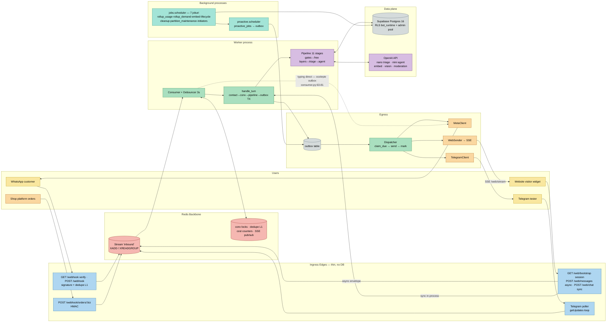

**Metadata (noduri cheie):**

| Nod                  | Fișier                                | Funcție               | Responsabilitate                                                            |
| -------------------- | -------------------------------------- | ---------------------- | --------------------------------------------------------------------------- |
| POST /webhook        | `src/webhook/app.py:81`              | `receive_webhook()`  | Verifică semnătura Meta, dedupe L1, XADD, ACK 200 <50ms                   |
| POST /webhook/orders | `src/webhook/app.py:127`             | `receive_order()`    | HMAC pe corp brut → envelope`kind=order` pe stream                       |
| POST /web/chat       | `src/web/app.py:190`                 | `web_chat()`         | Pipeline in-process, răspuns în același HTTP request                     |
| POST /web/messages   | `src/web/app.py:157`                 | `web_message()`      | Envelope neutru pe stream; reply prin SSE                                   |
| Telegram poller      | `src/channels/telegram/poller.py:70` | `poll_once()`        | getUpdates → envelope neutru pe stream                                     |
| Stream inbound       | `src/redis_bus.py:66`                | `enqueue_inbound()`  | XADD cu maxlen ~100k                                                        |
| Consumer             | `src/worker/consumer.py:333`         | `run_consumer()`     | XREADGROUP + debounce + reaper PEL                                          |
| handle_turn          | `src/worker/processor.py:200`        | `handle_turn()`      | Miezul turului: dedupe L2 → context → pipeline → outbox TX               |
| Pipeline             | `src/worker/runner.py:62`            | `run_pipeline()`     | Stagii în ordine fixă, early-exit pe reply/halt, măsoară                |
| Dispatcher           | `src/worker/dispatcher.py:325`       | `run_dispatcher()`   | Singurul punct de trimitere: outbox → ChannelSender                        |
| MetaClient           | `src/meta_client.py:28`              | `MetaClient`         | WhatsApp Cloud API send (text/template/typing)                              |
| TelegramClient       | `src/channels/telegram/client.py:78` | `TelegramClient`     | Bot API send + edit carusel                                                 |
| WebSender            | `src/channels/web/sender.py:34`      | `WebSender`          | Publish SSE pe`web:out:{visitor}` + backlog replay                        |
| Proactive            | `src/proactive/scheduler.py:253`     | `run_scheduler()`    | Joburi scadente → poartă consent/24h → outbox                            |
| Jobs scheduler       | `src/jobs/scheduler.py:132`          | `Job` loop           | rollup_usage · rollup_demand · embed_products · lifecycle · cleanup_dedupe · partition_maintenance · proactive_initiators |
| GET /webhook         | `src/webhook/app.py:62`              | `verify_webhook()`   | Handshake verificare Meta (token → challenge / 403)                        |
| GET /web/bootstrap   | `src/web/app.py:136`                 | `web_bootstrap()`    | Emite sesiunea vizitatorului (HMAC) + verificare Origin server-side         |
| Rich compose         | `src/worker/compose.py:344`          | `assemble()`         | Lanțul de grounding al căii bogate — v. Diagram 4c                       |
| Proactive gate       | `src/proactive/templates.py:83`      | `decide_proactive()` | Consent per kind + fereastra 24h + template aprobat — v. Diagram 10        |

---

## Diagram 2 — Application Startup

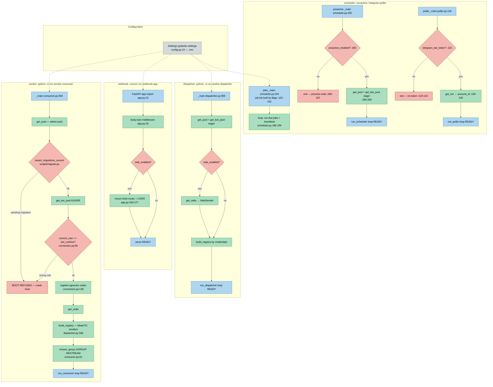

Evidență: poarta de boot pe migrări `src/worker/consumer.py:373-386`; assert rol `bot_runtime` `src/db/connection.py:96-107`; pool eager („parolă greșită crapă la boot, nu la primul mesaj") `src/worker/consumer.py:388`.
**Shutdown** (audit adversarial): worker `finally: close_media + close_redis + close_pool` (`consumer.py:397-401`); dispatcher idem (`dispatcher.py:286-289`). Singletoni lazy la runtime (nu la boot): `get_llm`, `get_media_registry` (`channels/media.py:34-43`), `SessionSecretCache` (`web/session.py:98-101`).

---

## Diagram 3 — User Message Workflow (async: WhatsApp / Telegram / web-SSE)

```mermaid
flowchart TD
  classDef edge fill:#aed6f1,stroke:#2874a6,color:#000
  classDef dec fill:#f9e79f,stroke:#b7950b,color:#000
  classDef step fill:#a9dfbf,stroke:#1e8449,color:#000
  classDef queue fill:#f5b7b1,stroke:#922b21,color:#000
  classDef db fill:#d5dbdb,stroke:#566573,color:#000
  classDef err fill:#f1948a,stroke:#922b21,color:#000

  MSG["Mesaj primit<br/>(WhatsApp / Telegram / site)"]:::edge
  CAP{"Mesajul e anormal de mare?<br/>(apărare anti-OOM) (app.py:99-101)"}:::dec
  R413["Refuzat: prea mare (413)"]:::err
  SIG{"Semnătura Meta e autentică?<br/>(webhook/app.py:103)"}:::dec
  JSONV{"E JSON valid? (:106-109)"}:::dec
  R400["Refuzat: cerere stricată (400)"]:::err
  R403["Refuzat: semnătură falsă (403)"]:::err
  DED1{"L-am mai văzut? — Meta re-trimite<br/>agresiv; doar MESAJELE se deduplică<br/>(redis_bus.py:53)"}:::dec
  SKIP1["Ignorat: e o dublură"]:::step
  XADD["Pus la coadă în Redis<br/>(limită ~100k — sub avalanșă cele mai<br/>vechi se PIERD) (redis_bus.py:68-73)"]:::queue
  RDOWN{"Redis e căzut?"}:::dec
  R503["503 → Meta va re-încerca"]:::err
  ACK200["Confirmăm către Meta imediat<br/>(sub 50ms)"]:::step

  XREAD["Un worker ia mesajul din coadă<br/>(consumer.py:245)"]:::step
  KIND{"Ce fel de eveniment e?<br/>(process_event :123, :155-158)"}:::dec
  TYPING["Arătăm «scrie...» instant (:74-81)"]:::step
  DEB["Așteptăm 3s să termine de scris —<br/>o rafală de mesaje devine UNUL<br/>(debounce.py:57)"]:::step
  ORDERK["Comandă nouă de pe site → o legăm<br/>de conversație (webhook/orders.py:64)"]:::step
  RESOLVE["Aflăm CĂRUI magazin îi aparține<br/>(canal → business) (consumer.py:145)"]:::db
  STATUSK["Notăm statusul: livrat / citit / eșuat"]:::db
  LOCK{"Conversația e deja în lucru?<br/>(lacăt per conversație)"}:::dec
  REQUEUE["Ocupat → repunem la coadă<br/>cu pauză (:96-102)"]:::queue
  DROPQ["Prea multe reîncercări → mesaj<br/>PIERDUT (doar log) (:99-100)"]:::err
  ADM{"Magazinul are loc liber?<br/>(frână de concurență) (:197-210)"}:::dec
  REQA["Peste capacitate → repus la coadă,<br/>NIMIC pierdut (:106-119)"]:::queue
  LOADB["Încărcăm magazinul + configurația<br/>lui de vertical (consumer.py:222)"]:::db
  CBK{"E o apăsare de buton (carusel)?"}:::dec
  CAROUSEL["Navigare în carusel — drum determinist,<br/>fără AI (callback.py:71)"]:::step

  HT["Începe procesarea turului<br/>(processor.py:200)"]:::step
  DED2{"Dublură scăpată de Redis?<br/>(plasa a doua, în DB) (:238)"}:::dec
  SKIP2["Ignorat: deja procesat"]:::step
  CTX["Încărcăm: cine e clientul, conversația,<br/>ultimele 8 mesaje, starea, faptele știute"]:::db
  SEEDC["Pornim contorul de cost al zilei (:336)"]:::step
  GUARD{"Magazinul a depășit bugetul zilnic<br/>de AI? (:116)"}:::dec
  NOLLM["AI oprit pe azi → răspundem degradat,<br/>dar RĂSPUNDEM"]:::err
  PIPE["Rulăm cele 12 stagii → Diagram 4a"]:::step
  REPLY{"A ieșit un răspuns?"}:::dec
  HALT["Tăcere intenționată — logată (:361)"]:::step
  DISC["Adăugăm disclaimerul, dacă e cazul (:368)"]:::step
  SPLIT{"Text prea lung (și nu e cu carduri)?"}:::dec
  FRAG["Îl spargem în maxim 2 mesaje"]:::step
  TX["Salvăm TOTUL dintr-o mișcare: mesajele +<br/>coada de trimis + starea discuției<br/>(:382-492)"]:::db
  POST["După răspuns, în fundal: cache, rezumat,<br/>profil, fapte noi — cu conexiunea DB<br/>deja eliberată (consumer.py:236 · aftercare.py:444)"]:::step

  DISP["Dispecerul (alt proces) ia din coadă<br/>ce e de trimis"]:::step
  RENDER{"Alegem forma după ce POATE canalul:<br/>carduri / carusel / șablon / text<br/>(dispatcher.py:101)"}:::dec
  SEND["Trimitem prin canal (Meta / Telegram)"]:::edge
  SENT["Marcat trimis + legăm id-ul de la<br/>provider (dispatcher.py:215)"]:::db
  FAIL["Eșec → reîncercăm cu pauze crescânde<br/>→ marcat mort (dispatcher.py:211)"]:::err
  RP["Notăm când forma cerută ≠ forma<br/>livrată (dispatcher.py:69-98)"]:::step

  MSG --> CAP
  CAP -- da --> R413
  CAP -- nu --> SIG
  SIG -- nu --> R403
  SIG -- da --> JSONV
  JSONV -- nu --> R400
  JSONV -- da --> DED1
  DED1 -- da --> SKIP1
  DED1 -- nu --> XADD --> RDOWN
  RDOWN -- da --> R503
  RDOWN -- nu --> ACK200
  XADD -.-> XREAD --> KIND
  KIND -- mesaj --> TYPING --> DEB
  KIND -- comandă --> ORDERK
  KIND -- "status / buton" --> RESOLVE
  DEB -- "trimite după 3s de liniște" --> RESOLVE
  RESOLVE --> STATUSK
  RESOLVE --> LOCK
  LOCK -- ocupat --> REQUEUE
  REQUEUE -- "limita depășită" --> DROPQ
  LOCK -- liber --> ADM
  ADM -- "peste capacitate" --> REQA
  ADM -- admis --> LOADB --> CBK
  CBK -- da --> CAROUSEL
  CBK -- nu --> HT --> DED2
  DED2 -- "deja procesat" --> SKIP2
  DED2 -- "revendicat" --> CTX --> SEEDC --> GUARD
  GUARD -- da --> NOLLM --> PIPE
  GUARD -- nu --> PIPE
  PIPE --> REPLY
  REPLY -- nu --> HALT
  REPLY -- da --> DISC --> SPLIT
  SPLIT -- da --> FRAG --> TX
  SPLIT -- nu --> TX
  TX --> POST
  TX -.-> DISP --> RENDER --> SEND
  SEND -- ok --> SENT --> RP
  SEND -- eroare --> FAIL
```

Calea **sincronă** `/web/chat` diferă doar la capete: sesiune HMAC + rate-limit fail-closed + gard de buget (`src/web/app.py:197-240`) → `handle_turn(deliver=False)` — fără outbox, răspunsul HTTP e transportul (`src/web/app.py:241-252`, `src/worker/processor.py:345,382-492`).

---

## Diagram 4a — Pipeline Routing Workflow (cele 12 stagii)

Ordinea stagiilor: `DEFAULT_STAGES`, `src/worker/runner.py:207-219`. Internele stagiului Agent → Diagram 4b.
*(Corectat după trace-ul invers: alias route-hit continuă spre agent, clarify are escaladare pe attempts, greeting rulează și după resume, handoff are ramura web→SALES, rate-limit are tăcere pe burst.)*

```mermaid
flowchart TD
  classDef stage fill:#a9dfbf,stroke:#1e8449,color:#000
  classDef dec fill:#f9e79f,stroke:#b7950b,color:#000
  classDef llm fill:#d7bde2,stroke:#6c3483,color:#000
  classDef free fill:#a3e4d7,stroke:#148f77,color:#000
  classDef err fill:#f1948a,stroke:#922b21,color:#000
  classDef out fill:#aed6f1,stroke:#2874a6,color:#000

  IN["Mesajul intră în pipeline"]:::stage

  subgraph G["1 · Porți — cod pur, fără AI (gates.py:439)"]
    G1{"Botul e oprit pe conversația asta?<br/>Clientul e blocat? A preluat un om?<br/>(:442-453)"}:::dec
    G2{"Trimite prea multe mesaje? (:323)"}:::dec
    G3{"Mesaj abuziv? — moderare automată (:348)"}:::llm
    MODB["Prea multe abateri în 24h →<br/>contactul e blocat (:305-318)"]:::err
    G4{"Semne de risc: amenințare legală,<br/>cere explicit un om? (:468)"}:::dec
    G5{"A trimis o poză? (:482)"}:::dec
    VIS["AI descrie poza → devine text de căutare<br/>(dacă pică, păstrăm descrierea clientului)<br/>(:385-436)"]:::llm
    GRD["Curățăm mesajul: tăiem excesul,<br/>mascăm datele personale (:487)"]:::stage
  end

  HALT["TĂCERE intenționată — nu răspundem<br/>(un om se ocupă / rafală de spam)"]:::err
  THR["Îi spunem O singură dată<br/>«hai mai încet» (:340-342)"]:::out
  NEU["Răspuns neutru, fără discuție"]:::out
  ESC["Chemăm un operator + mesaj de tranziție<br/>(gates.py:473-476)"]:::out

  LANG["2 · Detectăm limba: RO / HU / EN<br/>(language.py:27)"]:::stage

  subgraph CL3["3 · Reluăm clarificarea începută (clarify.py:28)"]
    CLR{"Îi pusesem o întrebare turul trecut?"}:::dec
    CONS["Răspunsul lui completează formularul:<br/>buget, nevoie, categorie (:41-52)"]:::stage
    ATT{"A răspuns vag de prea multe ori? (:59)"}:::dec
    RESUME["Reluăm de unde rămăsese<br/>(ruta salvată) (:69-73)"]:::stage
    ESCR["Prea multe încercări → om<br/>sau vânzare (:61-62)"]:::stage
  end

  GREET{"4 · E doar un salut? («bună»)<br/>(greeting.py:184)"}:::dec
  WELCOME["Mesaj de bun venit scris de noi — fără AI"]:::free
  ALIAS{"5 · Frază pe care o știm exact?<br/>(alias aprobat) (alias.py:46)"}:::dec
  AFAQ["Servim răspunsul pregătit dinainte (:64-72)"]:::free
  AROUTE["Știm doar ÎNCOTRO merge (ruta),<br/>nu și răspunsul (:73-82)"]:::stage
  SKIPS["Sărim cache / FAQ / triaj —<br/>ruta e deja știută<br/>(cache.py:93 · faq.py:49 · triage.py:214)"]:::stage
  CACHE{"6 · Am mai răspuns la o întrebare<br/>aproape identică? (cache semantic)<br/>preț/stoc se re-verifică, nu se servesc orb<br/>(cache.py:46-100)"}:::dec
  CHIT["Servim răspunsul din memorie — fără AI"]:::free
  FAQ{"7 · Se potrivește cu o întrebare<br/>frecventă? (prag + rerank) (faq.py:45-101)"}:::dec
  FHIT["Servim răspunsul din FAQ"]:::free

  TRI["8 · AI-ul MIC clasifică mesajul:<br/>vânzare / comandă / simplu / neclar<br/>(triage.py:293)"]:::llm
  TPARSE{"JSON-ul de la nano trece de schemă?<br/>(triage.py:329-336)"}:::dec
  TCAT["Categoria INVENTATĂ se aruncă tăcut<br/>(category_key=None) — ruta CONTINUĂ,<br/>NU cade în plasa finală (triage.py:339)"]:::step
  TGUARD{"Întrebare cu cifre/fapte deghizată<br/>în «simplu»? (:261)"}:::dec
  TCONF{"AI-ul e nesigur pe clasificare? (:272)"}:::dec
  ROUTE{"Încotro merge mesajul?"}:::dec
  SIMPLE["AI-ul mic răspunde direct<br/>+ butoane de continuare (:298-308)"]:::out
  CLARIFY["Punem O întrebare de clarificare<br/>+ variante de răspuns (:309-319)"]:::out

  HOFF{"9 · Canalul are operator uman?<br/>(handoff.py:39)"}:::dec
  HESC["Anunțăm operatorul + îi confirmăm<br/>clientului (:44-49)"]:::out
  HSUP["Pe site nu e operator → tratăm<br/>ca vânzare (:40-42)"]:::stage

  AGENT["10 · AI-ul MARE: caută în catalog și<br/>compune recomandarea → Diagram 4b<br/>(stages/agent.py:347)"]:::llm
  FB["11 · Plasa finală: nimic n-a produs răspuns →<br/>punem o întrebare de clarificare<br/>(runner.py:169)"]:::out
  SEND["Răspunsul pleacă spre client<br/>(un singur punct de ieșire)"]:::out

  IN --> G1
  G1 -- da --> HALT
  G1 -- nu --> G2
  G2 -- "prima dată peste limită" --> THR
  G2 -- "rafala continuă (:343)" --> HALT
  G2 -- nu --> G3
  G3 -- da --> MODB --> NEU
  G3 -- nu --> G4
  G4 -- "da + canal cu operator" --> ESC
  G4 -- "da, fără operator → continuăm (:470)" --> G5
  G4 -- nu --> G5
  G5 -- da --> VIS --> GRD
  G5 -- nu --> GRD
  GRD --> LANG --> CLR
  CLR -- da --> CONS --> ATT
  ATT -- da --> ESCR --> GREET
  ATT -- nu --> RESUME --> GREET
  CLR -- nu --> GREET
  GREET -- da --> WELCOME
  GREET -- nu --> ALIAS
  ALIAS -- "țintă: răspuns FAQ" --> AFAQ
  ALIAS -- "țintă: rută / produs / categorie" --> AROUTE --> SKIPS --> ROUTE
  ALIAS -- nu --> CACHE
  CACHE -- da --> CHIT
  CACHE -- nu --> FAQ
  FAQ -- da --> FHIT
  FAQ -- nu --> TRI --> TPARSE
  TPARSE -- "schemă invalidă / apel eșuat → return, ctx.route rămâne None" --> FB
  TPARSE -- ok --> TCAT --> TGUARD
  TGUARD -- "da → vânzare" --> ROUTE
  TGUARD -- nu --> TCONF
  TCONF -- "da → clarificare" --> ROUTE
  TCONF -- nu --> ROUTE
  ROUTE -- "simplu + are răspuns" --> SIMPLE
  ROUTE -- "simplu, fără text (:298)" --> FB
  ROUTE -- clarificare --> CLARIFY
  ROUTE -- "cere om" --> HOFF
  HOFF -- da --> HESC --> SEND
  HOFF -- "nu — site" --> HSUP --> AGENT
  ROUTE -- "vânzare / comandă" --> AGENT
  AGENT -- "răspuns compus" --> SEND
  AGENT -- "AI-ul a picat → fără răspuns (:370)" --> FB
  FB --> SEND
  SIMPLE --> SEND
  CLARIFY --> SEND
  WELCOME --> SEND
  CHIT --> SEND
  FHIT --> SEND
  AFAQ --> SEND
```

---

## Diagram 4b — Agent Stage Internals (fazele A–F după modularizare)

Monolitul `agent.py` (1411 linii) a fost spart în 19 module `src/agent/*` (NX-142/143/144).
`agent_stage` ([src/worker/stages/agent.py:347](../src/worker/stages/agent.py)) a rămas **doar
regia**: A→B→C→D → `build_plan` → `render`.

| Fază | Unde trăiește | Ce decide |
| --- | --- | --- |
| **A · Regie + siguranță** | `stages/agent.py:347` · `_persist_safety_context:296` | Porți de intrare (fără LLM / rută ≠ sales,order / mesaj gol → no-op). Persistă contextul de siguranță ÎNAINTE de orice cale care servește produse |
| **B · Intenții pre-loop** | `deterministic.py:573` (`try_pre_intents`) | Link / comparație / detaliu / recenzii pe setul deja afișat → răspuns determinist, **$0 inferență** |
| **C · Compunerea promptului** | `prompt_builder` · `merge_constraints:126` · `context.py` | System GENERAT din DB (P9); stiva de constrângeri multi-tur; hint-uri per-tur (filtre, cumpărare, lead score) |
| **D · Bucla de tool-uri** | `llm.py:341` (`run_tool_loop`) · `tool_executor.py` (`ToolRun`) | Modelul alege tool-urile. Capul dur e pe **runde de model** (`max_steps=3`), NU pe numărul de apeluri — o rundă poate emite N tool calls și toate se execută (`_run_tool_calls`, `llm.py:128`). Vezi „Bugetul real” mai jos. `show_more` ocolește complet bucla → paginare deterministă |
| **E · Planner** | `planner.py:182` (`build_plan`) | Shaping determinist post-loop → `ResponsePlan`. Patru căi aduc produse din DB **în afara** `ToolRun` — fiecare cu gate de siguranță propriu |
| **F · Render** | `finalize.py:325` (`render`) | Comparație → rich → proză → order → no-result. Validator + retry + fallback determinist |

**Invariantul central:** modelul nu are ultimul cuvânt pe cifre și linkuri. Fazele E și F sunt cod
determinist peste `ctx.retrieval`; validatorul respinge orice preț/link/număr care nu e în retrieval.

**Bugetul real al buclei — trei numere diferite, nu unul** (NX-250, măsurat pe `ba1e44f`).
„Max 3 tool calls per tur” a circulat ani în CLAUDE.md și în diagrama asta. E **fals**, și cele două
teste care există deja în repo o dovedesc împreună:

| Buget | Valoare pe calea LIVE | Unde se impune | Dovadă |
|---|---|---|---|
| **runde de model** | 3 (cap dur) | `llm.py:364` — `for _ in range(max_steps)`, `max_steps=3` implicit (`llm.py:348`), nesuprascris la apel (`stages/agent.py:473`) | `tests/test_llm_tool_loop.py::test_loop_caps_at_max_steps_then_forces_text` — a 4-a rundă e forțată FĂRĂ tools |
| **tool calls / tur** | **NEplafonat** | nicăieri: `_run_tool_calls` (`llm.py:128`) execută TOATE apelurile emise într-o rundă | `tests/test_llm_tool_loop.py::test_loop_runs_multiple_tool_calls_in_one_step` — o rundă, două tool-uri, ambele executate |
| **search calls / tur** | **NEplafonat** | nu există contor per-tool pe calea live | — |

Testul de cap numără 3 execuții doar fiindcă scenariul lui emite exact un tool call per rundă;
nu demonstrează un plafon de apeluri. Probă adversarială NX-250: 3 runde × 3 tool calls
⇒ **9 execuții** sub „max 3”.

Plafoanele SEPARATE (`max_model_rounds` / `max_tool_calls` / `max_mutations` / `max_repair_calls`,
per clasă de tur) există în `src/runtime/turn_budget.py` (NX-241), dar sunt **dormante**:
`turn_budget_enforced=false`. Vezi `docs/architecture/04-EVIDENCE.md`.

**Privirea de sus — cele șase faze.** Patru din șase nu cheamă niciun model:

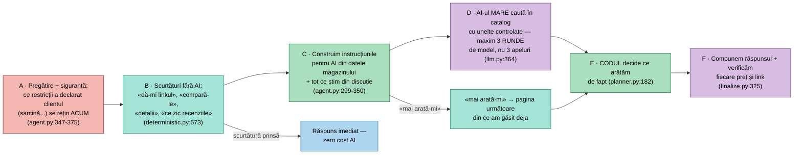

**Faza E nu e un arbore — e o listă de precedență.** Primul caz care se potrivește câștigă;
orice cale care aduce produse din DB ocolind uneltele trece prin propriul filtru de siguranță:

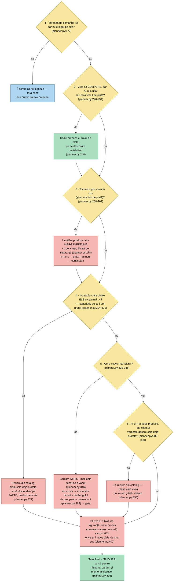

**Faza F — cum se alege forma răspunsului**, cu căderi în trepte (comparație → carduri → text):

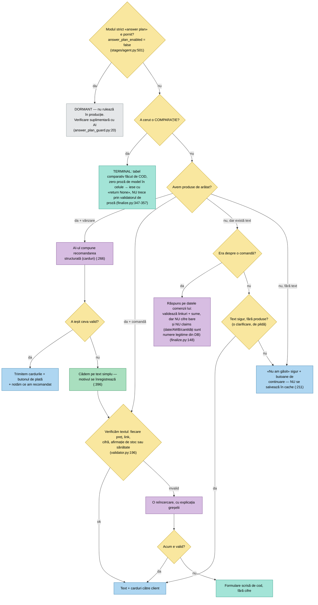


**Cele patru căi care ocolesc `ToolRun`** (cross-sell, superlativ, „mai ieftin", rehidratare) aduc
produse direct din DB. Fiecare are `policy.gate` propriu, iar `retrieval_final`
([planner.py:402](../src/agent/planner.py)) e plasa de siguranță: idempotent pe un set deja filtrat,
dar prinde orice cale VIITOARE care uită gate-ul. Fără el, un `cart_add` perfect sigur putea trage
un complement contraindicat.

**`unmet_query` cu `reason="price_gap"`** ([planner.py:362](../src/agent/planner.py)) e marcat exact
unde se știe că turul a fost o intenție de preț. Din rollup n-ai cum să distingi post-hoc „n-am găsit
nimic" de „n-am găsit nimic mai ieftin" — de aceea faptul se scrie la sursă, nu se inferă.

Memoria (istoric / profil / state / rezumat) intră în prompturi prin `conversation_transcript` +
`context_blocks` ([src/worker/context.py:23](../src/worker/context.py)). System-promptul agentului e
GENERAT din DB ([src/agent/prompt_builder.py](../src/agent/prompt_builder.py), principiul 9).

---

## Diagram 4c — Rich Composition & Grounding (compose.py — adăugată la auditul adversarial)

Echivalentul validatorului pentru calea BOGATĂ: modelul emite DOAR cuvinte + referințe `product_id`; codul hidratează faptele. Garanția anti-halucinație a căii care servește majoritatea recomandărilor.

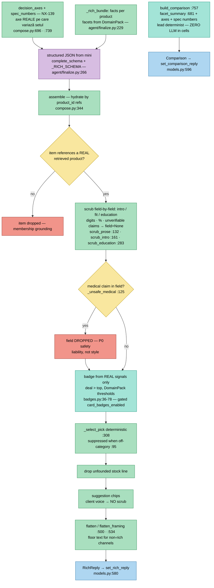

Cine o folosește: `_finalize_rich` (agent/finalize.py:266-311, recomandare + cross-sell) și randorul web (`flatten_framing` la `channels/web/render.py:127`). Comparația (CMPB) e apelată din ambele căi de compare (`agent/deterministic.py:422, :455` și `agent/finalize.py:348`).

---

# Stage 1 · WebWidget v2 — 04a / 04b1 / 04b2 / 04b3 / 04c

> ## ⚠️ CITEȘTE ÎNTÂI: aceste cinci diagrame NU descriu ce rulează
>
> **Diagramele 1–10 de mai sus = calea care servește clienți.** Cele cinci de aici = topologia
> Stage 1 (NX-232→249), **construită și merged, dar dormantă prin flag ȘI absentă din artefactul
> deployat**. Măsurat 2026-08-18 pe `ba1e44f`: producția întoarce 404 pe `POST /web/v2/turns` și pe
> `/health/*` (montat NEcondiționat), în timp ce `POST /web/chat` întoarce 422 ca local.
>
> NX-250 cerea aceste diagrame ca **as-built după cutover**. Cutoverul nu a avut loc, deci ele sunt
> livrate ca **topologie ȚINTĂ evidențiată**, nu ca as-built: fiecare element are simbol real în cod
> la SHA, dar statusul de runtime al fiecăruia este `OPTIONAL/OFF`, nu `LIVE_V2`. Cardul cere
> explicit acest tratament pentru muchii dormante („`OPTIONAL/OFF` cu config evidence, nu `LIVE`").
>
> **Inversiunea față de card:** cardul presupunea „v1 = LEGACY, v2 = live" și cerea o secțiune mică
> pentru v1. Realitatea e inversă — v1 e **LIVE**, v2 e dormant — deci raportul e inversat, nu
> cosmetizat. Registrul complet node/edge/invariant + verdictul:
> [`architecture/04-EVIDENCE.md`](architecture/04-EVIDENCE.md).

**Legenda de status**, folosită în toate cele cinci (statusul e scris și în TEXT, nu doar în
culoare — o diagramă nu are voie să depindă exclusiv de culoare):

| Marcaj | Înseamnă |
|---|---|
| `[OFF]` | cod real, poartă de flag stinsă în default; **și** absent din imaginea deployată |
| `[OFF*]` | ca `[OFF]`, dar flagul cere alt flag pornit înainte (poartă compusă, validată la boot) |
| `[LIVE]` | rulează azi în producție (apare doar unde v2 refolosește o piesă v1) |
| `[EXT]` | sistem extern (browser, provider) — nu e cod al nostru |
| `[UNVERIF]` | nu a putut fi verificat la acest SHA (vezi 04c: repo FE inaccesibil) |

---

## Diagram 11 — Stage 1 · 04a · Web ingress, durabilitate, serializare, recovery [DORMANT]

Traseul unui tur v2 de la browser până la rezultatul terminal, **cu Postgres ca AUTORITATE** și
Redis ca simplă trezire. Ce trebuie citit din diagramă: acceptul e idempotent prin cheie de ledger,
execuția e at-least-once cu fencing pe lease, iar SSE **nu** e autoritate — dacă un event se pierde,
`GET` reconstruiește același rezultat din ledger.

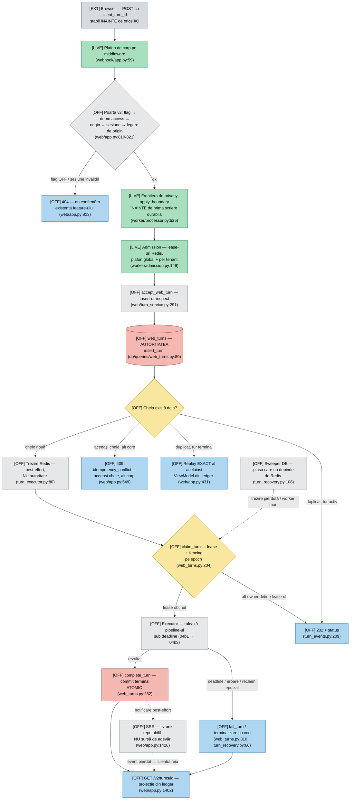

**Invarianții pe care îi susține 04a** (fiecare cu rândul lui în registru):

| Invariant | Cum e susținut | Ce NU promite |
|---|---|---|
| accept idempotent | cheie de ledger + `insert-or-inspect`; duplicat terminal ⇒ replay identic | că browserul trimite o singură dată |
| maximum un owner care execută | `claim_turn` cu lease + fencing pe epoch | că pipeline-ul rulează o singură dată |
| Postgres e autoritatea | `GET` reconstruiește rezultatul fără Redis; sweeper-ul nu depinde de trezire | că Redis livrează eventul |
| commit terminal atomic | rândurile din aceeași tranzacție, all-or-nothing | atomicitate peste API extern |
| niciun drum fără ieșire (P6) | orice ramură ajunge în `COMMIT` sau `FAILT`, ambele proiectate de `GET` | tăcere pe deadline (v. Gates) |

---

## Diagram 12 — Stage 1 · 04b1 · TurnSnapshot, stare/referinta, alegerea caii [DORMANT]

De la contextul ID-only trimis de browser până la decizia „cine răspunde": kernel de acțiune,
fast path determinist, sau agentul principal. **Frontendul nu furnizează fapte comerciale și nu
furnizează tenantul** — un câmp comercial în `context` e respins cu 422.

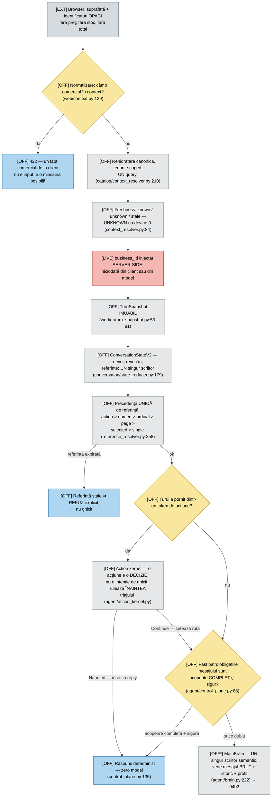

**De ce fast path-ul e o poartă de COD, nu o optimizare de model:** poate încheia turul singur DOAR
pentru clasa „factual exact și sigur". Orice obligație neacoperită ⇒ agentul. `UNKNOWN ≠ MISMATCH`:
o valoare necunoscută nu se rotunjește la zero și nu devine un „nu se potrivește".

---

## Diagram 13 — Stage 1 · 04b2 · Query/tools, EvidenceBundle, AnswerPlan [DORMANT]

Aici trăiesc **cele trei bugete separate** pe care le confunda documentația veche. Diagrama le
arată distinct, cu simbolul care le impune.

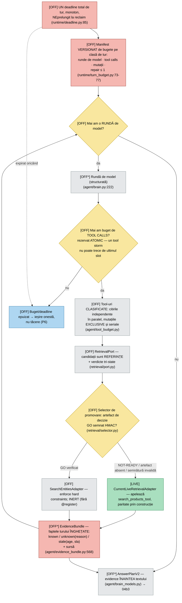

**Cele trei bugete, explicit** (motivul pentru care „max 3 searches" era o formulare falsă):

| Buget | v2 (dormant) | v1 (live azi) |
|---|---|---|
| runde de model | `max_model_rounds`, per clasă de tur (1/2/3/2) | 3, cap dur (`llm.py:364`) |
| tool calls | `max_tool_calls`, per clasă (2/4/6/4), rezervat atomic | **NEplafonat** |
| mutații | `max_mutations` (0/0/0/2), EXCLUSIVE și seriale | neclasificate |
| repair | `max_repair_calls` ≤ 1, validat la construcție | 1 retry de validator |

---

## Diagram 14 — Stage 1 · 04b3 · Validare, proiectie, rezultat atomic [DORMANT]

Poarta de adevăr și commit-ul. Punctul cheie: **grounding-ul respinge, nu doar omite** — o cifră
fără sursă în fapte invalidează răspunsul, nu se șterge tăcut din el.

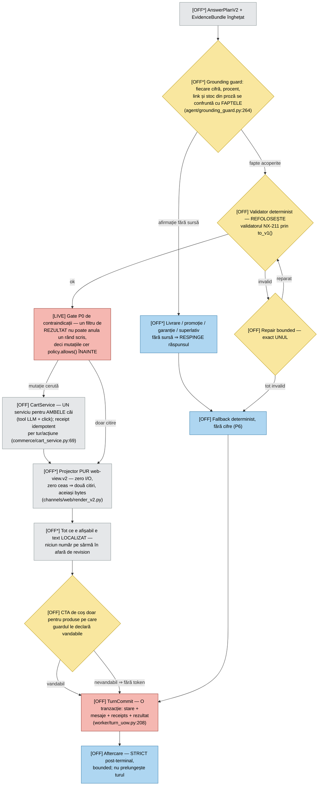

**Convergența cerută de card:** recomandare, comparație, no-result, order și acțiune ajung TOATE în
`COMMIT`, dar **nu prin același validator** — comparația și order-ul au gate propriu și pe calea v1
(vezi discrepanțele 10 de mai jos). Diagrama arată gate-ul comun de grounding, nu pretinde un
validator unic acolo unde codul are trei.

---

## Diagram 15 — Stage 1 · 04c · Frontend pasiv, single-flight [UNVERIFIED]

> **`[UNVERIF]` — limita onestă a acestei diagrame.** Implementarea trăiește în repo-ul FE separat
> (`Sales MVP Frontend Final`), care **nu e accesibil din acest repo**, iar DoR-ul NX-250 „frontend
> SHA disponibil read-only" e neîndeplinit. Ce urmează e **contractul văzut dinspre backend** —
> ce acceptă și ce emite serverul — nu o verificare a codului FE. Nicio afirmație despre interiorul
> browserului nu are aici dovadă de cod.

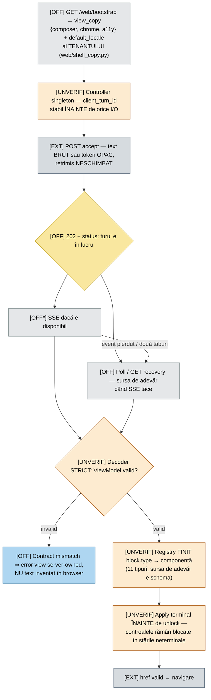

**Boundary-ul, ca listă de interdicții** (ce NU are voie să existe în 04c): intent, routing,
retrieval, ranking, merge de memorie, preț/stoc/reducere/total calculate în browser, mutație de coș,
parsare semantică de chip, greeting/disclaimer/fallback/progres inventat, asignare de release.
NX-244 a scos din calea v2 exact clasa asta de logică (`Intl`/`Math.round` pe preț, ton dedus cu
regex, thinking simulat cu timere, coș pe `localStorage`, sugestii hardcodate). **Verificarea acelei
eliminări s-a făcut în repo-ul FE, nu aici** — de aceea nodurile de mai sus rămân `[UNVERIF]` până
când un SHA de frontend intră în evidence.

---

## v1 — statusul REAL (nu „legacy")

Cardul cerea o secțiune mică pentru v1 ca `LEGACY/DISABLED`. Măsurătoarea spune altceva, deci
raportăm altceva:

| Fapt | Stare măsurată |
|---|---|
| `POST /web/chat` | **LIVE** — 422 pe corp gol, în producție și local |
| calea de randare v1 | **LIVE** — `channels/web/render.py`, contractul din `FRONTEND-CONTRACT-IZI.md` |
| rutele `/web/v2/*` | **absente din producție** (404, nu 422) |
| `/health/*` (NX-248) | **absente din producție** (404, deși montate necondiționat) |
| fereastră de rollback | **N/A** — nu există release manifest, deci nici `previous_digest` |
| v1 „disabled dar păstrat pentru rollback" | **fals** — v1 nu e disabled; e singurul care servește |

**Nicio muchie v1↔v2 în frontend.** Selecția e la BUILD (`VITE_CHAT_PROTOCOL_V2` comparat literal ⇒
Rollup elimină ramura moartă), deci buildul v2 nu conține v1 — verificat prin scan pe `dist/`, în
repo-ul FE.

---

## Diagram 5 — Product Search Workflow

Calea LIVE a lui `search_products` ([catalog_tools.py:646](../src/tools/catalog_tools.py)).
NX-208 (query understanding) NU e aici: expansiunile rulează doar în shadow
(`query_spec_shadow`, OFF) și în benchmark-ul offline — calea servită primește query-ul modelului.

```mermaid
flowchart TD
  classDef step fill:#a9dfbf,stroke:#1e8449,color:#000
  classDef dec fill:#f9e79f,stroke:#b7950b,color:#000
  classDef llm fill:#d7bde2,stroke:#6c3483,color:#000
  classDef db fill:#d5dbdb,stroke:#566573,color:#000
  classDef out fill:#aed6f1,stroke:#2874a6,color:#000
  classDef safe fill:#f5b7b1,stroke:#922b21,color:#000

  Q["AI-ul cere o căutare în catalog<br/>(catalog_tools.py:646)"]:::step
  CONC["Traducem vorbele clientului în chei de<br/>catalog: «ten gras» → oily (:662)<br/>+ ingrediente cerute: «cu niacinamidă» (:665-670)"]:::step
  INH{"Căutare în aceeași discuție,<br/>fără categorie nouă? (:681)"}:::dec
  INHERIT["Păstrăm raftul curent — un typo<br/>(«mai ifetin») nu ne mai aruncă<br/>pe alt raft (:683-690)"]:::step
  FP{"E exact aceeași căutare<br/>ca data trecută? (:698)"}:::dec
  PAGE["Pagina următoare din ce am găsit<br/>deja — fără AI, fără cost (:594)"]:::step

  LADDER["Plan de rezervă: ce criterii slăbim,<br/>în ce ordine, dacă nu iese nimic (:702)"]:::step
  EMB{"Avem AI + vectori pregătiți? (:713)"}:::dec
  VEC["Înțelesul frazei → vector<br/>(UN singur apel) (:715)"]:::llm
  LEX["Căutare pe CUVINTE în catalog (:731)"]:::db
  SEM["Căutare pe ÎNȚELES în catalog (:749)"]:::db
  FUSE["Combinăm cele două liste<br/>într-un singur clasament (:770)"]:::step
  ANY{"Am găsit ceva la pasul ăsta?"}:::dec
  RELAX["Slăbim următorul criteriu secundar<br/>(brandul cerut NU se slăbește niciodată)"]:::step
  EXH{"Am epuizat planul de rezervă?"}:::dec
  EMPTY["Chiar nu există → AI-ul spune cinstit<br/>«nu am găsit» (finalize.py:203)"]:::out

  SAFE["FILTRU de contraindicații pe TOT setul,<br/>ÎNAINTE să-l ținem minte (:786)"]:::safe
  DIV{"Sortare pe relevanță și nu caută<br/>un produs anume? (:792)"}:::dec
  DIVER["Prima pagină acoperă ieftin / mediu /<br/>scump + branduri diferite —<br/>nu 6 clone (:798)"]:::step
  PAGE1["Prima pagină: maxim 6, fără cele<br/>deja arătate clientului (:807)"]:::step
  TEL["Notăm CEREREA pentru comerciant: ce s-a<br/>căutat și ce NU s-a găsit — produs lipsă /<br/>variantă lipsă / nimic (:826-897)"]:::step
  SESS["Ținem minte restul rezultatelor<br/>pentru «mai arată-mi» (:901-908)"]:::db
  BRAND{"A cerut un brand pe care<br/>nu-l avem deloc? (:921)"}:::dec
  BDISC["Spunem cinstit «nu lucrăm cu brandul X» —<br/>NU îi prezentăm altul drept al lui (:922-930)"]:::out
  RC["Fiecare produs primește motivul potrivirii +<br/>scoatem ce e nerecomandat pentru el (:952-955)<br/>produs numit inexistent → spunem clar (:934-942)"]:::step
  RES["Rezultat: produsele complete merg la<br/>verificator, AI-ul vede rezumatul<br/>compact (max 6 × 8 câmpuri)"]:::out

  Q --> CONC --> INH
  INH -- da --> INHERIT --> FP
  INH -- nu --> FP
  FP -- da --> PAGE --> RES
  FP -- nu --> LADDER --> EMB
  EMB -- da --> VEC --> LEX
  EMB -- nu --> LEX
  LEX --> SEM --> FUSE --> ANY
  ANY -- nu --> EXH
  EXH -- nu --> RELAX --> LEX
  EXH -- da --> EMPTY
  ANY -- da --> SAFE --> DIV
  DIV -- da --> DIVER --> PAGE1
  DIV -- nu --> PAGE1
  PAGE1 --> TEL --> SESS --> BRAND
  BRAND -- da --> BDISC
  BRAND -- nu --> RC --> RES
```

Degradare: `embed` picat → `query_vec=None` → lexical-only (`catalog_tools.py:716-717`); semantic
picat în tur → rămâne lexical (`:764-765`). Poziția gate-ului de siguranță (`:786`) e esențială:
filtrat DUPĂ pool, un produs contraindicat ar rămâne în `active_search.pool` și ar reapărea la
„arată-mi altele". `unmet_query` e emis și pe căile CU rezultate (produs numit absent → alternativele
se servesc, dar golul de catalog tot se înregistrează).

---

## Diagram 6 — Conversation Memory Workflow

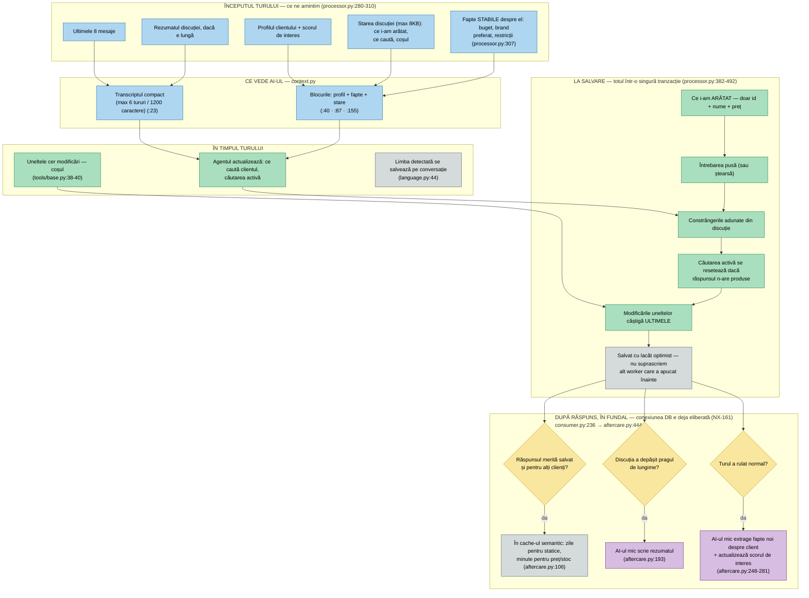

Facts memory (NX-148/160) e LIVE: migrările 023/024 sunt aplicate, `conversation_facts_enabled=true`,
iar blocul de facts intră în prompturi între profil și state ([context.py:155](../src/worker/context.py)).
Doar facts cu `visibility='inject'` ajung în prompt — PII/medical filtrate la sursă.

---

## Diagram 7 — Database Workflow

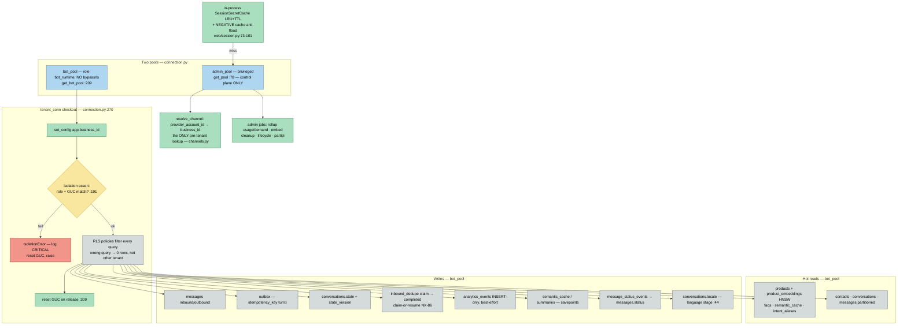

Tranzacția Sender (mesaje + outbox + state + dedupe-complete, atomic): `src/worker/processor.py:382-492`. Scrierile best-effort (analytics, cache, rezumat) rulează în `try/except` propriu, cu tranzacții imbricate unde e nevoie (`aftercare.py:72-87, :165, :227`) — un eșec se loghează, turul continuă.

---

## Diagram 8 — External Services Workflow

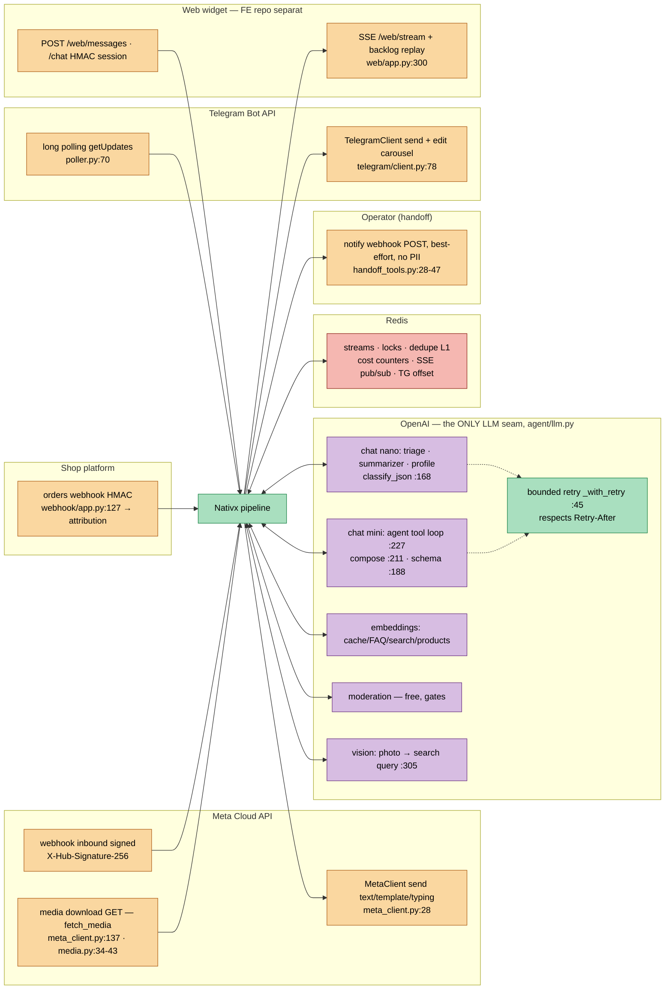

> %% UNVERIFIED: repo-ul frontend al widget-ului („Sales MVP Frontend") e extern acestui codebase;
> contractul JSON e documentat în `docs/FRONTEND-CONTRACT-IZI.md`, dar implementarea FE nu poate fi
> verificată de aici.

---

## Diagram 9 — Error Handling Workflow

```mermaid
flowchart TD
  classDef err fill:#f1948a,stroke:#922b21,color:#000
  classDef dec fill:#f9e79f,stroke:#b7950b,color:#000
  classDef ok fill:#a9dfbf,stroke:#1e8449,color:#000
  classDef deg fill:#fad7a0,stroke:#af601a,color:#000

  subgraph LLMErr["LLM failures"]
    L1["API error / 429"]:::err
    L2{"bounded retry ok?<br/>llm.py:45"}:::dec
    L3["triage fail → route None<br/>triage.py:316"]:::deg
    L4["agent loop fail → return<br/>stages/agent.py:370"]:::deg
    L5["fallback_stage: clarify question<br/>NEVER silence — runner.py:169"]:::ok
  end

  subgraph ValErr["Validator failures — agent/validator.py:196"]
    V1{"reply valid? prices/links/claims"}:::dec
    V2["1 retry with allowed prices<br/>finalize.py:94-148"]:::deg
    V3{"valid now?"}:::dec
    V4["deterministic reply from DB products<br/>finalize.py:94-148"]:::ok
  end

  subgraph CostErr["Cost guard — limits.py:59-91 · processor.py:116"]
    C1{"daily cap business/contact hit?"}:::dec
    C2["llm=None: gates + cache still work<br/>LLM stages skip"]:::deg
  end

  subgraph InfraErr["Infra failures"]
    I1["Redis down at webhook → 503, Meta retries<br/>webhook/app.py:127-128"]:::err
    I2["cache/FAQ error → miss, turn continues<br/>cache.py:169"]:::deg
    I3["analytics fail → log only<br/>aftercare.py:86"]:::deg
    I4["conv lock busy → requeue capped<br/>consumer.py:96-102"]:::deg
    I5["consumer crash mid-turn → un-ACKed<br/>reaper XAUTOCLAIM re-claims :293"]:::ok
    I6["processing exception → ACK + log<br/>consumer.py:286-288 — WARNING: turn LOST"]:::err
    I7["requeue cap exceeded → event DROPPED<br/>consumer.py:99-100 — WARNING: turn LOST"]:::err
    I8["inbound stream maxlen ~100k trim →<br/>oldest LOST under backlog — redis_bus.py:68-73"]:::err
  end

  subgraph BgErr["Background process failures"]
    B1["proactive job crash → mark failed<br/>+ event, clean savepoint<br/>proactive/scheduler.py:214-227"]:::deg
    B2["maintenance job crash → log + skip,<br/>retry next interval — jobs/scheduler.py:117-118"]:::deg
    B3["poller getUpdates fail → log +<br/>sleep 3s + retry — poller.py:113-116"]:::deg
  end

  subgraph SendErr["Delivery failures — dispatcher"]
    S1{"send failed?"}:::dec
    S2["mark_failed → backoff retry :211"]:::deg
    S3{"attempts exhausted?"}:::dec
    S4["status dead — visible, not silent"]:::err
    S5["dispatcher dead between claim/mark →<br/>visibility timeout, row redeemed"]:::ok
  end

  subgraph Human["Human handoff"]
    H1["risk pattern / route handoff"]:::dec
    H2["request_human: set handoff_until + notify<br/>gates.py:473"]:::ok
    H3["next turns: gates → intentional silence"]:::deg
  end

  L1 --> L2
  L2 -- no --> L3 --> L5
  L2 -- no --> L4 --> L5
  V1 -- invalid --> V2 --> V3
  V3 -- no --> V4
  C1 -- yes --> C2
  S1 -- yes --> S2 --> S3
  S3 -- yes --> S4
  H1 --> H2 --> H3
```

---

## Diagram 10 — Proactive Lifecycle (adăugată la auditul adversarial)

Cele mai reglementate decizii din sistem (consent + fereastra 24h Meta) — 100% cod determinist, zero LLM (`templates.py`).

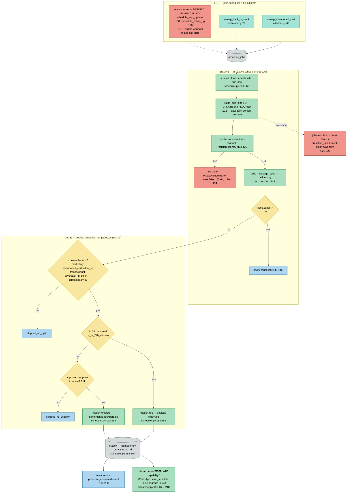

---

# Audit arhitectural (evidence-based)

## Discrepanțe documentație ↔ implementare (implementarea câștigă)

1. **CLAUDE.md e în urmă:** secțiunea „Structura proiectului" spune `stages/ … TODO: gates, free_layers; echo=fallback` — dar `gates.py`, `greeting.py`, `alias.py`, `cache.py`, `faq.py`, `clarify.py`, `handoff.py`, `language.py` există și sunt LIVE în `src/worker/runner.py:207-219`.
2. **Docstring stale în runner:** `src/worker/runner.py:8-10` descrie „un singur stagiu real (`echo_stage`)" — `echo_stage` nu există în `DEFAULT_STAGES`; pipeline-ul are 12 stagii.
3. **„Validatorul (stagiul 8)" din CLAUDE.md nu e stagiu separat:** trăiește în [`src/agent/validator.py`](../src/agent/validator.py) (`validate_prose:195`) și e chemat din faza F a agentului, nu ca stagiu al pipeline-ului. Comportamentul e cel documentat, structura diferă. *(Actualizat 2026-08-10: până la NX-142 erau funcții private în monolitul `agent.py` — de aceea R2 din tabelul de refactoring apare ca rezolvat.)*
4. **arch_explorer e ușor stale pe branch-ul curent:** raportează `agent_stage` la linia 858 și `triage_stage` la 179; în cod sunt la `stages/agent.py:347` și `triage.py:293`. Necesită re-rulare `arch_explorer/analyze.py`.
5. **`webhook/status.py` NU există** — CLAUDE.md îl listează ca LIVE; statusurile sunt parsate în `webhook/meta.py:104` (`parse_statuses`) și scrise de worker (`consumer.py:137-146`).
6. **STT/Whisper NU e implementat** — CLAUDE.md promite „vocale → STT (Whisper)"; `audio` e doar un tip de media parsat cu caption drept body (`webhook/meta.py:27,36-39`), ne-rutat spre vreo transcriere (gates rutează DOAR `image`, `gates.py:482`).
7. **Tool-ul `delivery_eta` NU există** — CLAUDE.md îl listează; registry-ul real are 10 tool-uri (grep `@register` în `src/tools/`), fără `delivery_eta`.

**Adăugate de auditul NX-250 (2026-08-18)** — detalii, dovezi și dispoziții în
[`docs/architecture/04-EVIDENCE.md`](architecture/04-EVIDENCE.md):

8. **„MAX 3 tool calls per tur" era FALS** (CLAUDE.md + Diagram 4b). Capul dur e pe **runde de model** (`llm.py:364`), nu pe apeluri: o rundă poate emite N tool calls și `_run_tool_calls` (`llm.py:128`) le execută pe toate. Măsurat: 3 runde × 3 apeluri ⇒ **9 execuții**. Cele două teste existente o dovedesc împreună (`test_loop_caps_at_max_steps_then_forces_text` + `test_loop_runs_multiple_tool_calls_in_one_step`). Plafoanele pe apeluri există în `src/runtime/turn_budget.py` (NX-241) dar sunt OFF.
9. **PII brut traversează frontiera de moderation** (P0-1). NX-230 a mutat mascarea înaintea primei scrieri durabile (`processor.py:525`), deci `messages.body` și istoricul sunt curate — dar `ctx.message.body` rămâne BRUT până la pasul 8 din `gates_stage`, iar moderarea (pasul 5) trimite exact acel corp la API-ul extern (`gates.py:357-360`).
10. **Calea de comparație nu trece prin validatorul de proză** — iese cu `return None` la `finalize.py:357`. Nu e un bug (celulele sunt compuse determinist din fapte de retrieval, zero proză de model), dar **nu e același gate**; docstring-ul lui `render` o spune deja explicit. Idem calea `order` (`_finalize_grounded`, `finalize.py:148`): validează linkuri + sume, dar cu `check_bare=False, check_claims=False`.

## Puncte forte

- **Pipeline liniar cu un singur owner per câmp** — runner generic; observabilitatea (latency + tokens per stagiu + buget per tur) e în runner, nu în stagii (`src/worker/runner.py:47-105`).
- **Un singur punct de ieșire, tranzacțional** — reply + outbox + state + dedupe-complete într-o singură TX (`src/worker/processor.py:382-492`); dispatcher cu visibility-timeout self-healing (`src/worker/dispatcher.py:8-13`).
- **Validatorul e apărarea load-bearing anti-halucinație și anti-prompt-injection** — orice preț/link/produs trebuie să existe în `ctx.retrieval` (`src/agent/validator.py:78-104`); degradarea finală e un reply determinist din DB (`src/agent/fallbacks.py:23`).
- **Izolare multi-tenant în straturi** — rol LOGIN fără bypassrls + GUC per checkout + assert de izolare la fiecare checkout (`src/db/connection.py:187-204, 274-287`); boot-gate pe migrări (`src/worker/consumer.py:315-321`).
- **Fiabilitate pe coadă** — dedupe 2 straturi (Redis + DB claim-or-resume), ACK-after-flush (`src/worker/debounce.py:11-15`), reaper XAUTOCLAIM (`src/worker/consumer.py:293-330`).
- **Cost governance pe 3 niveluri** — business/zi, contact/zi, vizitator web, reseed din `usage_daily`, enforcement post-increment fără TOCTOU (`src/worker/processor.py:308-379`).

## Puncte slabe / riscuri

1. **⚠ Cel mai serios: excepție de procesare = tur pierdut tăcut.** La orice excepție în `process_event`, consumer-ul face ACK și doar loghează (`src/worker/consumer.py:286-288`; la fel reaper-ul, per-intrare, `:308`). Meta a primit deja 200 → nu re-trimite. Clientul nu primește NIMIC — încălcare a principiului 6 exact pe calea de eroare pe care principiul o vizează. **A doua cale de pierdere (găsită la trace-ul invers):** lock ocupat persistent → după `conv_lock_max_requeues` evenimentul e DROPAT cu un simplu log (`consumer.py:99-100`). → **NX-140**
2. **`agent.py` e un god-module** — 1200+ linii; `agent_stage` (`:957+`) amestecă 3 intenții deterministe, bucla LLM, login-wall, checkout-fallback, cross-sell; validatorul + 3 căi de finalize în același fișier.
3. **Cuplaj maxim în processor** — `handle_turn` are fan-out 45 (cel mai mare din sistem, `arch_explorer/GRAPH_REPORT.md`) și ~300 linii: orchestrare + politică de state-merge + sender + post-tur.
4. **Ciclu de import gestionat manual** — stagiile importă `PipelineDeps` din runner sub `TYPE_CHECKING` (`src/worker/stages/gates.py:37-38`); runner-ul importă stagiile la sfârșitul fișierului (`src/worker/runner.py:189-199`).
5. **Conexiune DB ținută pe durata apelurilor LLM** — pipeline-ul rulează pe `conn` din `bot_pool` (max_size=10, `src/db/connection.py:224-229`) în timp ce agentul face 1-4 apeluri LLM (`src/worker/processor.py:345`); la fel `/web/chat` (`src/web/app.py:223-243`). Plafon ~10 tururi concurente/proces; pooler Supabase capat la ~15 sesiuni. **Bottleneck-ul #1 de scalare.** → **NX-141**
6. **Dispatcher secvențial + poll de 2s** — rând cu rând, tenant cu tenant (`src/worker/dispatcher.py:233-241`), sleep 2s la idle (`:245-251`). Un tenant lent întârzie toți ceilalți; +0-2s latență pe calea async.
7. **Fallback-ul final e doar în română** — `src/worker/runner.py:173-176`, deși pipeline-ul e RO/HU/EN și triage are `_CLARIFY_FALLBACK` per-locale (`src/worker/stages/triage.py:313`). Încalcă P11.
8. **SSL fără verificare pe orice win32** — `src/db/connection.py:56-73` dezactivează verificarea certificatului condiționat de platformă, nu de env. Prod e Linux → risc latent.
9. **Cuplaj src→scripts la runtime** — `src/worker/consumer.py:315` importă `scripts.migrate`; a produs deja incidentul Dockerfile (imagine fără `scripts/` → crash-loop, PR #132).
10. **Duplicare mică de asamblare context** — `history_block`/`context_block` construite identic în triage (`triage.py:223-226`) și agent (`stages/agent.py:309-312`).

**Circular dependencies:** doar ciclul runner↔stages gestionat prin late-import (pct. 4). **Dead code (corectat la auditul adversarial):** `estimate_turn_cost` (`src/worker/limits.py:186`) — definit, referit doar într-un comentariu (`processor.py:133`), înlocuit de costul real NX-125 → de șters. **Unreachable seams (intenționate, TODO):** `schedule_awb_update` (`initiators.py:160-187`) și `schedule_follow_up` (`initiators.py:190`) — definite, niciun apelant; webhook-ul de comenzi ar trebui să le cheme la expediere.

---

---

# Lentile

Aceleași 12 stagii, șase întrebări diferite. O lentilă nu adaugă noduri — recolorează scheletul
din Diagram 4a. Deciziile arhitecturale se iau pe lentile, nu pe topologie.

## Lentila 1 · COST — unde se duc banii pe tur

Zece puncte în care sistemul cheamă un model. Restul e cod determinist.

| Punct | Model | Când | Evitabil prin |
| --- | --- | --- | --- |
| Moderation | `omni-moderation-latest` | Gates, fiecare mesaj text | `moderation_enabled` |
| Vision | `gpt-5.4-mini` | Gates, doar imagini | `vision_enabled` |
| Embedding query | `text-embedding-3-small` | Cache + FAQ lookup | — (ieftin, e chiar mecanismul de economie) |
| Triaj | `gpt-5.4-nano` | Orice mesaj care trece de straturile gratuite | alias / cache / FAQ hit |
| Triaj compune „simple" | `gpt-5.4-nano` | Rută `simple` | — |
| Buclă tool-uri | `gpt-5.4-mini` | Rute `sales` / `order` | intenții pre-loop · `show_more` |
| Compunere rich | `gpt-5.4-mini` | Recomandare cu produse | — |
| Finalizare proză (+1 retry) | `gpt-5.4-mini` | Când rich eșuează sau ruta e order | — |
| Extractor profil | `gpt-5.4-nano` | Post-tur, async | `profile_extraction_enabled` |
| Summarizer | `gpt-5.4-mini` | Conversații > 20 mesaje | `summary_enabled` |

**Căile cu cost zero de inferență** (ținta: 40-60% din trafic): alias exact · cache semantic ·
FAQ · salut determinist · intenții pre-loop (link/compare/detaliu/recenzie) · paginare
`show_more` · tabel comparativ · căutarea „mai ieftin" · toate mesajele de fallback.

**Plafoane impuse în cod**, nu în prompturi: max 3 tool calls/tur · istoric max 8 mesaje ·
state ≤ 8KB (CHECK în DB ca plasă) · max 6 produse × 8 câmpuri în tool results · cost guard
zilnic per business (`cost_guard_enabled`, contor Redis; sursa de facturare rămâne `usage_daily`).
Prefixul de system e byte-identic între tururi → prompt caching (75-90% discount) — orice hint
per-tur se pune în USER, nu în prefix.

## Lentila 2 · DATE — un singur proprietar per câmp

Principiul 3 din CLAUDE.md e verificabil: fiecare câmp din `TurnContext` are exact un stagiu
care îl scrie. Când două vor să scrie același câmp, arhitectura e greșită.

| Câmp | Proprietar unic | Notă |
| --- | --- | --- |
| `language` | `language_stage` | Cheie în TOATE lookup-urile (faqs / semantic_cache / wa_templates) |
| `route` | `triage_stage` | Excepții documentate: `alias_stage` setează ruta fără reply; `handoff_stage` o rescrie în SALES pe canale fără operator; `clarify_resume` o restaurează; `action_kernel_stage` o fixează pentru o acțiune opacă (NX-236) |
| `action` | `processor` | Comanda deja autorizată la marginea web; kernelul o CITEȘTE, nu o produce |
| `retrieval` | `planner.build_plan` | Singurul scriitor — de aceea gate-ul de siguranță final stă tot acolo |
| `reply` | orice stagiu (early exit) | Un singur punct de IEȘIRE (Sender), dar multe puncte de decizie |
| `halt` | `gates_stage` | Tăcere INTENȚIONATĂ, fără reply — distinctă de „n-am produs nimic" |
| `from_cache` | `cache_stage` | — |
| `state.safety` | `agent_stage` (faza A) | Persistat de processor din `state_patch` |
| `state.search_constraints` | `agent_stage` (faza C) | Stiva multi-tur |

**State = ref-uri, nu obiecte** (P8): `displayed_products` ține `{product_id, name, price}`.
De aceea toate cele patru căi din faza E **rehidratează din catalog** înainte să judece —
un ref nu-și trădează retinalul în nume.

## Lentila 3 · EȘEC — unde poate ieși tăcere

Principiul 6 („niciodată tăcere") are un lanț de degradare explicit. Fiecare treaptă e cod, nu
speranță.

```
rich eșuat ──→ rich_downgraded ──→ proză
proză invalidă ──→ 1 retry cu feedback ──→ formulare deterministă fără cifre
buclă LLM eșuată ──→ no-op ──→ fallback_stage (întrebare de clarificare)
fără cheie LLM / cost guard depășit ──→ llm=None ──→ pipeline degradat, tot cu reply
tool eșuat ──→ commerce_note ──→ chips-urile nu promit acțiunea refuzată
zero rezultate ──→ mesaj sigur, cacheable=False ──→ chips de continuare
```

**Cele două locuri unde tăcerea e corectă**, ambele intenționate: `halt` din Gates (om a preluat
conversația / burst de rate-limit) și dedupe (retry Meta pe un mesaj deja procesat).

**Cache poisoning** e clasa de bug care revine: orice reply de tip „n-am găsit" trebuie
`cacheable=False`. Altfel un `hit_count` care crește servește „n-am găsit" la orice query similar,
sărind agentul. S-a întâmplat live pe demo.

## Lentila 4 · FLAG-URI — ce rulează de fapt

**86 de flag-uri bool** în `Settings`; **71 ON**, **15 OFF** by default. Lista exactă e în blocul
`claim:flags` — CI-ul cade dacă divergeaza. Ce contează arhitectural:

**Stratul shadow** — rulează în paralel cu producția, observă, nu atinge `reply`:
`query_spec_shadow_enabled` · `match_gate_shadow_enabled` · `search_shadow_enabled`.
Toate OFF. Asta e o dimensiune întreagă a sistemului pe care nicio diagramă de dinainte n-o arăta:
măsurăm calitatea căutării fără să riscăm răspunsul.

**Construit dar neactivat**: `answer_plan_enabled` (+ `_critic`, `_max_quality`) ·
`injection_screen_enabled` · `web_identity_enabled` · `ai_disclaimer_enabled` ·
`faq_locale_fallback_enabled` · `replay_store_prompt_enabled` · `validator_stock_claims_enabled`.

**Atenție la citire**: `web_enabled` e OFF în default-urile din cod și ON în `.env.prod`.
Un flag OFF în `config.py` nu înseamnă OFF în producție — înseamnă „decizia se ia în env".

## Lentila 5 · IZOLARE — unde se poate scurge un tenant

Izolarea primară e `WHERE business_id = $1` în cod. RLS e plasa, nu mecanismul.

| Cale | Rol DB | Ce poate atinge |
| --- | --- | --- |
| `tenant_conn` (pipeline, joburi per-tenant) | `bot_runtime`, FĂRĂ `bypassrls` | Doar rândurile tenantului (`app.business_id` setat per checkout) |
| `admin_conn` (control plane) | privilegiat | **Excepție unică documentată**: `resolve_channel` (canal → business, rulează ÎNAINTE ca tenantul să fie cunoscut) + mentenanță non-PII |

**Orice alt query pe `admin_conn` e un bug de izolare.** CI-ul are un test dedicat
(`scripts/check_no_raw_conn.py` + jobul „Izolare concurentă NX-53").

**PII trăiește într-un singur loc**: `channel_identities` (telefon E.164 / id canal + hash).
Nici în `orders`, nici în loguri (redaction în logger), nici în `analytics_events` — de aceea
whitelist-ul de argumente pentru evenimentul `tool_call` exclude deliberat `search_products.query`
(ar putea ecoua fraza userului) și întoarce `{}` pentru tool-urile cu argumente PII.

## Lentila 6 · SIGURANȚĂ — gate-uri P0

Două familii, ambele cu kill-switch, ambele verificate prin mutație (o protecție inertă e teatru
de siguranță).

**Contraindicații** (`src/safety/policy.py`): `SafetyPolicy.for_turn` o dată per tur, aplicat în
**cinci** puncte — `cross_sell`, `attr_query`, `cheaper`, `rehydrate`, `retrieval_final` — plus
`state_prune` pe `displayed_products`. Contextul declarat (ex. sarcină) se **persistă** în
`state.safety`, pentru că istoricul e plafonat la 8 mesaje: fără persistare, o declarație de la
turul 9 dispărea și produsul contraindicat reintra.

**Claim-uri medicale** (`validator._safety_ok`, `safety_medical_guardrail_enabled`): niciun claim
terapeutic („tratează", „sigur în sarcină", „fără alergeni", „recomandat de medic"). Pe proză:
invalid → retry → fallback. Pe calea bogată: scrub → DROP. Răspundere juridică, nu preferință de ton.

---

## Lentila 7 · OPERARE — ce rulează, e gata, și cum a ajuns acolo (NX-248)

Primele șase lentile privesc un TUR. Asta privește INSTANȚA: aceleași întrebări, dar despre
procesul care execută turele.

**Ce rulează.** `src/ops/build_info.py` — release SHA, revizie de config, interval de schemă
tolerat. Un container NU-și poate citi propriul digest (ar fi o recursie: digestul e amprenta
manifestului care conține stratul în care ar trebui scris), deci `image_digest_claimed` vine din
mediu, iar adevărul se stabilește din afară: `docker inspect` vs manifest
(`scripts/release/verify_manifest.py`). Container care se auto-declară = afirmație; host care
compară = dovadă.

**E gata?** Trei întrebări cu trei consecințe (`src/ops/health.py`): `live` → orchestratorul
REPORNEȘTE (deci zero I/O: un Postgres jos nu are voie să repornească flota); `startup` → proxy-ul
nu bagă instanța în rotație (latch: un startup care oscilează e mai rău decât ambele stări);
`ready` → proxy-ul o scoate din rotație. `required` vs `optional` se citește din COD, nu din
obișnuință — cu Redis jos, `api` iese (rate-limitul de accept e `fail_closed`) și `worker` rămâne
`degraded` (Postgres e autoritatea, NX-233). Procesele fără HTTP au health propriu
(`src/ops/worker_health.py`): freshness + PID viu + `boot_id`, fiindcă un fișier scris de un proces
mort arată proaspăt exact cât e fereastra.

**Cum a ajuns acolo.** Un commit → UN artefact (digest + SBOM + provenance + semnătură + scan
fail-closed) → staging cu ACELAȘI digest → smoke v2 (accept → terminal → replay byte-identic) →
aprobare umană → producție cu ACELAȘI digest. Fără rebuild, fără `git pull` pe host. Rollbackul are
țintă (`previous_digest`) și o poartă: dacă schema aplicată a depășit ce tolerează imaginea
precedentă, releaseul se blochează ÎNAINTE de deploy — vezi
[PRODUCTION-READINESS.md](PRODUCTION-READINESS.md) și [RELEASE-RUNBOOK.md](RELEASE-RUNBOOK.md).

**Unde poate ieși tăcere (completare la Lentila 3).** Un healthcheck pe socket: portul răspunde și
cu DSN greșit, schemă veche și pool tenant mort. De-asta sonda e semantică, iar CI verifică
CONȚINUTUL imaginii (`scripts/release/image_contract.py`), nu doar că buildul a trecut — bugul
găsit așa: registrul de siguranță NX-173 lipsea din imagine, iar workerul refuza să pornească.

---

# Contract verificat

Blocurile de mai jos sunt comparate cu codul de `scripts/verify_architecture_doc.py`, rulat în CI.
Nu le edita de mână: `python scripts/verify_architecture_doc.py --emit-claims` le regenerează.

Ce se verifică: **listele**. Ce nu: **săgețile**. O diagramă poate avea toate stagiile corecte și
o muchie greșită între ele — pentru muchii rămân `arch_explorer/verify.py` și cititorul.

```claim:stages
gates_stage
language_stage
action_kernel_stage
clarify_resume_stage
greeting_stage
alias_stage
cache_stage
faq_stage
triage_stage
handoff_stage
agent_stage
fallback_stage
```

```claim:tools
cart_add
check_order
checkout_link
compare_products
faq_lookup
get_product_details
reorder
request_human
search_products
subscribe_back_in_stock
```

```claim:processes
dispatcher
proactive
redis
scheduler
telegram-poller
webhook
worker
```

```claim:routes
GET /bootstrap
GET /detail
GET /live
GET /r/{business_id}/{ref_code}
GET /ready
GET /startup
GET /stream
GET /v2/turns/{turn_id}
GET /v2/turns/{turn_id}/events
GET /webhook
POST /chat
POST /messages
POST /v2/feedback
POST /v2/turns
POST /webhook
POST /webhook/orders/{business_id}
```

```claim:jobs
cleanup_conversation_traces
cleanup_dedupe
cleanup_web_turns
embed_products
lifecycle
partition_maintenance
proactive_initiators
rollup_demand
rollup_usage
```

```claim:flags
admission_distributed_enabled = true
admission_enabled = true
ai_disclaimer_enabled = false
alias_enabled = true
answer_plan_critic_enabled = false
answer_plan_enabled = false
answer_plan_max_quality = false
attr_query_enabled = true
cache_enabled = true
card_badges_enabled = true
catalog_projection_v2_enabled = true
catalog_reason_codes_enabled = true
cheaper_intent_enabled = true
cheapest_alternatives_enabled = true
checkout_intent_fallback_enabled = true
clarification_policy_v2_enabled = false
closure_chips_enabled = true
compare_coherence_guard_enabled = true
compare_intent_enabled = true
comparison_facets_enabled = true
comparison_focus_enabled = true
comparison_lead_llm_enabled = true
comparison_narrative_enabled = true
content_status_filter_enabled = true
conv_lock_enabled = true
conversation_cart_enabled = false
conversation_facts_enabled = true
conversation_sensitive_memory_enabled = false
conversation_state_v2_enabled = false
conversation_state_v2_write_enabled = false
conversation_trace_enabled = false
cost_guard_enabled = true
cross_sell_enabled = true
db_op_metrics_enabled = true
db_query_timing_enabled = false
decision_axes_enabled = true
demand_rollup_enabled = true
detail_intent_enabled = true
domain_pack_enabled = true
embed_job_enabled = true
facet_search_enabled = true
faq_enabled = true
faq_locale_fallback_enabled = false
faq_policy_gate_on_faq_kind = true
faq_rerank_enabled = true
injection_screen_enabled = false
input_pii_mask_enabled = true
lead_score_hint_enabled = true
lexical_rank_v2_enabled = false
lifecycle_job_enabled = true
link_intent_enabled = true
llm_sampling_enabled = true
match_gate_shadow_enabled = false
memory_canonicalize_enabled = true
memory_open_capture_enabled = true
memory_safe_injection_enabled = true
memory_v2_enabled = true
moderation_enabled = true
no_result_alternatives_enabled = true
observability_enabled = false
observability_metrics_enabled = true
observability_traces_enabled = true
partition_job_enabled = true
pool_metrics_enabled = true
proactive_enabled = true
proactive_initiators_enabled = true
profile_extraction_enabled = true
query_spec_shadow_enabled = false
rate_limit_enabled = true
reference_precedence_v2_enabled = false
relations_first_enabled = true
release_controller_enabled = false
relevance_mask_enabled = false
replay_store_prompt_enabled = false
response_style_enabled = true
response_telemetry_enabled = true
retrieval_candidate_enabled = false
review_intent_enabled = true
rich_facets_enabled = true
rich_pick_deterministic_enabled = true
rich_pick_relevance_gate_enabled = true
rich_pick_web_enabled = false
rich_review_anchor_enabled = false
safety_contraindications_enabled = true
safety_medical_guardrail_enabled = true
search_blended_rank_enabled = true
search_category_hard_enabled = true
search_category_tree_enabled = true
search_diversify_enabled = true
search_offcategory_guard_enabled = true
search_sessions_enabled = true
search_shadow_enabled = false
search_sort_mode_enabled = true
short_ack_guard_enabled = true
single_brain_enabled = false
spec_digits_grounded_enabled = true
summary_enabled = true
triage_factual_guard_enabled = true
triage_shadow_enabled = true
triage_sync_shadow_enabled = false
turn_budget_alerts_enabled = true
turn_budget_enforced = false
turn_deadline_enabled = false
turn_latency_spans_enabled = true
turn_parallel_reads_enabled = false
typing_enabled = true
validator_bare_numbers_enabled = true
validator_claims_enabled = true
validator_stock_claims_enabled = false
vision_enabled = true
web_actions_enabled = false
web_admission_enabled = true
web_context_enabled = false
web_context_prompt_enabled = false
web_demo_access_enabled = false
web_enabled = false
web_feedback_enabled = false
web_identity_enabled = false
web_session_origin_binding = false
web_session_v2_enabled = false
web_session_v2_required = false
web_turn_executor_enabled = false
web_turn_ledger_enabled = false
web_turn_lock_enabled = true
web_turn_recovery_enabled = false
web_turn_sse_enabled = false
web_turn_v2_enabled = false
web_view_v2_projector_enabled = false
welcome_enabled = true
```

```claim:migrations
003_bot_runtime_role.sql
004_inbound_dedupe.sql
005_bot_runtime_login.sql
006_semantic_cache_v2.sql
007_semantic_cache_invalidation.sql
008_order_items_insert.sql
009_gdpr_svc_role.sql
010_conversations_one_open.sql
011_bot_runtime_read_aliases_faqs.sql
012_inbound_dedupe_completion.sql
013_usage_cached_tokens.sql
014_schema_migrations.sql
015_fts_index.sql
016_analytics_turn_trace.sql
017_faqs_embedding_model.sql
018_orders_external_customer_ref.sql
019_proactive_job_dedupe.sql
020_messages_latency_seconds.sql
021_outbox_priority_dispatcher.sql
022_analytics_turn_id_index.sql
023_conversation_facts.sql
024_conversation_facts_memory_v2.sql
025_usage_split_attribution.sql
026_variant_gtin_net_content.sql
027_product_relations.sql
028_product_content_status.sql
029_product_embeddings_versioned.sql
032_commerce_and_content.sql
033_ro_unaccent_search.sql
034_semantic_cache_prompt_version.sql
035_evidence_and_derived_signals.sql
036_search_documents_shadow.sql
037_partition_maintenance.sql
038_demand_daily.sql
039_public_read_categories.sql
040_web_turns.sql
041_conversation_carts.sql
042_web_feedback.sql
043_messages_content_type_action.sql
044_release_policy_and_turn_capture.sql
045_conversation_traces.sql
```


---

# Refactoring — plan cu evidență

> **Stare la resincronizarea din 2026-08-10.** Tabelul de mai jos e din 2026-07-02; citările lui
> către `agent.py` (liniile 472-1216 de ATUNCI) trimit la un fișier care între timp a fost spart în 19 module.
> Verificat pe cod, nu presupus:
>
> - **R2 REZOLVAT** — validatorul trăiește în [`src/agent/validator.py`](../src/agent/validator.py).
> - **R3 REZOLVAT** — intențiile deterministe în [`src/agent/deterministic.py`](../src/agent/deterministic.py) (pre-loop) și `planner.py` (post-loop).
> - **R4 DESCHIS** — `src/worker/deps.py` nu există; ciclul runner↔stages e tot pe late-import.
> - **R7 DESCHIS** — `fallback_stage` are și azi textul RO hardcodat (încalcă P11).
> - R1/R5/R6/R8 — neverificate la această trecere; tratează-le ca necunoscute, nu ca deschise.


| #  | Problemă                                                                      | Evidență                                  | Soluție                                                                                      | Impact                                                                                  | Card             |
| -- | ------------------------------------------------------------------------------ | ------------------------------------------- | --------------------------------------------------------------------------------------------- | --------------------------------------------------------------------------------------- | ---------------- |
| R1 | Excepție de procesare → ACK + drop, client fără răspuns                   | `consumer.py:228-230`                     | Re-queue cu contor; la epuizare → fallback reply în outbox + event`turn_failed`, apoi ACK | Erorile tranzitorii se auto-vindecă; cele permanente produc mesaj + semnal, nu tăcere | **NX-140** |
| R2 | Validatorul (apărarea critică) trăiește ca funcții private în god-module | `agent.py` @2026-07-02, 472-502 + 560-688               | Mutare pură în`src/worker/validator.py`                                                   | Testare izolată; auditabilitate de securitate pe un fișier                            | —               |
| R3 | Intențiile deterministe împletite în`agent_stage`                         | `agent.py` @2026-07-02, 984-1027 + 1174-1216            | `stages/intents.py` cu registru `[(predicate, handler)]` înaintea buclei LLM             | Intent nou = fișier nou + intrare în registru                                         | —               |
| R4 | Ciclu import runner↔stages prin late-import                                   | `runner.py:189-199`, `gates.py:37-38`   | `PipelineDeps` în `src/worker/deps.py`                                                   | Graf de importuri aciclic real                                                          | —               |
| R5 | Conexiune DB ținută prin apelurile LLM → plafon ~10 tururi concurente       | `processor.py:345`, `connection.py:227` | Fazează handle_turn: load → release conn → LLM fără conn → TX pe conn proaspăt         | Concurența limitată de LLM, nu de pool                                                | **NX-141** |
| R6 | Dispatcher serial + poll 2s                                                    | `dispatcher.py:233-251`                   | gather bounded per tenant; tenanti în paralel; idle 0.5s                                     | Latență de livrare constantă sub load mixt                                           | —               |
| R7 | fallback_stage RO-only (încalcă P11)                                         | `runner.py:173-176`                       | Dict per-locale ro/hu/en pe`ctx.language`                                                   | Paritate multilingvă pe toate ieșirile                                                | —               |
| R8 | Docstring-uri/documentație stale                                              | `runner.py:8-10`, CLAUDE.md „Structura"  | Update + re-rulare`arch_explorer/analyze.py`                                                | Previne decizii greșite pe documentație veche                                         | —               |

**Concluzie:** sistemul e neobișnuit de disciplinat — principiile din CLAUDE.md chiar sunt implementate (pipeline liniar, single-exit, validator structural, RLS în straturi), iar mecanismele de fiabilitate sunt de calitate de producție. Cele două datorii reale: **concentrarea** (agent.py + processor.py acumulează tot ce e nou — R2/R3/R4 le dezamorsează ieftin) și **gaura ACK-on-error** (R1, singura încălcare structurală a propriilor principii). R5 e singurul subiect veritabil de scalare.
