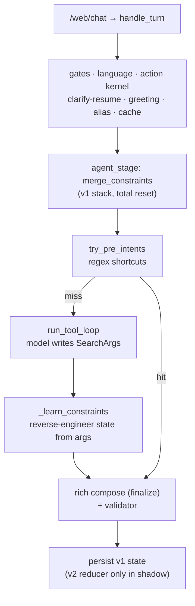
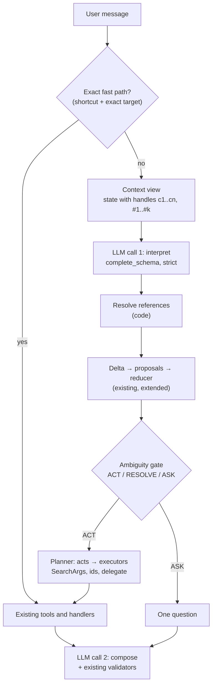

# Aria conversation kernel — technical design

> Sursa: tabul „Aria conversation kernel — technical design” din documentul „Aria conversation kernel — technical design” (claude.ai/code/artifact/d32bcfd1-104d-4b00-9800-ecaba4e67fcd), exportat pe 2026-09-25. Referință: unde designul și `KERNEL-CONTRACT-v1.md` nu sunt de acord, câștigă contractul.

Sep 25, 2026 · @Dan · Status: DRAFT for review, no code changed

## Verdict

**Superseded in part by Contract v1.0 (normative).** After review: `thread` has no `switch` (parking follows a subject change), `goal` is removed, provenance has three levels, and there are no count limits in the schema. Examples below that mention `thread=switch` or `goal` read as „subject change” and „primary act”.

The Turn Interpretation + State Delta direction is right, and about 60% of it is already built. What is missing is the link between the two halves: today the model never writes a delta. It writes `search_products` arguments, and code reverse-engineers state from them after the search has already run.

What exists today, in two halves that do not meet:

- **A delta reducer with provenance** (`ConversationStateV2` + `state_reducer`, NX-235): typed proposals, one writer, revocation tombstones, source/strength, a byte budget, lazy v1 ↔ v2 adaptation. Production persists v1, but the reducer and its projection to v1 exist and are tested.
- **A model that interprets the turn**: but its only output channel is `SearchArgs`, which is a *query*, not a *change*. `observed_constraints` then guesses the change back out of the query (`_learn_constraints`), which is why the category is learned from the model's guess and why a new shelf resets everything.

The proposal needs five corrections before it is sound:

1. **Actions and deltas must not overlap.** REFINE, CORRECT and CHANGE\_GOAL are shapes of the delta, not actions. If the model emits both `action=REFINE` and an empty delta, there are two sources of truth that disagree. Code derives them.
2. **KEEP is not an operation.** Absence of a change is KEEP. Emitting it invites the model to restate state, which is exactly what we want to stop.
3. **Deltas must address state by handle, not by value.** The model sees the current constraints as a short numbered list (`c1: budget ≤ 100 lei`) and writes `REMOVE c2`. Addressing by value (`remove fragrance`) re-creates the fuzzy-matching problem.
4. **Gift is not a goal.** It is a recipient constraint. Routine is not a skincare goal either: it is a *bundle* goal (routine, outfit, room set, PC build).
5. **The interpretation cannot be a round of the current tool loop.** On `chat.completions`, tool calls force `reasoning_effort=none`. It should be one strict-schema call (`complete_schema`), which can reason, and which *replaces* the model's current job of writing search arguments. Call count stays the same (interpret + compose = 2, the same as a recommend turn today after NX-312).

The minimum change: the model writes a `TurnInterpretation`; code resolves references, applies the delta through the existing reducer, decides whether to ask, and a new deterministic planner writes `SearchArgs`. Shortcuts, tools, validators and composition stay. No external framework is justified.

## Current architecture, as production runs it

Production answers on the v1 path and persists v1 state. This was measured on `analytics_events` for `sole-ro`: zero `brain*` events since 2026-09-17, v1-only events (`answer_shape`, `prose_round`) daily, and 19/19 conversations of the last 7 days without `schema_version`. The local `.env` runs single brain + v2 write, so a local reproduction exercises a different path.



The model's interpretation of the turn exists only implicitly, as the arguments of the tool it chose. Everything the system knows about "what changed" is inferred afterwards from those arguments.

### What already has the shape of the proposal

| Proposal concept | Existing component | Gap |
| --- | --- | --- |
| State delta | `StateUpdateProposal` ops: `set_need`, `revoke`, `supersede`, `set_topic`, `set_references`, `set_pending_question`… | Produced from search args, never by the model directly |
| Reducer | `state_reducer.reduce_all`: single writer, 12 reject reasons (`hard_downgrade`, `unsupported_revoke`, `revoked_key`…) | Runs in shadow on prod; `set_topic` supersedes every scoped need |
| Provenance | `Need.source` (6 values), `HARD_CAPABLE_SOURCES`, `corroborated_by` | Needs only; no quote kept |
| Scope | `NeedSpec.scoped` per key (budget scoped, recipient/size/restriction not) | Facet-derived needs are always scoped |
| Polarity | `operator` (`not_contains` via universal `restriction`, `lte`/`gte` on budget) | Facets cannot declare exclusion; no per-need polarity |
| Goal | `Topic.goal: str \| None` | Written by nobody |
| References | `reference_resolver`: action > named > ordinal > page > selected > single, outcome resolved/ambiguous/stale/none | Only the CURRENT displayed set; no catalog lookup; no attribute/relative refs |
| Ambiguity | `clarification_policy`: information gain ≥ 0.30, one question, anti-loop | Only gates questions someone else proposes; the v1 path proposes none |
| Numeric constraints | `extract_constraints` + `UnitRegistry` (pack units, comparators per locale) | Separate from needs; model args bypass it |
| Search session | `active_search {filters, pool, cursor, fp, page}` | Opaque in v2; cleared on any reply without products |

The domain layer is already data-driven. `DomainPack` declares facets (`TypedFacet`: type, operators, binding partitioning/additive, aliases, labels, `enforce_ready`), units, concern maps and comparison facets per tenant. Skincare leaks into the kernel in only four places: the `concerns` universal spec, the `skin_concerns` alias, the `concern_map` special case in `needs.py:280`, and `observed_constraints`' mapping of search-arg names.

## A. Target architecture

One model call interprets the turn; everything between it and the existing composition call is code. The tool loop stays, but becomes a delegate for open-ended turns, not the default way to understand a message.



Read it top-down: the only new pieces are the interpretation schema, the reference resolver's second half (catalog + recent sets), the delta mapper, the ambiguity gate and the planner. Tools, shortcut handlers, composition, validators and persistence are reused.

### Why a separate `complete_schema` call and not a tool round

- On `chat.completions`, sending tools forces `reasoning_effort=none` (`llm._sampling`). A schema call without tools can reason at `low`.
- A tool round lets the model skip interpretation and jump straight to `search_products`, which is the current failure mode.
- It does not add a call: it takes the place of loop round 1, whose only job today is writing `SearchArgs`.

### Model calls per turn

| Turn type | Today (v1) | Proposed | Note |
| --- | --- | --- | --- |
| New search / refine | 2 (loop r1 + compose; NX-312 skips the prose round) | 2 (interpret + compose) | same |
| Compare two named products | 3 (search, search/compare, narrative) | 2 (interpret + narrative) | names resolved in code |
| Link / show more / cheaper, target exact | 0 | 0 | fast path unchanged |
| Link, target named | 0, wrong target (serves all displayed) | 1 (interpret; reply deterministic) | +1, now correct |
| Store question (FAQ) | 2 | 2 (interpret + compose) | planner calls `faq_lookup` |
| Clarification | 2 | 1 (interpret; question from template or interpretation) | −1 |
| Order / cart / checkout, open-ended | 2–3 | 2–3 (interpret + delegated loop) | worst case +1; measure share |

Latency risk: `reasoning_effort=low` on the interpret call is untested. The first version should run at `none` (parity with today's round 1, p50 2.9 s), and moving to `low` is decided on replay, the same rule NX-320 already pre-registered.

## B. Models

*The normative models are in Contract v1.0; this section is kept as the review draft.*

Five small models the LLM fills, and three that only code fills. They are strict-schema compatible: every field is present, and optional fields are nullable. Tenant vocabularies (dimensions, category keys) are injected as `enum`s per tenant, the way `_ENUM_SOURCES` already does for `family`.

### Filled by the model (one call)

```python
ActKind = Literal[
    "find",          # search / recommend / refine (refine = find + non-empty changes)
    "show_more",     # next page of the active result set
    "compare",       # 2-4 targets
    "detail",        # facts / how-to / reviews about specific targets
    "link",          # where to buy / product URL
    "cart",          # add / remove / checkout
    "bundle",        # routine, outfit, room set, build: several complementary items
    "order_status",
    "store_info",    # delivery, returns, payment: not catalog
    "chitchat",
    "other",
]

class Act(BaseModel):
    kind: ActKind
    targets: list[str]        # Reference ids ("r1"); never product ids
    query: str | None         # free words for find/store_info, in the user's words

class StateChange(BaseModel):
    op: Literal["set", "add", "remove", "replace", "clear"]
    target: str | None        # handle of an existing constraint ("c2") for remove/replace;
                              # "topic" or "all" for clear
    dimension: str | None     # tenant enum: category, price, brand, recipient, <facet keys>, free
    relation: Literal["eq", "lte", "gte", "contains", "avoid"] | None
    value: str | None         # a menu value when the dimension has one, else the user's words
    number: float | None
    unit: str | None          # must exist in the pack's UnitRegistry
    relative_to: str | None   # Reference id: "cheaper than r1", "bigger than r2"
    quote: str                # the user's exact words supporting this change

class Reference(BaseModel):
    id: str                   # "r1", local to this turn
    text: str                 # the words as written ("al doilea", "Samsung-ul")
    kind: Literal["ordinal", "deictic", "name", "attribute", "extreme", "the_other", "earlier"]
    ordinal: int | None       # 1-based; -1 = last
    name: str | None          # kind=name
    dimension: str | None     # kind=attribute|extreme: color, price, size, brand
    value: str | None         # kind=attribute: "negru", "Samsung"
    direction: Literal["min", "max"] | None   # kind=extreme
    within: Literal["shown_now", "shown_earlier", "catalog", "unspecified"]

class Ambiguity(BaseModel):
    about: Literal["reference", "scope", "value", "goal"]
    target: str | None        # Reference id or index of the StateChange
    readings: list[str]       # 2-4 short readings, in the user's language

GoalKind = Literal["find", "compare", "bundle", "purchase", "support"]

class TurnInterpretation(BaseModel):
    thread: Literal["continue", "switch", "resume", "aside"]
    acts: list[Act]                     # ordered; the LAST act is what the reply answers
    changes: list[StateChange]          # 0-6; empty = nothing changed
    references: list[Reference]         # 0-4
    ambiguities: list[Ambiguity]        # 0-2
    goal: GoalKind | None               # only when this turn sets or changes it
    corrects_previous_turn: bool
```

Why each field exists, and what was cut from the original proposal:

- **`acts` is a list with an implied primary** (the last one). "Nu, mă refeream la al doilea. Compară-l cu primul." is one `compare` act. The correction is not an act: it is `corrects_previous_turn=true` plus a reference.
- **No `REFINE`, `CORRECT`, `CHANGE_GOAL` acts.** They are derived by code: refine = `find` with changes; change goal = `goal` set; correction = the flag.
- **No `KEEP` op.** Absence is keep.
- **`thread` is new.** It is what makes "unrelated question" and "back to the phones" cheap: `aside` must not touch state, and `resume` restores the parked topic.
- **`quote` is mandatory on every change.** It is how code decides `user_explicit` vs `model_inferred` without a wordlist (the NX-322 rule, generalized).
- **`Goal` is a single enum, not an object.** Gift is a `recipient` constraint; routine is a `bundle` goal whose steps come from the pack.

### Filled only by code

```python
class ResolvedRef(BaseModel):
    ref_id: str
    outcome: Literal["exact", "ambiguous", "not_found", "stale"]
    product_ids: list[str]     # 1 if exact; candidates if ambiguous
    source: Literal["action", "shown_now", "shown_earlier", "page", "catalog"]
    reason: str | None         # ordinal_out_of_range, price_changed, unavailable, tie

class AmbiguityDecision(BaseModel):
    verdict: Literal["act", "resolve_from_context", "must_ask"]
    reason: str               # closed vocabulary, e.g. target_ambiguous_on_mutation
    question: str | None

class TurnPlan(BaseModel):
    executor: Literal["search", "page", "compare", "detail", "link", "cart",
                      "bundle", "faq", "order", "ask", "delegate_tool_loop", "reply_only"]
    product_ids: list[str]
    search_args: SearchArgs | None   # existing model, derived by the planner
```

### Example output

State: `#1 Canapea Oslo 2 locuri (1.899 lei)`, `#2 Canapea Oslo 3 locuri (2.399 lei)`, constraint `c1: color = gri`. The user writes: "Nu, mă refeream la al doilea. Compară-l cu primul."

```json
{
  "thread": "continue",
  "acts": [{"kind": "compare", "targets": ["r1", "r2"], "query": null}],
  "changes": [],
  "references": [
    {"id": "r1", "text": "al doilea", "kind": "ordinal", "ordinal": 2, "name": null,
     "dimension": null, "value": null, "direction": null, "within": "shown_now"},
    {"id": "r2", "text": "primul", "kind": "ordinal", "ordinal": 1, "name": null,
     "dimension": null, "value": null, "direction": null, "within": "shown_now"}
  ],
  "ambiguities": [],
  "goal": "compare",
  "corrects_previous_turn": true
}
```

## C. State transitions

The reducer applies six rules. Every one of them already exists in `state_reducer` except parking and the aside rule.

| Op | Reducer effect | Existing mechanism |
| --- | --- | --- |
| `set` | Replaces the active value of a scalar dimension; the old one becomes `superseded` with a tombstone | `set_need` on a non-list key |
| `add` | Appends to a list dimension; `relation=avoid` creates an exclusion | `set_need` with `contains` / `not_contains` |
| `remove cN` | Revokes; the tombstone blocks a later model-inferred re-add | `revoke` + `revoked_key` |
| `replace cN` | Atomic supersede | `supersede` |
| `clear topic` | Topic-scoped needs superseded; conversation-scoped kept | `set_topic` `topic_reset` |
| new category | As `clear topic`, but the old topic and its needs are **parked**, one level deep | new |
| `thread=aside` | No state change at all, including `active_search` | new; today a reply without products clears the search session |

Whether a dimension is topic- or conversation-scoped is **data**: `NeedSpec.scoped` today, and a per-facet `scope` in the pack for facet dimensions (today facets are always scoped). The kernel never knows that "size" or "recipient" exists.

Notation: `T` topic, `G` goal, `cN` constraints, `#N` shown products, `⇢` what code does. Interpretations are abridged; the `quote` field is omitted where it is the whole message.

**1. Add a constraint (skincare).** State: `T=ingrijire-ten`, `c1 price ≤ 100`, `c2 concerns ∋ hidratare`.

> „Și să nu fie foarte gras.”

`changes: [add dimension=texture relation=avoid value="gras" quote="să nu fie foarte gras"]` ⇢ `c3 texture avoid gras` added; `c1`, `c2` untouched. If the tenant has no `texture` facet, the dimension falls back to `free`, which becomes a soft ordering term and never a filter.

**2. New search with units (smartphones).** Empty state.

> „Vreau un telefon cu minim 256 GB, sub 3000 lei.”

`thread=switch`, `acts:[find]`, `changes: [set category=telefoane; add storage gte 256 GB; set price lte 3000 lei]` ⇢ units validated by `UnitRegistry` (GB is a `storage` unit, lei a `price` unit), so 256 can never become a budget. The planner produces `SearchArgs(category=telefoane, price_max=3000, constraints=[storage≥256])`.

**3. Replace the category, keep person-level preferences (clothing).** State: `T=rochii`, `c1 size = M`, `c2 color = negru`. In this pack both `size` and `color` are declared conversation-scoped.

> „Nu mai vreau rochii, arată-mi fuste.”

`changes: [replace target=T dimension=category value=fuste]` ⇢ topic `rochii` parked; `c1`, `c2` kept because the pack says so; the planner searches `fuste, size M, negru`. The same message in a pack where `color` is topic-scoped parks `c2` with the dresses.

**4. Recipient + budget, no subject (gifts).** Empty state.

> „Este pentru sora mea și nu vreau să dau mai mult de 200 lei.”

`acts:[find]`, `changes: [set recipient=sora; set price lte 200]`, `goal=find` ⇢ both stored (recipient is conversation-scoped). The gate sees `find` with no subject dimension (no category, type or query words) and asks one question, drawn from the tenant's top-level shelves. The question comes from the rule, not from a model guess.

**5. Relative reference over the shown set (furniture).** Shown: `#1 Canapea Oslo 2 locuri`, `#2 Canapea Oslo 3 locuri`.

> „Arată-mi varianta mai mare dintre cele două.”

`references: [r1 kind=extreme dimension=size direction=max within=shown_now]`, `acts:[detail r1]` ⇢ the resolver reads the real `size` attribute (or the pack's declared proxy for it) on `#1` and `#2`, picks `#2` (`exact`). If either value is unknown, the outcome is `ambiguous`: the reply shows both and names the missing fact instead of guessing.

**6. Remove a constraint (any vertical).** State: `c3 fragrance avoid`.

> „Nu mai contează dacă are parfum.”

`changes: [remove target=c3]` ⇢ revoked with a tombstone. On a later turn, a model-inferred `add fragrance avoid` is rejected (`revoked_key`); only the user saying it again revives it.

**7. Category change, then return (electronics).** State: `T=telefoane`, `c1 storage ≥ 256`, `c2 price ≤ 3000`, shown `#1..#3`.

> „Arată-mi și niște tablete.”

`thread=switch`, `changes: [set category=tablete]` ⇢ phones parked with `c1`, `c2` and their shown set; storage (a facet) does not carry over.

> „Hai înapoi la telefoane. Care era cel mai ieftin?”

`thread=resume`, `references: [r1 kind=extreme dimension=price direction=min within=shown_earlier]`, `acts:[detail r1]` ⇢ the parked topic is restored with its constraints; `r1` resolves against the parked shown set, using the prices re-read from the catalog, not the snapshot.

**8. Unrelated question in the middle (any).** Mid-search on phones.

> „Cât durează livrarea?”

`thread=aside`, `acts:[store_info query="livrarea"]`, `changes: []` ⇢ `faq_lookup`; state, including `active_search`, untouched. The next „arată-mi mai multe” still pages the phones.

**9. Goal change: find → compare → purchase (smartphones).** Shown `#1..#3`.

> „Care e diferența între primele două?”

`goal=compare`, `acts:[compare r1 r2]` with `r1 ordinal=1`, `r2 ordinal=2` ⇢ `serve_comparison([#1, #2])`.

> „Ok, îl iau pe al doilea.”

`goal=purchase`, `acts:[cart r1]`, `r1 ordinal=2` ⇢ a mutation, so the target must be `exact`; it is, so `cart_add(#2)`.

**10. Correction of the previous turn (furniture).** The previous turn stored `c1 color = gri`.

> „Nu, am zis bej, nu gri.”

`corrects_previous_turn=true`, `changes: [replace target=c1 value=bej]` ⇢ `c1` superseded. The flag also marks the previous turn's interpretation as wrong, which feeds the correction-rate metric.

**11. Scope ambiguity (skincare, Case B from the audit).** `T=ingrijire-ten`.

> „Păi mi se usucă pielea după duș.”

`changes: [add concerns=dry quote="mi se usucă pielea"]`, `ambiguities: [about=scope readings=["pielea feței","pielea corpului"]]` ⇢ the gate maps both readings to catalog roots and gets two different shelves. Information gain is high, so it asks one question. If both readings had mapped to the same shelf, it would act.

**12. Multi-act turn with an unresolvable pronoun (gifts, then electronics).**

> „Vreau ceva bun pentru ea.” (first message)

`references: [r1 kind=deictic text="ea" within=unspecified]` ⇢ no antecedent in the state, so `not_found`. `find` with no subject and an unresolved recipient is `must_ask`.

> „Adaugă-l pe primul în coș și arată-mi o husă pentru el.” (phones shown)

`acts:[cart r1, find]`, `changes: [set category=huse; add compatible_with relative_to=r1]`, `thread=switch` ⇢ cart first (exact target), then an accessory search anchored on `#1`. Phones are parked, not deleted.

## D. Components and code mapping

Five new modules, eight extended, two refactored, and three retired once the new path is the default. Nothing on the HTTP side, in the tools, in composition or in the validators changes.

### References: code owns every product id

The model only says *what kind* of reference it saw. The resolver checks the sources in a fixed order and stops at the first unique hit:

1. **Signed action token.** Already exists; stale if the revision changed.
2. **By kind:**
   - `ordinal`: position in `shown_now`, or in the named earlier set when `within=shown_earlier`. Out of range → `ambiguous`.
   - `deictic`: focus (`selected_product`) → single shown → page anchor.
   - `name`: `match_name` on shown and recent sets, then catalog `find_product_named_in_query`, where the longest exact containment wins and a tie is `ambiguous`.
   - `attribute`: filter the set on a real attribute or variant label („Samsung-ul”, „varianta neagră”).
   - `extreme`: argmin/argmax on the real attribute re-read from the catalog; any unknown value → `ambiguous`.
   - `the_other`: the complement of the focus in a 2-item set; otherwise `ambiguous`.
   - `earlier`: the recent sets, then the parked topic.
3. **Staleness, checked on every resolved id:** unpublished or unavailable → `stale(unavailable)`; price different from the one shown → resolved, with the new price flagged for the reply.

New state needed: `References.recent_sets` (the last two shown sets as `{id, name, price}`, about 1 KB, the first thing `serialize` drops when over budget) and `parked_topic`.

| Outcome | Read-only act (detail, compare, link) | Mutation (cart, checkout) |
| --- | --- | --- |
| exact | execute | execute |
| ambiguous, ≤ 3 candidates | answer about all candidates, name the ambiguity | ask, candidates as options |
| not\_found (name) | search with the name as query, disclose „nu am găsit exact” | ask |
| stale | refresh facts, say what changed | ask if unavailable |

### Ambiguity gate: the model flags, code decides

The gate has four verdicts, not three. **`act_both`** is added because for a cheap, read-only act, answering about both readings beats spending a turn on a question.

1. A mutation target that is not `exact` → `must_ask`, always.
2. `find` with no subject (no category, no type, no query words) → `must_ask` (the existing clarify-first rule).
3. Scope ambiguity flagged by the model → map each reading to a subject value through the vocabulary.
   - Same value → `resolve_from_context`.
   - Different values → `estimate_information_gain` over the current pool: ≥ 0.30 → `must_ask`, else act on the active topic.
4. Reference `ambiguous` on a read-only act → `act_both`.
5. Anti-loop: the existing `asked_questions` + `max_attempts_per_key=2`; a second ask on the same key becomes `act_both` with a disclosure.

No second LLM call: the question text is either a pack template (the `question` slot built by NX-315) or one of the model's `readings`.

### Planner: state + act → `SearchArgs`

`SearchArgs` stays the search tool's input. It stops being written by the model; the planner writes it from the reduced state:

| `SearchArgs` field | Derived from |
| --- | --- |
| `category` | `topic.category_key` (server-held; the model no longer re-sends it every turn) |
| `price_max` / `price_min` | active `budget_max` / `budget_min` needs, or `relative_to` resolved to that product's price |
| `concerns`, facet filters | active needs: `hard` → filter, `soft` → `prefer` (the NX-322 ordering path) |
| exclusions | `avoid` needs; hard only when the source is `user_explicit` |
| `query` | `act.query` + `free`-dimension values (soft terms) |
| `sort_mode` | an `extreme` reference on price, or a relative price change („mai ieftin” = the existing cheaper ordering) |
| `product_name` | a `name` reference that was not resolved exactly (the search becomes the fallback) |
| `limit`, `in_stock_only` | `settings.card_slots`, defaults |

The provenance gates inside `search_products_tool` (NX-313, NX-319) stay as defense in depth. They pass by construction on user-said values, and still catch a `model_inferred` category.

### Tool loop and shortcuts

Each act has one executor, and every executor already exists:

| Act | Executor (existing) |
| --- | --- |
| `find` | `search_products_tool` via `ToolRun.execute` (keeps budget, telemetry, safety backstop) |
| `show_more` | `continue_search_session` |
| `compare` | `serve_comparison(ids)` |
| `detail` | `_handle_detail_intent` / `serve_reviews` with ids |
| `link` | `_handle_link_intent(ctx, deps, ids)` (the `ids` parameter already exists, from NX-316) |
| `bundle` | `routine_plan` |
| `store_info` / `order_status` | `faq_lookup` / `check_order` |
| `cart` | `CartService` / `cart_add` |
| `other`, `chitchat` | `run_tool_loop`, with the interpretation passed as context |

The regex shortcuts stay as an optimization: a shortcut may skip the interpret call only when its target is exact without the model (pure pagination, a single shown product, a name `match_name` resolves uniquely) and `carries_new_constraints` is false. Otherwise the same handler runs as the executor, after interpretation. That removes the B1/B2 class („all shown links”, „first two compared”) without deleting a handler.

### Code mapping

| Status | File | Current symbol | Change |
| --- | --- | --- | --- |
| new | `src/conversation/interpretation.py` | — | Models from section B, per-tenant schema, validation (dimensions in vocabulary, handles exist, quote in the user's text) |
| new | `src/conversation/delta.py` | — | `StateChange` → `StateUpdateProposal` (source from the quote check) |
| new | `src/conversation/ambiguity_gate.py` | — | Rules above; calls `decide_clarification` |
| new | `src/agent/turn_planner.py` | — | acts → `TurnPlan`; `SearchArgs` derivation |
| new | `src/worker/stages/interpret.py` (or a branch in `agent_stage`) | — | Orchestrates interpret → resolve → reduce → gate → plan → execute |
| extend | `src/conversation/state_v2.py` | `Topic`, `References` | `Topic.goal` as the enum; `parked_topic`; `References.recent_sets` |
| extend | `src/conversation/state_reducer.py` | `set_topic`, `reduce_all` | park/resume; aside = no-op; facet scope from the pack |
| extend | `src/conversation/needs.py` | `_spec_from_facet`, `concern_map` special case | Per-facet `scope`; move `concerns` specifics into the pack |
| extend | `src/domain/facets.py` | `TypedFacet` | `scope: topic\|conversation`; allow `not_contains` on list facets |
| extend | `src/agent/reference_resolver.py` | `resolve_reference`, `match_name` | New kinds, catalog stage, recent sets, stale reasons |
| extend | `src/worker/context.py` | `context_blocks`, `conversation_transcript` | State view with handles; replace the blind `[-1200:]` cut (the NX-255 work) |
| extend | `src/tools/base.py` | `run_tool` | Field-level validation errors back to the model |
| extend | `src/worker/processor.py` | `_turn_proposals` | Keep `active_search` on `thread=aside` |
| refactor | `src/agent/deterministic.py` | `try_pre_intents`, `_handle_compare_intent` | Gates fire only on exact targets; handlers take ids |
| refactor | `src/worker/stages/agent.py` | `agent_stage` | Flag branch into the new stage; old path intact |
| retire later | `src/conversation/observed_constraints.py`, `agent._learn_constraints`, `merge_constraints` | — | Replaced by model deltas once the flag is default |
| unchanged | `src/web/app.py`, `runner.py`, `catalog_tools.search_products_tool`, `SearchArgs`, `finalize`/`compose`, `validator.py`, `grounding_guard.py`, `llm.py` (`complete_schema` reused) | — | — |

`brain.py` (the single brain) is a second attempt at „one call decides everything”. It is left frozen, not merged: its plan is an answer, not an interpretation. It is decided after this path has data.

## E. Migration plan

Seven phases. Phases 1–2 fix a defect class on the current path with no model change. Phases 3–4 are pure code tested on fixtures. Only phase 5 changes what the model writes, and it ships dark.

| # | Phase | What ships | Flag | Test that proves it | Size |
| --- | --- | --- | --- | --- | --- |
| 0 | Baseline + corpus | Domain-diverse replay set (section G) and today's metrics on it; no behavior change | — | Metrics reported for v1 | M |
| 1 | Exact targets for shortcuts | Link/compare shortcuts resolve named targets first; a name that doesn't resolve goes to the model; `aside` replies keep `active_search`; field-level tool errors | kill-switches, ON (measured defects, as NX-311/319) | B1/B2 regressions fail on today's code, pass after | S |
| 2 | Reference resolver v2 | New kinds, catalog stage, `recent_sets`, stale reasons; pure | ON for shortcuts only | Resolver unit suite, 5 domains | M |
| 3 | Interpretation contract | Models, per-tenant schema, validation, prompt; offline replay script over `messages` + `conversation_traces` | none (not on the live path) | Schema accepted by the provider (1 smoke call, run by Adi); replay agreement on labeled turns | M |
| 4 | Delta + reducer extensions | `delta.py`; park/resume/aside; facet scope from the pack; plus the v2 persistence steps from section F (shadow diff, then write) | none (pure) | Reducer property tests: no blind reset; revoke sticks; aside is identity | M |
| 5 | Interpreted turn, dark | New stage: interpret → resolve → reduce → gate → plan → existing executors → existing compose | `INTERPRETED_TURN_ENABLED` OFF; canary through the NX-249 controller | Full replay: correctness ≥ v1 on every family, latency p50 within +10%, calls per turn ≤ v1 | L |
| 6 | Promote + retire | Default ON after the gate; delete `observed_constraints`, `_learn_constraints`, `merge_constraints` after 2 weeks of clean data | flag flip | Metric deltas in section H hold on live traffic | S |

Ordering constraints:

- Phase 5 depends on 2, 3, 4.
- Phase 1 is independent and should ship first: it removes a wrong-product class today.
- Reasoning effort on the interpret call (`none` vs `low`) is decided after phase 5, on replay, not before (D15). The full replay is one run, started by Adi, because it spends credits.

## F. Backward compatibility with production v1

`ConversationStateV2` should remain and be extended (option A), and production has to start persisting it before the interpreted turn goes live. The v1 dict cannot carry what the kernel depends on: `adapt_v1` rebuilds needs as soft with `scope=None` and creates no revocations. A kernel persisted as v1 would forget every „nu mai contează” between turns.

V2 is already a conversation state, not a search state: topic, needs with source/strength/scope/status, tombstones, pending clarification, asked questions, references, cart ref. `active_search` is only one opaque field in it. What it lacks is conversational memory beyond one shown set, and those are additions (`parked_topic`, `recent_sets`, a live `goal`), not a redesign.

The path to v2 persistence already exists and has a shadow step:

1. `CONVERSATION_STATE_V2_ENABLED=true` alone computes v2 each turn, persists v1, and emits `conversation_state_shadow_diff`. Run it in production and read the diffs.
2. `CONVERSATION_STATE_V2_WRITE_ENABLED=true` persists v2. Every v1 reader keeps working through `ConversationState.from_jsonb` → `project_v1`, which is how the local environment already runs.
3. Only then enable `INTERPRETED_TURN_ENABLED` on a canary.

What stays compatible, and why:

| Concern | Guarantee |
| --- | --- |
| Flag OFF | Current v1 path byte-identical; new modules are not imported on the hot path |
| Frontend / API contract | Unchanged: executors and `compose` produce the same `render_web` payloads; a question is an ordinary reply with chips |
| Existing conversations | Lazy: `adapt_v1` on the first turn after the switch, no SQL migration (8 KB CHECK kept; `serialize` budget 6 KB) |
| Mixed paths | Both paths read and write the same v2 document through proposals; the track is captured per turn on the ledger (NX-249), so a reclaim cannot switch path mid-turn |
| Rollback | Flag OFF. V2 documents stay readable by v1 through the projection; `parked_topic` and `recent_sets` are simply ignored |
| Tools and SQL | No change to `SearchArgs`, `search_products_tool` or any query; the planner calls them the way the model did |

The one real cost: v2 write has never run in production. Step 1 is there to find out what the diff shows before depending on it.

## G. Testing strategy

Every layer except the interpret call is pure, so most of the suite runs without a model or a database. Domain diversity comes from four synthetic packs next to SOLE, so a test can fail when skincare leaks into the kernel.

**Fixture packs** (JSON, in `tests/fixtures/packs/`, each with a 20–40 product catalog stub): `electronics` (storage GB, screen inch, brand, color), `fashion` (size and color conversation-scoped, category topic-scoped), `furniture` (width cm, seats, material, variants), `gifts` (recipient, occasion, price). Plus the real `sole-ro` pack.

| Layer | What is tested | Style | Examples of must-hold properties |
| --- | --- | --- | --- |
| Interpretation validation | Unknown dimension, unknown handle, quote not in the user's text, unit from the wrong dimension, >4 references | Unit, table-driven | `100 ml` never becomes `price`; a quote the user didn't write → `model_inferred`, soft |
| Delta → proposals + reducer | Every op × every scope × every source | Unit + property-based (random op sequences) | No op sequence ever clears a conversation-scoped need except `remove`/`clear all`; `aside` is identity; a revoked need stays revoked under model-inferred re-adds; state always fits 6 KB |
| Reference resolver | Every kind × outcome, on 5 packs | Unit, table-driven | Never returns an id outside shown/recent/page/catalog; extreme with an unknown value is `ambiguous`, never a guess; a tie is never `exact` |
| Ambiguity gate | The rule table in D | Unit | A mutation on a non-exact target always asks; one question per turn; a second ask on the same key never happens |
| Planner | state + act → `TurnPlan` | Golden snapshots of `SearchArgs` | Category comes from state, never from interpretation text; soft needs never land in a `WHERE` |
| Shortcut gates | B1/B2 and variants | Regression (must fail on current `main`) | A named link never serves all shown products |
| Full conversation replay | 2–6 turn journeys × 5 packs, through the real stage with a scripted model | Integration (`ScriptedLLM`), the NX-246 journey format | State after each turn equals the expected state; target products equal expected ids |
| Live-model replay | Same journeys + real SOLE turns, real interpret call | Offline script, one run started by Adi | Metrics in H; no credits spent in CI |

The replay journeys are the 12 examples in section C plus the audit cases A–G, written once per pack where they make sense. Each journey is tagged with the families from section H, so coverage is reported by family, not only in total.

## H. Metrics

The gate for phase 6 is simple: no metric may get worse on any family, and at least the state and target metrics must improve. Metrics marked *replay* are computed on the labeled journeys; *live* ones from `analytics_events` on real traffic, one event per turn with a closed vocabulary.

| Metric | Definition | Source | Baseline today |
| --- | --- | --- | --- |
| State transition correctness | Turns where the reduced state equals the labeled state | replay | measured in phase 0 |
| Wrong carry-over | A constraint the label says should be gone is still active | replay | phase 0 |
| Unwanted reset | A constraint the label says should survive is gone | replay + live (`topic_reset` supersedes followed by the user restating the value within 2 turns) | phase 0 |
| Reference accuracy | Resolved ids equal labeled ids, by kind | replay | phase 0 |
| Wrong product target | Link/compare/detail/cart served a product the user did not name or point at | replay + live (named reference ≠ served ids) | B1/B2 make this non-zero today |
| Unnecessary clarification | Asked when the label says act | replay | phase 0 |
| Missed clarification | Acted when the label says ask | replay | phase 0 |
| Model-inferred values used as filters | Hard filters whose source is not `user_explicit` | live | 71/128 need terms not said by the user (NX-322) |
| Unresolved values | Model values that match nothing in the vocabulary | live | 45/105 concern resolutions `unknown` (NX-322) |
| Tool correction rate | Tool calls rejected by validation / total | live | not emitted today (B4) |
| Correction turns | `corrects_previous_turn=true` / turns | live | new signal |
| Model calls per turn | From `llm_usage.per_call`, by act | live | recommend = 2 after NX-312 |
| Latency | e2e p50 / p90, by act | live (`turn_latency`) | p50 24.9 s / p90 99.4 s (NX-311 measurement, before its fix) |
| Hallucinated catalog facts | Validator rejections + `grounding_guard` rejects that reach the fallback | live | existing counters |

The first three are the ones this architecture exists to move. If they don't improve on replay, phase 5 doesn't ship, whatever the other numbers say.

## I. Failure analysis

The design does not make the model understand better. It makes misunderstandings smaller, visible and reversible. The table lists how it still fails and what limits the damage.

| Failure | How it happens | What limits it | Residual risk |
| --- | --- | --- | --- |
| Model misreads the turn | Wrong act (`find` instead of `detail`) | Executors are cheap and read-only; the user's next turn can correct it, and `corrects_previous_turn` counts it | Real; the one-call design has no second opinion |
| Incorrect delta | Adds a constraint the user didn't state | Mandatory `quote`; a quote not in the user's text makes the change soft (order, never filter) | A quote that *is* in the text but misread („nu gras” read as „gras”) passes as `user_explicit` |
| Missing delta | Model forgets to emit `remove` | State keeps the old value; the reply shows the active constraints, so the user sees it | Silent until the user notices |
| Stale state | Price or stock changed since shown | Every resolved id is re-read from the catalog; `stale` outcome | None for facts; a stale *preference* (budget from 20 turns ago) persists by design |
| Wrong reference | „celălalt” with 3 shown | `the_other` needs a 2-item set, else `ambiguous` | Anaphora across turns („acela de care vorbeam”) relies on `selected_product`, only one deep |
| Ambiguous reference | Two products share a name prefix | `unique_prefixes` + tie → `ambiguous`; mutations ask | A read-only answer about two items is longer |
| Conflicting constraints | „sub 100” then „minim 150” | `merge_constraints` in `constraints.py` already rejects crossing bounds; the reducer reports a `hard_conflict` candidate → ask | — |
| User changes their mind | „De fapt, vreau cu parfum” | `replace` on the handle; `revoke` tombstones allow user revival | Change of mind without naming the old value („altceva”) is a model call, not code |
| Unrelated topic switch | „Ai și căști?” mid-phones | `thread=switch` parks the phones topic | Only one level parked; a third topic drops the first |
| Aside misread as switch | „Cât costă livrarea la canapea?” | `aside` requires no changes; a switch with no subject change is rejected by validation | The model may still emit a spurious category |
| Multiple intents | „Adaugă-l în coș și arată-mi o husă” | `acts` is ordered; the planner executes ≤ 2 acts, the mutation first | 3+ acts truncated; the reply says what was not done |
| Domain gap | A vertical with a concept no facet covers | `free` dimension → soft terms, never a filter | Weak ranking until the pack gains the facet (data work, not code) |
| Schema drift per tenant | Enum of dimensions changes with the catalog | Enum built from the pack, stable ordering; prompt cache key per tenant | A cache miss after each pack change |

Two risks are specific to the choice of one call. First, interpretation quality at `reasoning_effort=none` is unmeasured. Second, the model now describes changes against a *rendered* state, so a rendering bug (a missing handle) becomes an interpretation bug. The renderer needs its own snapshot tests.

## J. Recommendation

Build it in the order of section E, starting with phase 1 this week, and do not add any framework. Pydantic, strict schemas and the existing Python stages already cover what this design needs.

**1. Implement first**

- Phase 1: exact targets for the link/compare shortcuts, `aside` keeping the search session, field-level tool errors. It removes a wrong-product class on today's production path without touching the model.
- Phase 2: the reference resolver v2. It is pure, and useful to the shortcuts before any interpretation exists.
- Turn on `CONVERSATION_STATE_V2_ENABLED` (shadow only) in production to start reading the v1 ↔ v2 diff. This is a flag change, so it is your call.

**2. Do not implement yet**

- The interpret call on the live path (phase 5), until the replay corpus exists (phase 0) and v2 persistence has run in production.
- `reasoning_effort=low` on the interpret call: decide on replay.
- A task stack deeper than one parked topic.
- Merging with or deleting `brain.py`.
- Removing any regex shortcut.

**3. Preserve**

`SearchArgs` and `search_products_tool` with their provenance gates, `state_reducer` and its reject reasons, `clarification_policy`, the shortcut handlers (as executors), `compose`/`finalize`, `validator.py`, `grounding_guard`, the safety policy, the per-call budget in `llm.py`, and the channel/web contract.

### Where the LLM/code boundary bends

Three places cross the boundary proposed in the brief, each deliberately:

- **The model picks tenant vocabulary values** (category key, facet value) from a menu. That is catalog knowledge. It is safe because the menu is closed and code validates membership.
- **The model's `readings` can become the question text.** That is model text reaching the user, so it goes through `naturalize` and the prose validator like any other reply.
- **„Hard” is decided by code, not by the model.** The model supplies a quote; code decides whether it supports the value. Letting the model declare strength would reintroduce guessed filters.

### External frameworks: none are worth adopting now

| Framework | What it would solve | What it replaces | What it adds | Verdict |
| --- | --- | --- | --- | --- |
| LangGraph | Explicit state graph, checkpointing, human-in-the-loop | `runner.py` (\~100 lines of ordered stages) + processor persistence | A second state store beside Postgres + `state_version`, graph-level debugging, a dependency on its checkpoint schema | No: the pipeline is linear by principle (P1), and persistence is already transactional |
| Rasa | Trained NLU + dialogue policies | The interpret call | Training data per tenant and vertical; the opposite of „vocabulary is data” | No |
| Haystack | Retrieval pipelines | Lexical SQL search | An abstraction over a search that is SQL with RLS | No |
| Instructor | Pydantic output + re-ask | `complete_schema` + `model_validate` + bounded repair | Client patching that bypasses `_guarded` (per-call budget, usage rows, deadline) | No, as agreed |
| Guardrails | Output validators | `validator.py`, `grounding_guard`, `compose` scrubs | A parallel validator registry | No |
| DSPy | Prompt optimization against a metric | Hand-tuning of the interpret prompt | An offline optimizer; no runtime cost | Maybe later, offline only, once the replay corpus and metrics from G/H exist |

The one place a library could earn its keep is DSPy-style offline tuning of the interpret prompt, and only after phase 0 gives it something to optimize against.
