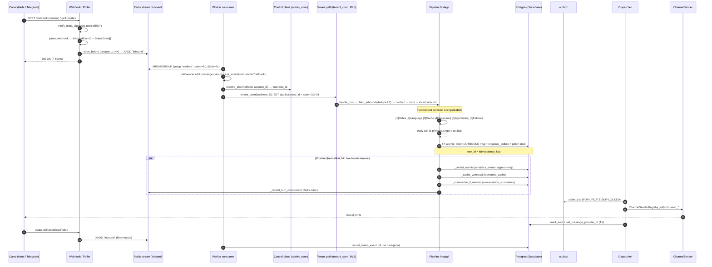

# SYSTEM-FLOW — Nativx Assistant cap-coadă

> Documentul de orientare pentru un dezvoltator nou. Explică EXACT cum curge un
> mesaj de la canal (WhatsApp / Telegram) până la răspuns, plus ce se întâmplă
> post-tur (cache, summarizer, cost). Toate referințele sunt `fișier:linie` reale.
> Sursa de adevăr pentru schemă: [`schema_v2_production.sql`](schema_v2_production.sql).
> Arhitectura de ansamblu și principiile: [`../CLAUDE.md`](../CLAUDE.md).

---

## 0. Mental model în 30 de secunde

- **Pipeline liniar, 9 stagii, un singur `TurnContext`.** Niciun loop de
  orchestrare, nicio săritură înapoi. Orice stagiu poate seta `ctx.reply` →
  *early exit* direct la Sender.
- **LLM doar în 2 puncte:** Triaj (nano) și Agent (mini). Tot restul e cod
  determinist.
- **Margini subțiri, miez agnostic de canal.** Cuplajul de transport stă în
  exact două locuri: ingestia (parser → envelope neutru) și ieșirea
  (`ChannelSender` registry). Stagiile 3-9 nu știu ce canal e dedesubt.
- **Un singur punct de ieșire:** Sender scrie tranzacțional în `outbox`; un
  dispatcher separat trimite la Meta/Telegram.
- **Izolare multi-tenant primară = `WHERE business_id = $1` în cod;** RLS
  (`bot_runtime` + `app.business_id`) e plasa de siguranță, nu mecanismul
  principal.

---

## 1. Diagrama drumului unui mesaj

---

## 2. Subsistemele, cu fluxul real

### 2.1 Ingestie — de la canal la stream

Două margini de intrare produc același **envelope neutru** pe stream-ul unic:

- **WhatsApp (Meta Cloud API), canal PRIMAR.** `POST /webhook`
  ([`src/webhook/app.py:65-107`](../src/webhook/app.py)):
  1. `verify_meta_signature(app_secret, raw, signature)` peste corpul **BRUT**
     ([`src/webhook/signature.py:14-29`](../src/webhook/signature.py)) → 403 la eșec.
  2. `parse_webhook(payload)` → `InboundEvent[]` + `parse_statuses` →
     `StatusEvent[]` ([`src/webhook/meta.py:49-95`](../src/webhook/meta.py)).
  3. **Dedupe layer 1** (rapid): `seen_before(redis, channel_account_id,
     provider_msg_id)` — `SET NX EX` 48h
     ([`src/redis_bus.py:50-60`](../src/redis_bus.py)). Statusurile NU se
     deduplică (`delivered` și `read` au același wamid).
  4. `enqueue_inbound(redis, event.to_dict())` → `XADD` pe `STREAM_INBOUND='inbound'`
     ([`src/redis_bus.py:63-70`](../src/redis_bus.py)).
  5. **ACK 200 în < 50ms** — Meta reîncearcă agresiv la timeout. Pe `RedisError`
     → 503 (Meta reîncearcă; NX-51 deduplică la retry).

- **Telegram (Bot API, long polling), canal de TEST.** `poll_once` →
  `getUpdates(offset)` → `_to_event` / `_to_callback_event` → `enqueue_inbound`
  ([`src/channels/telegram/poller.py:70-103`](../src/channels/telegram/poller.py)).
  Offset-ul avansează **per bot** (cheie Redis `_offset_key`) — NU folosește
  consumer group. Rulează pe VPS fără HTTPS / tunel / verificare semnătură.

- **Webhook comenzi (F2-2):** `POST /webhook/orders/{business_id}`
  ([`src/webhook/app.py:110-136`](../src/webhook/app.py)) — margine subțire, fără
  DB: verifică un secret partajat (`hmac.compare_digest`), apoi pune envelope
  `kind='order'` cu `business_id` din path (autentificat de secret, NU rezolvat
  pe canal).

**Contractul de margine** (`InboundEvent` / `StatusEvent` / `CallbackEvent`):
[`src/channels/base.py:17-56`](../src/channels/base.py). Câmpuri neutre:
`channel_kind`, `channel_account_id` (id-ul receptor), `sender_external_id`
(id-ul userului), `provider_msg_id`, `body`, `content_type`, ...

### 2.2 Redis backbone

[`src/redis_bus.py`](../src/redis_bus.py): stream **unic** `inbound` (nu per
conversație — `conversation_id` nu e cunoscut la webhook fără round-trip DB;
ordinea per conversație se asigură în worker). Payload = `{data: JSON}`.
Consumer group `workers` (`XREADGROUP` distribuie între replici). `XADD`
`maxlen≈100000` aproximativ → overflow trunchiază cozile vechi.

### 2.3 Worker consumer & rutare

[`src/worker/consumer.py`](../src/worker/consumer.py):

- `consume_once` ([`:102-132`](../src/worker/consumer.py)): `XREADGROUP`
  (count=10, block=2000ms) → `json.loads(fields['data'])`. Mesajele trec prin
  `debouncer.add` (coalesce per expeditor, R1); statusurile/celelalte merg
  imediat la `process_event`. **`XACK` în `finally` — chiar și la eșec**, ca să
  nu blocheze coada (eroarea e logată).
- `process_event` ([`:48-99`](../src/worker/consumer.py)) — router după `kind`:
  - `order` → `tenant_conn(business_id din envelope)` → `process_order`
    ([`src/webhook/orders.py:60-122`](../src/webhook/orders.py)).
  - altfel → `resolve_channel(admin_conn, channel_kind, channel_account_id)`
    ([`src/db/queries/channels.py:16-39`](../src/db/queries/channels.py)) → derivă
    `business_id` + `channel_id`. Canal necunoscut / inactiv → ignorat (nu
    crapă).
  - `status` → `record_status_event` (delivered/read/failed).
  - `callback` (butoane Telegram) → `handle_callback`
    ([`src/worker/callback.py:36-93`](../src/worker/callback.py)) — navigare
    carusel (drum determinist, NU pipeline LLM).
  - `message` (default) → `handle_turn` (miezul).

### 2.4 Turn cycle — `handle_turn` (pipeline 9 stagii)

Entry: [`src/worker/processor.py:258-407`](../src/worker/processor.py). Conexiunea
e DEJA tenant-scoped pe `business.id`.

**Pregătire (înainte de pipeline):**

1. **Dedupe L2 (durabil):** `claim_inbound(conn, business.id, provider_msg_id)`
   — guard ÎNAINTE de orice scriere ([`:282`](../src/worker/processor.py)).
   `False` → return `TurnResult(deduped=True)`. Prinde retry-ul Meta scăpat de
   Redis după restart/FLUSHALL. *Trade-off NX-51: claim-ul se commit-ează
   imediat — crash în mijlocul turului = mesaj „văzut" fără finalizare.*
2. `get_or_create_contact` ([`:286-292`](../src/worker/processor.py)) — identity
   resolution prin `channel_identities` (PII-ul trăiește DOAR aici, P12).
3. `get_or_create_conversation` ([`:293-299`](../src/worker/processor.py)).
4. `insert_message(... INBOUND, CONTACT ...)` + `touch_last_inbound` (fereastra
   24h) ([`:301-313`](../src/worker/processor.py)).
5. **TurnContext construit o singură dată** ([`:315-332`](../src/worker/processor.py)):
   `turn_id`, `business`, `contact`, `message`, `conversation_id`, `history`
   (max 8), `state` (`ConversationState.from_jsonb`), `summary`
   (`get_summary_for_context`), `language` (`conv["locale"]` sau default),
   `bot_active`, `handoff_until`.
6. **Cost guard (G2c):** `_llm_within_budget(ctx, redis, business)`
   ([`:335`](../src/worker/processor.py)) → `None` dacă peste
   `daily_cost_cap_usd`. Pipeline rulează oricum (degradare, nu eșec).

**Pipeline** (`run_pipeline`,
[`src/worker/runner.py:38-54`](../src/worker/runner.py)). `DEFAULT_STAGES`
([`:80-87`](../src/worker/runner.py)) rulează SECVENȚIAL; runner-ul măsoară
latența fiecărui stagiu (`stage_completed`) și **oprește la primul `ctx.reply !=
None` sau `ctx.halt`** ([`:51`](../src/worker/runner.py)). Stagiile nu știu că
sunt măsurate (principiul 10).

| # | Stagiu | Fișier:linie | Scrie | Ce face |
|---|---|---|---|---|
| 1 | `gates_stage` | [`stages/gates.py:186`](../src/worker/stages/gates.py) | `ctx.halt`, `ctx.reply` | 6 porți (vezi mai jos) |
| 2 | `language_stage` | [`stages/language.py:27`](../src/worker/stages/language.py) | `ctx.language` | RO/HU/EN ÎNAINTE de cache (P11) |
| 3 | `cache_stage` | [`stages/cache.py:89`](../src/worker/stages/cache.py) | `ctx.reply`, `ctx.from_cache` | L1 exact + L2 semantic |
| 4 | `triage_stage` | [`stages/triage.py:65`](../src/worker/stages/triage.py) | `ctx.route`, `ctx.reply` | **LLM nano** — clasificare |
| 5 | `agent_stage` | [`stages/agent.py:197`](../src/worker/stages/agent.py) | `ctx.retrieval`, `ctx.reply` | **LLM mini** — tool-calling |
| 6 | `fallback_stage` | [`runner.py:57`](../src/worker/runner.py) | `ctx.reply` | „n-am înțeles" (niciodată tăcere) |

**Gates — 6 porți, nu 3** ([`stages/gates.py:186-217`](../src/worker/stages/gates.py)):
1. `bot_active=False` → `halt_silent("bot_inactive")` (kill-switch).
2. `contact.is_blocked` → `halt_silent("contact_blocked")` (NX-15).
3. `handoff_until > now()` → `halt_silent("handoff_active")` (un om a preluat).
4. `_rate_limited` (G2c) → throttle (contor Redis).
5. `_moderation_blocked` (NX-15) → `deps.llm.moderate` → răspuns neutru.
6. `detect_risk(body)` → `request_human` + mesaj de tranziție.

**Triaj** ([`stages/triage.py:65`](../src/worker/stages/triage.py)) — `llm=None`
→ no-op. Clasifică `route ∈ {simple|sales|order|clarify|handoff}` cu
`classify_json` → `TriageOut` (Pydantic). `category_key` validat contra listei
reale (inventat → `None`). `simple`/`clarify` → setează reply direct (early
exit); incertitudine = CLARIFY ieftin, NU recovery agent.

**Agent** ([`stages/agent.py:197`](../src/worker/stages/agent.py)) — rulează DOAR
pentru `route=SALES`. Buclă tool-calling cu **cap dur 3 apeluri**
(`run_tool_loop`, [`src/agent/llm.py:95-154`](../src/agent/llm.py)); la cap 3 →
ultim apel `tools=None` (text forțat). Tool-urile read (Faza 1):
`search_products`, `get_product_details`, `compare_products`
([`src/tools/catalog_tools.py:81-127`](../src/tools/catalog_tools.py)); write:
`checkout_link` ([`src/tools/commerce_tools.py:47-111`](../src/tools/commerce_tools.py)).
Toate scoped pe `ctx.business.id` (modelul NU primește `business_id`).

**Validator inline** (`_finalize`,
[`stages/agent.py:163-194`](../src/worker/stages/agent.py)) — ZERO halucinații
structurale:
- `_prices_ok`: fiecare preț din reply (regex `_PRICE_RE`) ∈ prețurile din
  `retrieval` ±0.5 lei.
- `_links_ok`: fiecare URL ∈ `product_url ∪ generated_links` (linkurile
  `checkout_link` sunt grounded prin construcție).
- Invalid → 1 retry cu `_RECO_SYSTEM` (fără tools, prețuri permise explicit) →
  dacă tot invalid → `_deterministic_reply` (listă din prețuri reale).

### 2.5 Sender — singurul punct de ieșire (stagiul 9)

După pipeline, dacă `ctx.reply is None`: dacă `ctx.halt` → log „tăcere
intenționată"; altfel log „tur fără reply" — în ambele cazuri **fără outbox**
([`:340-348`](../src/worker/processor.py)).

Altfel, **scriere ATOMICĂ** într-o singură tranzacție
([`:351-391`](../src/worker/processor.py)):
- `insert_message(... OUTBOUND, BOT, status="queued")`,
- construiește payload (`type='text'`; sau `type='carousel'` +
  `displayed_products` în state dacă `ctx.reply.products`),
- `enqueue_outbox(... turn_id ...)` — **`turn_id` = `idempotency_key`** → un
  singur outbox per tur,
- `patch_conversation_state(... state_version ...)` — optimistic lock,
  `touch_outbound=True`.

**Dispatcher** (proces separat,
[`src/worker/dispatcher.py:118-144`](../src/worker/dispatcher.py)): `claim_due`
(`FOR UPDATE SKIP LOCKED`) → `ChannelSenderRegistry.get(channel_kind)` →
`send_text` / `send_carousel_card` / `send_products` / `edit_message_media`. La
succes: `mark_sent` + `set_message_provider_id` (TX). La eșec:
`mark_failed(attempts++)` cu backoff; epuizare → `'dead'`. Tipuri payload
nesuportate → `'dead'` (payload neversionat).

### 2.6 Post-tur (best-effort, NU blochează livrarea)

Toate rulează DUPĂ scrierea outbox, cu savepoint propriu — un eșec nu afectează
turul (deja a răspuns):
- `_persist_events` → `analytics_events` (append-only) ([`:337`](../src/worker/processor.py)).
- `_record_turn_cost` → contor Redis zilnic, DOAR dacă `llm` a fost folosit
  ([`:338`](../src/worker/processor.py)).
- `_cache_writeback` ([`:403`](../src/worker/processor.py)) — semantic_cache:
  static (FAQ, fără produse) TTL zile; dynamic (cu produse) TTL minute +
  `retrieval_signature` (snapshot preț) + `data_version`. Sărit dacă
  `from_cache` / `cacheable=False` / `llm=None`.
- `_summarize_if_needed` ([`:406`](../src/worker/processor.py)) — rezumat rolling
  în `conversation_summaries`; sărit dacă `llm=None` sau sub `summary_threshold`;
  regenerează doar la `>= summary_regen_delta` mesaje noi.

---

## 3. Cele 2 puncte LLM, izolarea multi-tenant, degradarea

### 3.1 Singurele 2 apeluri LLM din pipeline

| Punct | Model | Stagiu | Rol |
|---|---|---|---|
| Triaj | GPT-5.4-**nano** | `triage_stage` ([`stages/triage.py:65`](../src/worker/stages/triage.py)) | clasificare rută + răspuns `simple`/`clarify` |
| Agent | GPT-5.4-**mini** | `agent_stage` ([`stages/agent.py:197`](../src/worker/stages/agent.py)) | recomandare sales + tool-calling (max 3) |

Tot restul (gates, language, cache exact, validator, sender, dispatcher) e cod
determinist. `moderate` și `embed` sunt apeluri LLM auxiliare (gates / cache /
writeback), nu „puncte de decizie" în sensul de mai sus.

### 3.2 Izolarea multi-tenant

**Mecanism primar: `WHERE business_id = $1` în cod, fără excepție** (principiul 7).
Plasa de siguranță (defense-in-depth):

- **Două pool-uri** ([`src/db/connection.py`](../src/db/connection.py)):
  - `admin_conn` (pool privilegiat, `service_role`, RLS bypass) — control plane.
    Folosit DOAR pentru: `resolve_channel` (derivă tenantul înainte să fie
    cunoscut), `business_ids_with_due_outbox` (dispatcher), joburi nocturne. **NU
    scrie date de tenant.**
  - `tenant_conn(business_id)` (pool `bot_pool`, login `bot_runtime`, FĂRĂ
    bypassrls) ([`:197-231`](../src/db/connection.py)). Setează DOAR
    `app.business_id` per checkout (fără `SET ROLE` — asta era scurgerea P0-A sub
    pooler). **NX-04:** set + verificare (`current_user` + GUC) într-un singur
    round-trip; mismatch → `IsolationError` ÎNAINTE de orice query. La release →
    `set_config('app.business_id', '')` (fail-closed pentru următorul checkout).
- **RLS** ([`003_bot_runtime_role.sql:69-130`](003_bot_runtime_role.sql)): fiecare
  tabel tenant are politică `business_id = current_business_id()`; fără GUC setat
  → 0 rânduri. Un query greșit devine „zero rezultate", nu „datele altui client".
- **PII (P12):** telefon E.164 / id canal trăiesc DOAR în `channel_identities`;
  summarizer-ul redactează telefoane înainte de embedding; logurile nu conțin
  PII.

### 3.3 Best-effort / degradare (niciodată tăcere, principiul 6)

| Mecanism | Comportament la eșec | Referință |
|---|---|---|
| Cost guard | Redis jos → **fail-open** (LLM activ) | [`processor.py:335`](../src/worker/processor.py) |
| Peste buget | `llm=None` → triaj/agent no-op, gates+cache L1 încă merg | [`processor.py:335-336`](../src/worker/processor.py) |
| Rate limit / cache Redis | Redis jos → fail-open (guard = no-op) | [`stages/gates.py`](../src/worker/stages/gates.py) |
| Validator agent | invalid ×2 → fallback determinist (prețuri reale) | [`stages/agent.py:163-194`](../src/worker/stages/agent.py) |
| Fallback stage | nicio reply → „n-am înțeles" (clarificare) | [`runner.py:57-65`](../src/worker/runner.py) |
| `_persist_events` | excepție înghițită, turul continuă | [`processor.py:337`](../src/worker/processor.py) |
| `_cache_writeback` / `_summarize_if_needed` | savepoint propriu, eșec logat, turul deja a răspuns | [`processor.py:403-406`](../src/worker/processor.py) |
| `XACK` la eșec | mesajul nu blochează coada (logat) | [`consumer.py:128-130`](../src/worker/consumer.py) |
| Webhook `RedisError` | 503 → Meta reîncearcă → NX-51 deduplică | [`app.py:102-105`](../src/webhook/app.py) |

---

## 4. Bucla de bani cap-coadă

Atribuirea leagă o conversație de o comandă reală. Detalii schemă:
[`schema_v2_production.sql`](schema_v2_production.sql) (checkout_links, orders,
order_items, shipments).

1. **Creare link (în tur, stagiul Agent/Sender).** Tool-ul `checkout_link`
   ([`src/tools/commerce_tools.py:47-111`](../src/tools/commerce_tools.py)) →
   `create_checkout_link(business_id, conversation_id, contact_id, ref_code=turn_id,
   cart, url)` ([`src/db/queries/commerce.py:17`](../src/db/queries/commerce.py)).
   `UNIQUE(business_id, ref_code)` → idempotent. Botul pune `?ref=turn_id` în URL.
   Linkul e grounded → validatorul îl acceptă (`generated_links`).
2. **Conversie (asincron, extern).** Webhook comenzi
   ([`src/webhook/app.py:110-136`](../src/webhook/app.py)) → `process_order`
   ([`src/webhook/orders.py:60-122`](../src/webhook/orders.py)), totul într-o
   tranzacție:
   - `get_checkout_link_by_ref(business_id, ref_code)`
     ([`commerce.py:54`](../src/db/queries/commerce.py)) → contact + conversație.
   - `upsert_order` ([`commerce.py:73`](../src/db/queries/commerce.py)) —
     `UNIQUE(business_id, external_id)` idempotent; `attribution='assisted'` dacă
     ref a făcut match, altfel `'none'`.
   - `insert_order_items` ([`commerce.py:114`](../src/db/queries/commerce.py)) —
     **DOAR la primul insert** (redelivery NU re-inserează iteme).
   - `mark_checkout_converted` ([`commerce.py:144`](../src/db/queries/commerce.py))
     — `WHERE converted_order_id IS NULL` → prima comandă câștigă.
   - Emit `order_received` + `order_attributed` (`insert_events`,
     [`src/db/queries/analytics.py:19`](../src/db/queries/analytics.py)).
3. **Rollup nocturn (F2-3).** `run_rollup(conn, day)`
   ([`src/jobs/rollup_usage.py:37-51`](../src/jobs/rollup_usage.py)) →
   `rollup_usage_day` ([`src/db/queries/usage.py:18-96`](../src/db/queries/usage.py))
   agregă `analytics_events` + orders atribuite → `usage_daily`. **Sursa de
   adevăr pentru facturare = `usage_daily`**, NU contorul Redis (advisory). Idempotent
   (re-rulează din evenimente brute).

**Fără buclă de feedback:** turul NU așteaptă webhook-ul de comandă; conversia e
un side-effect descoperit la rollup. Toate calculele de venit sunt în UTC.

---

## 5. Invarianții cheie (cele 12 principii, unde se aplică)

| # | Principiu | Unde se aplică (file:line) |
|---|---|---|
| 1 | **Pipeline liniar**, fără loop / săritură înapoi | `run_pipeline` oprește la primul reply ([`runner.py:44-54`](../src/worker/runner.py)) |
| 2 | **LLM doar la 2 puncte** (nano triaj, mini agent) | `DEFAULT_STAGES` ([`runner.py:80-87`](../src/worker/runner.py)); restul determinist |
| 3 | **Un singur proprietar per câmp** TurnContext | `ctx.route`←triaj, `ctx.retrieval`←agent, `ctx.language`←language ([`models.py:204-250`](../src/models.py)) |
| 4 | **Buget de context în cod**, nu în prompt | history max 8 ([`processor.py:326`](../src/worker/processor.py)); state ≤8KB (CHECK în [`003`](003_bot_runtime_role.sql)) |
| 5 | **Un singur punct de ieșire** (Sender → outbox → dispatcher) | TX atomic ([`processor.py:351-391`](../src/worker/processor.py)); dispatcher ([`dispatcher.py:118-144`](../src/worker/dispatcher.py)) |
| 6 | **Niciodată tăcere** — degradare | fallback ([`runner.py:57`](../src/worker/runner.py)); validator fallback ([`agent.py:163-194`](../src/worker/stages/agent.py)) |
| 7 | **`business_id` pe tot**; RLS ca plasă | `tenant_conn` GUC + NX-04 ([`connection.py:197-231`](../src/db/connection.py)); RLS ([`003`](003_bot_runtime_role.sql)) |
| 8 | **State = ref-uri, nu obiecte** | `displayed_products: {product_id, name, price}` ([`processor.py:370-376`](../src/worker/processor.py)) |
| 9 | **Promptul se generează din DB** | triaj din `category_slugs` ([`triage.py`](../src/worker/stages/triage.py)); agent din tool schemas |
| 10 | **Observabilitate din runner** — stagiile nu se măsoară singure | `ctx.emit("stage_completed")` ([`runner.py:47-49`](../src/worker/runner.py)) |
| 11 | **Limba e parte din cheie** — language ÎNAINTE de cache | `language_stage` (poziția 2) înainte de `cache_stage` ([`runner.py:80-87`](../src/worker/runner.py)) |
| 12 | **PII într-un singur loc** (`channel_identities`) | identity ([`contacts.py:66-87`](../src/db/queries/contacts.py)); redaction în summarizer |

**Alte invarianți de implementare:**

- **Dedupe stratificat:** L1 Redis NX 48h (rapid, [`redis_bus.py:50-60`](../src/redis_bus.py))
  → L2 DB `claim_inbound` durabil (post-restart, [`processor.py:282`](../src/worker/processor.py)).
- **`turn_id` = `idempotency_key`** pe outbox → un singur mesaj per tur
  ([`processor.py:377-383`](../src/worker/processor.py)).
- **`state_version` optimistic lock** la `patch_conversation_state` →
  pierderi-de-update prevenite ([`processor.py:384-391`](../src/worker/processor.py)).
- **ZERO prețuri/linkuri inventate:** validator `_prices_ok` / `_links_ok`
  ([`agent.py:79-105`](../src/worker/stages/agent.py)).
- **`XACK` chiar și la eșec** → coada nu blochează ([`consumer.py:128-130`](../src/worker/consumer.py)).
- **Statusurile NU se deduplică** (delivered + read, același wamid) —
  `record_status_event` ([`consumer.py:82-90`](../src/worker/consumer.py)).
- **Canale cuplate DOAR la margini:** ingestie (`InboundEvent` neutru,
  [`channels/base.py:17-56`](../src/channels/base.py)) și ieșire
  (`ChannelSenderRegistry`, [`dispatcher.py`](../src/worker/dispatcher.py)).

---

## 6. Pointeri de navigare

- Pipeline-ul: [`src/worker/runner.py`](../src/worker/runner.py) +
  [`src/worker/stages/`](../src/worker/stages/).
- Miezul turului: [`src/worker/processor.py:258`](../src/worker/processor.py)
  (`handle_turn`).
- Rutarea + tenant resolution: [`src/worker/consumer.py:48`](../src/worker/consumer.py).
- Izolarea DB: [`src/db/connection.py`](../src/db/connection.py) +
  [`003_bot_runtime_role.sql`](003_bot_runtime_role.sql) +
  [`db_connections.md`](db_connections.md).
- Tool-uri: [`src/tools/`](../src/tools/) + schemas
  [`src/agent/tool_definitions.py`](../src/agent/tool_definitions.py).
- Bucla de bani: [`src/webhook/orders.py`](../src/webhook/orders.py) +
  [`src/db/queries/commerce.py`](../src/db/queries/commerce.py) +
  [`src/jobs/rollup_usage.py`](../src/jobs/rollup_usage.py).
- Schema: [`schema_v2_production.sql`](schema_v2_production.sql) +
  [`schema_reference.md`](schema_reference.md). Arhitectura:
  [`../CLAUDE.md`](../CLAUDE.md).
